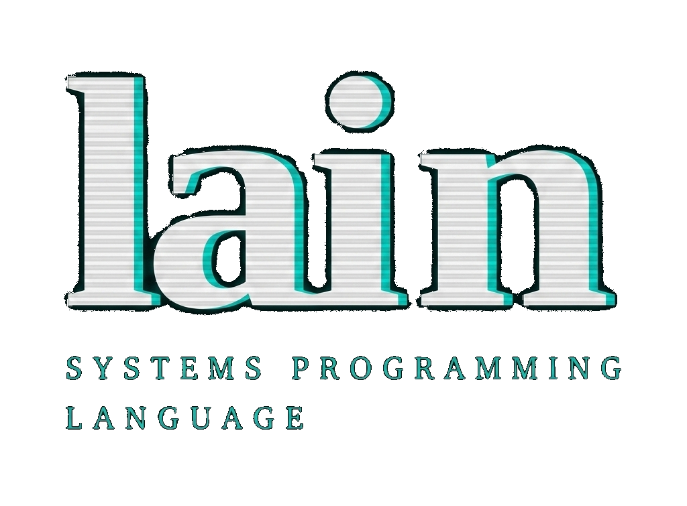

<p align="center">
  
</p>

<p align="center">
  <a href="https://lain-blush.vercel.app/"><strong>Official Website</strong></a>
</p>

Lain is a statically typed, compiled programming language designed for embedded systems, safety-critical software, and systems programming. Memory safety and resource safety are guaranteed entirely at compile time: no garbage collector, no reference counting, no runtime bounds checks.

---

## Safety Guarantees

| Safety Concern | Guarantee | Mechanism |
|:---------------|:----------|:----------|
| **Buffer Overflows** | Impossible | Value Range Analysis (§8) verifies every array access at compile time |
| **Use-After-Free** | Impossible | Linear types (`mov`) ensure resources are consumed exactly once |
| **Double Free** | Impossible | Ownership is linear; a resource is consumed exactly once |
| **Data Races** | Structurally impossible | Lain programs are single-threaded pre-1.0; no concurrency model exists. Interrupt-aware model (M2) is roadmapped. |
| **Null Dereference** | Prevented | Pointer dereference requires `unsafe` |
| **Memory Leaks** | Prevented | Linear variables must be consumed; forgetting is a compile error |
| **Division by Zero** | Impossible | A refinement (`b int != 0`) or a live guard (`if d != 0`) must establish it |
| **Integer Overflow** | Impossible | Checked at compile time and REJECTED (§17); `+%` wraps, `+\|` saturates, `+?` recovers — each by request |
| **Purity Violations** | Impossible | an effect the row does not name is rejected: I/O, allocation, a panic, or a loop that is not provably finite |

---

## Compilation Model

```
.ln source -> [Lain Compiler] -> out.c -> [gcc/clang] -> executable
```

All safety checks (ownership, borrowing, bounds, purity, pattern exhaustiveness) happen during compilation. The generated C99 code contains no runtime checks.

---

## Quick Start

**Build the compiler:**
```bash
gcc -std=c99 -Wall -Wextra -o lain src/main.c -I src
```

**Compile a Lain program:**
```bash
# Step 1: Lain -> C
./lain my_program.ln -o out.c

# Step 2: C -> Executable
gcc out.c -o my_program -Dlibc_printf=printf -Dlibc_puts=puts -w

# Step 3: Run
./my_program
```

> [!NOTE]
> `import std.…` resolves the module path relative to the **working directory**, so run the
> compiler from the repository root (the directory containing `std/`) when an example imports
> from the standard library.

**Run the test suite:**
```bash
./run_tests.sh
```

---

## Language Reference

---

## 1. Lexical Structure

### 1.1 Keywords

The following identifiers are reserved keywords and cannot be used as variable or function names.

**Core keywords:**
| Keyword | Purpose |
|:--------|:--------|
| `var` | Mutable variable declaration |
| `mov` | Ownership transfer (move semantics) |
| `type` | Type definition (structs, enums, ADTs) |
| `func` | Pure function declaration |
| `effects` | Declares a function's effect row (`io`, `diverge`, `raises`, `alloc`) |
| `return` | Return a value from a function |
| `if` | Conditional branch |
| `else` | Default branch in conditional/case |
| `for` | Range-based for loop |
| `while` | While loop |
| `decreasing` | Termination measure for bounded `while` in `func` |
| `break` | Exit the innermost loop |
| `continue` | Skip to the next iteration |
| `case` | Pattern matching |
| `in` | Range iteration / membership in a range or a list of constants, as a constraint or a bounds-proving condition |
| `and` | Logical AND |
| `or` | Logical OR |
| `true` | Boolean true literal |
| `false` | Boolean false literal |
| `as` | Type cast operator |
| `import` | Module import |
| `extern` | External (C) declaration |
| `unsafe` | Unsafe block |
| `c_include` | Reserved: refused (`[E100]`); an `extern` declares the C function itself (§10.1) |
| `defer` | Defer execution until end of scope |
| `comptime` | Compile-time branch — only `comptime if` is implemented (§20) |
| `assert` | A fact the compiler must prove where it is written (§6.8) |
| `assume` | A fact the compiler takes without proof, inside `unsafe` only (§6.8) |
| `try` | Pass a union's marker on to the caller (§14.4) |

> [!NOTE]
> **Reserved**: `use` is recognised by the lexer and refused as an identifier or a field name; the
> module-level `use` form is not implemented, and this implementation refuses it with `[E100]`.
> `macro`, `expr`, `pre`, `post`, `end`, `export`, `fun` and `undefined` are **not** reserved —
> each is usable today as an ordinary identifier and as a struct field name.
> There is no `fun` alias for `func`, and no `undefined` initializer.

### 1.2 Operators & Punctuation

**Arithmetic operators:**
| Operator | Description |
|:---------|:------------|
| `+` | Addition |
| `-` | Subtraction / Unary negation |
| `*` | Multiplication / Pointer dereference |
| `/` | Division |
| `%` | Modulo |

Each of `+ - * /` also has a wrapping (`+%`), a saturating (`+|`) and, except `/`, a checked (`+?`) form; §17 says when you need one.

**Comparison operators:**
| Operator | Description |
|:---------|:------------|
| `==` | Equal |
| `!=` | Not equal |
| `<` | Less than |
| `>` | Greater than |
| `<=` | Less than or equal |
| `>=` | Greater than or equal |

**Logical operators:**
| Operator | Description |
|:---------|:------------|
| `and` | Logical AND (keyword) |
| `or` | Logical OR (keyword) |
| `!` | Logical NOT (prefix) |

**Bitwise operators:**
| Operator | Description |
|:---------|:------------|
| `&` | Bitwise AND |
| `\|` | Bitwise OR |
| `^` | Bitwise XOR |
| `~` | Bitwise NOT (complement) |
| `<<` | Left shift |
| `>>` | Right shift |
| `<<%` | Left shift that discards the bits shifted out |

**Assignment operators:**
| Operator | Description |
|:---------|:------------|
| `=` | Assignment |
| `+=` | Add and assign |
| `-=` | Subtract and assign |
| `*=` | Multiply and assign |
| `/=` | Divide and assign |
| `%=` | Modulo and assign |
| `&=` | Bitwise AND and assign |
| `\|=` | Bitwise OR and assign |
| `^=` | Bitwise XOR and assign |
| `<<=` | Left shift and assign |
| `>>=` | Right shift and assign |

> [!NOTE]
> Compound assignments (`+=`, `-=`, etc.) are desugared by the parser into `x = x + expr` form.

**Other punctuation:**
| Symbol | Description |
|:-------|:------------|
| `(` `)` | Grouping, function calls, construction (`Point(1, 2)`) |
| `[` `]` | Array indexing, array/slice type syntax |
| `{` `}` | Blocks, struct/ADT bodies |
| `.` | Field access, module path separator |
| `..` | Range (exclusive end) |
| `..=` | Range (inclusive end) |
| `...` | Variadic parameters (in `extern` declarations) |
| `,` | Separator in lists |
| `:` | Match arm separator, sentinel in slice types |
| `;` | Statement terminator (optional) |

### 1.3 Literals

**Integer literals:**
```lain
42          // Decimal integer
0           // Zero
-1          // Negative (unary minus + literal)
0xFF        // Hexadecimal: 255
0b1010      // Binary: 10
0o17        // Octal: 15
1_000_000   // An underscore between digits is a separator, nothing more
```

**Character literals:**
```lain
'A'         // Character literal
'\n'        // Escape sequence
'\0'        // Null character
```

Recognized escape sequences: `\n` (0x0A), `\t` (0x09), `\r` (0x0D), `\0` (0x00), `\\` (0x5C), `\"` (0x22), `\'` (0x27), and `\xHH`, a byte given as exactly two hex digits (`\x41` is `A`).

**String literals:**
```lain
"Hello, World!\n"    // String literal with escape sequence
```
String literals have type `u8[:0]` (null-terminated sentinel slice). They expose two fields:
- `.data`: pointer to the raw bytes (`*u8`)
- `.len`: length of the string, excluding the sentinel

```lain
extern func libc_printf(fmt *u8, ...) i32 effects io

func main() i32 effects io {
    var s = "Hello"
    libc_printf("Length: %d\n", s.len)   // 5
    libc_printf("Content: %s\n", s.data) // Hello
    return 0
}
```

### 1.4 Comments

```lain
// Single-line comment
/* Multi-line
   comment */
```

### 1.5 Statement Termination

Semicolons are **optional**. Both styles are valid:

```lain
var x = 10;    // With semicolon
var y = 20     // Without semicolon
```

---

## 2. Type System

### 2.1 Primitive Types

**Integers:**

| Type | Description | C Equivalent |
|:-----|:------------|:-------------|
| `int` | Alias of `i32` | `int32_t` |
| `i8` | Signed 8-bit integer | `int8_t` |
| `i16` | Signed 16-bit integer | `int16_t` |
| `i32` | Signed 32-bit integer | `int32_t` |
| `i64` | Signed 64-bit integer | `int64_t` |
| `u8` | Unsigned 8-bit integer | `uint8_t` |
| `u16` | Unsigned 16-bit integer | `uint16_t` |
| `u32` | Unsigned 32-bit integer | `uint32_t` |
| `u64` | Unsigned 64-bit integer | `uint64_t` |
| `isize` | Signed pointer-sized integer | `int64_t` (64 bits in this implementation) |
| `usize` | Unsigned pointer-sized integer | `uint64_t` (64 bits in this implementation) |
| `i1` … `i64`, `u1` … `u64` | Any width from 1 to 64 bits (`u3`, `i12`) | the narrowest `intN_t` that holds it |

> [!NOTE]
> Fixed-width integer types require `<stdint.h>` in the generated C code (included automatically).
> `int` is an alias of `i32`, identical in every respect.
> **Overflow** is a compile-time error, not a wrap: an operation that may overflow is `[E086]` unless the compiler proves it cannot, and wrapping is written when it is meant (`+%`, §17).

**Floating-point:**

| Type | Description | C Equivalent |
|:-----|:------------|:-------------|
| `f32` | 32-bit IEEE 754 floating-point | `float` |
| `f64` | 64-bit IEEE 754 floating-point | `double` |

Floating-point types support the standard arithmetic operators (`+`, `-`, `*`, `/`) and comparison operators. The modulo operator `%` is **not** available for floating-point types.

A float is initialised from a float literal. An integer literal is **not** implicitly converted:
`var pi f64 = 3` is `[E012] implicit conversion between float and integer`, and the message asks
for an explicit `as` cast.

```lain
func main() i32 {
    var pi f64 = 3.14159
    var radius f32 = 5.0
    var n i32 = 7
    var scaled f64 = n as f64
    return 0
}
```

**Boolean:**

| Type | Description | C Equivalent |
|:-----|:------------|:-------------|
| `bool` | Boolean type with values `true` and `false` | `_Bool` |

```lain
extern func libc_printf(fmt *u8, ...) i32 effects io

func main() i32 effects io {
    var x bool = true
    var y bool = false

    if x {
        libc_printf("x is true\n")
    }
    return 0
}
```

### 2.2 Implicit Integer Widening

Lain allows **implicit widening**: a value of lower rank can be used where a higher-rank type is expected, without an explicit cast.

**Rank hierarchy:**

| Rank | Types |
|:-----|:------|
| 1 | `u8`, `i8` |
| 2 | `u16`, `i16` |
| 3 | `u32`, `i32`, `int` |
| 4 | `u64`, `i64` |
| 5 | `usize`, `isize` |

In a binary expression, the result type is the type of the higher-rank operand. **Narrowing** (high rank to low rank), `float`/`int` conversions, and pointer casts always require an explicit `as` cast.

```lain
var x u8 = 42
var y int = x           // OK: implicit widening u8 -> int
var z = x + 1000        // result type: int (1000 is int, wider than u8)

var n i32 = 200
var b = n as u8         // proven: VRA shows 200 fits u8
var f = n as f64        // widening, always fits
// `n as u8` at n = 1000 is [E086]. `as` is the PROVEN tier; `as?` `as%` `as|` are the
// checked, wrapping and saturating ones.
```

### 2.3 Pointer Types

Pointer types use the prefix `*` syntax:

```
*int       // Pointer to int (shared, read-only)
*var int   // Writable pointer to int
mov *int   // Owned pointer (linear)
*u8        // Pointer to u8 (C string compatible)
*void      // Opaque pointer (like C's void*)
```

| Syntax | Mode | C Equivalent |
|:-------|:-----|:-------------|
| `*T` | Read-only: a write through it is `[E009]` | `T*` |
| `*var T` | Writable | `T*` |
| `mov *T` | Owned (linear) | `T*` |

Reading or writing through a raw pointer is only allowed inside `unsafe` blocks (see §11). Taking an address, `&x`, is not: making a pointer is safe (§11.4).

### 2.4 Array Types

Arrays are fixed-size, stack-allocated collections. The size is part of the type.

A declaration names the element type and the length. Elements may be written one at a time, or
given as a literal, and an index reads back:

```lain
func main() i32 {
    var arr int[3]
    arr[0] = 10
    arr[1] = 20
    arr[2] = 30

    var bytes u8[256]
    bytes[0] = 1

    var lit int[3] = [10, 20, 30]
    var x = lit[0]
    return x
}
```

Array indices are **statically verified** at compile time. Accessing an out-of-bounds index is a compile error (see §8).

### 2.5 Slice Types

Slices are dynamic views into arrays. They consist of a pointer and a length.

```lain
func main() i32 {
    var arr int[5] = [1, 2, 3, 4, 5]
    var s int[] = arr[0..3]   // Slice of elements [0, 1, 2]
    return s.len as i32
}
```

All slice types (`T[]`) expose two fields:
- `.data`: pointer to the underlying data (`*T`)
- `.len`: number of elements in the slice

**Sentinel-terminated slices** end with a known sentinel value (typically `0`):

```
u8[:0]     // Null-terminated byte slice (C string compatible)
```

### 2.6 String Literals

String literals have type `u8[:0]` (null-terminated sentinel slice).

```lain
var greeting = "Hello, Lain!"       // Type: u8[:0]
var msg u8[:0] = "Explicit type"    // Explicit annotation
```

Strings can be passed to functions expecting `u8[:0]` or to C functions via `.data`:

```lain
extern func libc_printf(fmt *u8, ...) i32 effects io

func greet(msg u8[:0]) effects io {
    libc_printf("Message: %s\n", msg.data)
}

func main() i32 effects io {
    greet("hi")
    return 0
}
```

The `effects io` is not decoration. A `func` with no row claims to do nothing observable, so one
that calls `libc_printf` without it is `[E011]` — see §5.2.

### 2.7 Struct Types

Structs are defined using the `type` keyword.

**Definition:**
```lain
type Point {
    x int
    y int
}
```

A struct is built positionally, or declared and filled field by field. Reading a field uses the
same dotted name, and assigning a struct **copies** it, so writing through the copy leaves the
original alone (for non-linear structs):

```lain
type Point {
    x int
    y int
}

func main() i32 {
    var p = Point(10, 20)     // positional construction

    var x = p.x               // field access
    var y = p.y

    var p2 = p                // a struct assignment copies
    p2.x = 30
    if p.x != 10 { return 1 } // p is untouched

    var q Point               // declared, then filled field by field
    q.x = 10
    q.y = 20

    return x + y + q.x + p2.x
}
```

**Linear fields:**
Struct fields annotated with `mov` indicate ownership and make the containing struct **linear** (move-only):

```lain
type File {
    mov handle *FILE     // Owned handle; makes the struct linear
}
```

**Field invariants:**
A field may state a fact that holds for the struct's whole life. It is proven wherever the value
is built or the field is written ([E121] otherwise), and it is a fact wherever the field is read:

- `pos usize in 0..text.len` — `pos` is a valid index into the slice or array field `text`,
  always below its length; `in 0..=text.len` for a cursor that may rest at the end;
- `pos u32 <= src.len` — a position against another field's length (`<`, `<=`, `>`, `>=`);
- `len usize <= cap` — a relation between two integer fields;
- `src u8[<= 4294967295]` — a bound on a slice field's length, in the brackets, as for a parameter.

```lain
type Lexer {
    src u8[<= 4294967295]
    pos u32 <= src.len
}
func skip_spaces(var l Lexer) {
    while l.pos < l.src.len and l.src[l.pos] == 32 {
        l.pos = l.pos + 1
    }
}
func main() i32 {
    var buf u8[4] = [32, 32, 97, 98]
    var l = Lexer(buf, 0)
    skip_spaces(var l)
    if l.pos != 2 { return 1 }
    return 0
}
```

The length bound is what lets `pos` be a `u32`: without it, `src.len` is a `usize` and
`l.pos + 1` could overflow over a source past 4 GB. A `var` reference to a field an invariant
relates (`bump(var l.pos)`) is refused, since a write through it would escape the check; pass the
struct (`var l`) instead.

**Layout, and asserting it:**
`@sizeof(T)` and `@alignof(T)` are the size and alignment of `T` as the C compiler lays it out
(`usize`). A layout claim belongs in the program, not in a comment — a module-scope `assert`
states it where the type is declared, and a constant with no layout in it is checked by Lain
at once:

```lain
type Token {
    kind u8
    len u16
    pos u32
}
BUF usize = 64
assert @sizeof(Token) == 8
assert BUF % 16 == 0
func main() i32 {
    return 0
}
```

The operand must be a `bool` constant — literals, named constants, operators (the wrapping `+%` `-%` `*%` included), `as` and `as%`, `@sizeof`,
`@alignof` ([E133] otherwise). A false one is [E134]: from Lain when it can compute the value,
and from the C compiler (a `_Static_assert` carrying the same code) when it measures a type.

**Bit-exact packing — `[packed]`:**
A struct of `iN`/`uN` fields can be laid out bit-exactly in one integer — hardware registers,
protocol headers. Fields go in declaration order from bit 0, and the container is the smallest of
`uint8/16/32/64_t` that holds them:

```lain
[packed]
type Header {
    version u4
    flag u1
    priority u3
    length u8
}
assert @sizeof(Header) == 2
func main() i32 {
    var h = Header(7, 1, 5, 200)
    h.priority = 2
    if h.version != 7 or h.priority != 2 { return 1 }
    return 0
}
```

A read is a shift and a mask (an `iN` field is sign-extended); a write is a read-modify-write that
leaves the other fields alone. A field has no address, so a `var` reference to it or `&` of it is
[E121] — pass the whole struct instead.

### 2.8 Algebraic Data Types (ADTs)

Lain uses a unified syntax for enums, tagged unions, and algebraic data types. All are defined with `type`.

**Simple enum (no data):**
```lain
type Color {
    Red,
    Green,
    Blue
}
```

**ADT with variant data:**
```lain
type Shape {
    Circle { radius int }
    Rectangle { width int, height int }
    Point                               // Unit variant (no data)
}
```

**Construction:**
```lain
type Color {
    Red,
    Green,
    Blue
}

type Shape {
    Circle { radius int }
    Rectangle { width int, height int }
    Point
}

func main() i32 {
    var c = Color.Red
    var shape = Shape.Circle(10)
    var rect = Shape.Rectangle(5, 8)
    var p = Shape.Point
    return 0
}
```

**Pattern matching & Data Extraction:**
See §6.5 for `case` expressions.

> [!IMPORTANT]
> The `case` expression is the **only** mechanism to safely extract data from an ADT variant. Lain does not permit direct property access (e.g., `shape.radius`) on an ADT, because the compiler cannot statically guarantee that the ADT currently holds that specific variant.

**Direct Field Notation (Unsafe Extraction):**
If you are certain of the active variant and need to bypass the branching overhead, you can extract the field directly using the variant name. This is **only allowed** inside an `unsafe` block.

```lain
// VERIFY: exit 0
type Shape {
    Circle { radius int }
    Point
}

func main() i32 {
    var s = Shape.Circle(10)
    unsafe {
        var r = s.Circle.radius      // Zero-overhead direct C union access
        if r as i32 != 10 { return 1 }
    }
    return 0
}
```

"Only inside `unsafe`" is enforced, and it has its own diagnostic:

```lain
type Shape {
    Circle { radius int }
    Point
}

func main() i32 {
    var s = Shape.Circle(10)
    var r = s.Circle.radius      // ERROR [E125]
    return r as i32
}
```

```
[E125] Error Ln 8, Col 13: direct ADT field access ('Shape.Circle') is only allowed inside an 'unsafe' block — destructure with `case` instead.
```

If the variant at runtime is actually a `Rectangle`, this will yield garbage data, living up to its `unsafe` name.

### 2.9 Opaque Types (`extern type`)

Opaque types declare a type whose size and layout are unknown to Lain. They can only be used behind pointers.

```lain
extern type FILE      // C's FILE struct
```

**Rules:**
- Can only be used as `*FILE`, never by value.
- Instantiating by value (`var f FILE`) is a compile error.

```lain
extern type FILE
extern func fopen(filename *u8, mode *u8) mov *FILE
extern func fclose(stream mov *FILE) int
```

### 2.10 The `void` Type

The `void` keyword represents the absence of a value. It is exclusively used for declaring opaque pointers (`*void`, analogous to C's `void*`).
Variables cannot be declared of type `void` (`var x void` is a compile error).

### 2.11 Nested Types

Not supported. `type Token.Kind { Identifier, Number }` is parsed, but nothing can name its
variants (`Token.Kind.Identifier` is `[E128]`), so no value of the type can be made. Give the type a
name of its own: `type TokenKind { Identifier, Number }`.

---

## 3. Variables & Mutability

Lain enforces a clear distinction between immutable and mutable bindings.

### 3.1 Immutable Bindings (Default)

Variables declared by simple assignment are **immutable**. They must be initialized and cannot be reassigned.

```lain
x = 10           // Immutable binding
// x = 20        // ERROR: Cannot assign to immutable variable
```

### 3.2 Mutable Bindings (`var`)

The `var` keyword creates a mutable binding. A declaration may give an initial value or omit it —
omitting it costs nothing, which is how a large stack buffer is declared:

```lain
func main() i32 {
    var y = 10          // mutable, initialised
    y = 20

    var buffer u8[4096] // no initialiser: the storage is not written
    buffer[0] = 1

    return y
}
```

There is no `undefined` initialiser; `undefined` is an ordinary identifier, so
`var buffer u8[4096] = undefined` is `[E106] use of undeclared identifier`.

**Definite initialisation is enforced, and it is flow-sensitive.** Reading a variable the compiler
cannot show was written is `[E005]`, and a write on only one branch is not enough:

```lain
// ERROR: [E005] read of an uninitialised value — `n` is written on one path only
func main() i32 {
    var n i32
    if 1 == 1 {
        n = 7
    }
    return n
}
```

### 3.3 Type Annotations

Types can be optionally specified on any declaration:

```lain
var z int = 30            // Explicit type
var arr u8[5]             // Array with explicit type
name = "Lain"             // Inferred as u8[:0]
```

### 3.4 Global Variables

Variables can be declared at module (file) scope:

```lain
var global_counter int    // Mutable global variable
```

> [!WARNING]
> There is no global mutable state to read or write: a top-level `var` is `[E100]`. This is why the
> effect row has no `write` member — the bound would hold vacuously, so the row rejects the word.

### 3.5 Binding vs. Assignment Disambiguation

- If `x` is **not** already in scope: `x = 10` creates a **new immutable binding**.
- If `x` **is** already in scope and was declared `var`: `x = 10` is an **assignment**.
- If `x` **is** already in scope and is immutable: `x = 10` is a **compile error**.

```lain
x = 10           // New immutable binding (x not in scope before)
var y = 20       // New mutable binding
y = 30           // Assignment (y was declared var)
// x = 40        // ERROR: x is immutable
```

### 3.6 Lexical Block Scoping

Variables declared within a block are only visible within that block:

```lain
func scoped() i32 {
    var total = 0
    if true {
        var step = 20      // visible only inside this block
        total = total + step
    }
    return total           // 20; `step` is not in scope here
}

func main() i32 {
    return scoped()
}
```

> [!IMPORTANT]
> **Shadowing is forbidden**, not allowed. Re-declaring a name that is already in scope — in an
> inner block or the same one — is `[E013]`, so a name means one thing for the whole of its
> function. There is no inner variable that quietly replaces an outer one.

```lain
func f() i32 {
    var x = 10
    if true {
        var x = 20       // ERROR [E013]
        return x
    }
    return x
}
```

```
[E013] Error Ln 4, Col 9: Redeclaration or shadowing of variable 'x' is forbidden
   |
 4 |         var x = 20       // ERROR [E013]
   |         ^
```

## 4. Ownership & Borrowing

Lain guarantees memory safety without garbage collection through a strict **Ownership & Borrowing** system based on linear logic.

### 4.1 Ownership Modes

Every parameter, variable and field has one of three ownership modes:

| Mode | Syntax | Semantics | C Emission |
|:-----|:-------|:----------|:-----------|
| **Shared** | `p T` | Immutable borrow. Multiple shared references can coexist. | `const T*` |
| **Mutable** | `var p T` | Exclusive read-write borrow. Only one at a time. | `T*` |
| **Owned** | `mov p T` | Ownership transfer. Value must be consumed exactly once. | `T` (by value) |

### 4.2 Move Semantics (`mov`)

The `mov` operator transfers ownership of a value. After a move, the source variable is **invalidated**.

**Variable-to-variable move, and a move at a call site.** The moved-from variable is invalidated in
both cases, and the invalidation is what `mov` buys: it is why no second consumer can exist.

```lain
// VERIFY: exit 0
type Resource { id i32 }

func take_ownership(mov r Resource) i32 {
    return r.id
}

func main() i32 {
    var a Resource
    a.id = 1
    var b = mov a            // a is moved into b; a is now invalid
    if b.id != 1 { return 1 }

    var c Resource
    c.id = 7
    if take_ownership(mov c) != 7 { return 2 }
    return 0
}
```

Touch the source after the move and the program is refused:

```lain
type Resource { id i32 }

func f() i32 {
    var a Resource
    a.id = 1
    var b = mov a
    return a.id              // ERROR [E001]
}
```

```
[E001] Error Ln 7, Col 12: use of a value that was already moved
```

**Returning ownership.** A constructor takes `mov` the same way a function does, so ownership
passes into the returned value:

```lain
// VERIFY: exit 0
type Resource { id i32 }
type Container { inner Resource }

func wrap(mov r Resource) Container {
    return Container(mov r)    // Transfer ownership into return value
}

func main() i32 {
    var a Resource
    a.id = 5
    var c = wrap(mov a)
    if c.inner.id != 5 { return 1 }
    return 0
}
```

### 4.3 Linear Types

A type is **linear** if it has a `mov` field. Linearity also passes outward through containment —
a struct holding a linear value is linear — but never silently: a field whose type is linear must
itself be declared `mov`, and leaving the annotation off is `[E083]`. So a type's linearity is always
visible in its own declaration, at every level. A linear value must be consumed **exactly once**:

| violation | code |
|:----------|:-----|
| Not consumed before the end of its scope | `[E003]` |
| Consumed twice | `[E002]` |
| Consumed inside a loop | `[E002]` — consuming a value declared outside the loop from inside it *is* consuming it twice |
| Consumed on some paths but not others | `[E016]` |
| Moved without writing `mov` | `[E007]` |

The rule holds **whatever the field's type**. A `mov` field of type `i32` makes its struct linear
exactly as a pointer would: an `i32` can perfectly well be a resource, a POSIX file descriptor being
the obvious one, so the compiler does not guess from the type whether a value needs releasing.

```lain
type Fd { mov handle i32 }

func close_fd(mov {handle} Fd) {
}

func leak(mov f Fd) {         // ERROR [E003]
}
```

```
[E003] Error Ln 6, Col 15: a linear value is not consumed before it goes out of scope
```

Holding a linear value in another struct passes the obligation outward, and the annotation is what
makes that visible — omit it and the declaration itself is refused:

```lain
type Inner { mov tag i32 }
type Outer { inner Inner, n i32 }     // ERROR [E083]
```

```
[E083] Error Ln 2, Col 14: field 'inner' in struct 'Outer' has linear type but is missing `mov` annotation. Write it `mov inner Inner`.
```

**What consumes a linear value is destructuring it.** A function that takes `mov` and does nothing
with it has not consumed it — it has moved the leak one level up, and is itself `[E003]`. So the
consumer is the one that takes the value apart:

```lain
type Handle { mov raw *u8 }     // a mov field -> Handle is linear

func close_it(mov {raw} Handle) {
    // destructuring the parameter consumes the Handle
}

func ok(mov h Handle) {
    close_it(mov h)             // consumed exactly once
}

func main() i32 {
    return 0
}
```

Each violation, against that same pair. Not consumed:

```lain
type Handle { mov raw *u8 }

func close_it(mov {raw} Handle) {
}

func leak(mov h Handle) {       // ERROR [E003]
}
```

```
[E003] Error Ln 6, Col 15: a linear value is not consumed before it goes out of scope
```

Consumed twice, and the loop case, which is the same violation rather than a separate one:

```lain
type Handle { mov raw *u8 }

func close_it(mov {raw} Handle) {
}

func twice(mov h Handle) {
    close_it(mov h)
    close_it(mov h)             // ERROR [E002]
}
```

```
[E002] Error Ln 8, Col 14: this value is moved twice
```

Consuming on one path and not another is `[E016]`, *"consumed on some paths but not others"*: every
execution path must agree, consuming the value or leaving it alone.

```lain
type Handle { mov raw *u8 }

func close_it(mov {raw} Handle) {
}

func branchy(mov h Handle, c bool) {
    if c {
        close_it(mov h)      // ERROR [E016]: the else path does not consume h
    }
}
```

```
[E016] Error Ln 8, Col 9: consumed on some paths but not others
```

And the transfer must be written: passing a linear value to a `mov` parameter without the keyword is
`[E007]`, so an ownership transfer is never silent.

```lain
type Handle { mov raw *u8 }

func close_it(mov {raw} Handle) {
}

func implicit(mov h Handle) {
    close_it(h)              // ERROR [E007]
}
```

```
[E007] Error Ln 7, Col 5: moving linear variable 'h' requires explicit 'mov' at the call site.
```

### 4.4 Borrowing Rules (Read-Write Lock)

Lain enforces a "Read-Write Lock" model at compile time:

1. **Multiple shared borrows** are allowed simultaneously.
2. **Exactly one mutable borrow** is allowed at a time.
3. **Shared and mutable borrows cannot coexist** for the same variable.

| Active borrows | Operation attempted | Result |
|:---------------|:--------------------|:-------|
| None | Shared borrow | OK |
| None | Mutable borrow | OK |
| Shared borrow(s) | Shared borrow | OK |
| Shared borrow(s) | Mutable borrow | **Error** `[E004]` |
| Mutable borrow | Any other borrow | **Error** `[E004]` |
| Any active borrow | Move | **Error** `[E005]` |

**Conflict example (compile error):**
```lain
type Data { v i32 }

func modify_both(a Data, var b Data) {
    b.v = a.v
}

func main() i32 {
    var data = Data(1)
    modify_both(data, var data)     // ERROR [E004]: shared AND mutable in one call
    return 0
}
```

#### Two-Phase Borrows

When calling a method via UFCS (e.g., `x.method(x.field)`), the compiler desugars it to `method(var x, x.field)`. Without special handling, the mutable borrow of `x` for the first parameter would block reading `x.field` for the second.

Lain solves this with **two-phase borrows** (inspired by Rust RFC 2025). During argument evaluation, mutable borrows are registered in a **RESERVED** phase that permits shared reads of the same owner. After all arguments are evaluated, reserved borrows are promoted to **ACTIVE** (fully exclusive).

```lain
// The addition WRAPS: `v.data + n` on two unbounded ints is a real overflow, and this
// example is about two-phase borrows, not about arithmetic.
type Vec { data int, cap int }
func push_n(var v Vec, n int) { v.data = v.data +% n }

func main() int {
    var v = Vec(0, 10)
    v.push_n(v.cap)      // OK: v.cap is a shared read during RESERVED phase
    return v.data         // 10
}
```

Two-phase borrows do **not** permit moves or mutable writes during the reserved phase; only shared reads.

### 4.5 Non-Lexical Lifetimes (NLL)

Borrows expire at their **last use**, not at the end of the lexical scope. This makes many common patterns valid that a purely scope-based system would reject.

```lain
type Buffer { n i32 }
func read(b Buffer) i32 { return b.n }
func mutate(var b Buffer) { b.n = b.n +% 1 }

func main() i32 {
    var data = Buffer(0)
    var guard i32 = 0
    // OK: the shared borrow `read(data)` expires after evaluation, so it does not conflict
    // with the mutable borrow `mutate(var data)` in the loop body.
    while guard < 10 {
        if read(data) >= 10 { break }
        mutate(var data)
        guard = guard + 1
    }
    return data.n              // 10
}
```

The counter is not part of the borrow lesson — it is there because the loop needs a bound the
compiler can see. `while read(data) < 10` alone is refused for TERMINATION (`E011`): nothing relates
the call's result to the body's work, which is a separate obligation from the borrow one being
demonstrated here.

**Reference bindings.** A borrow can also be *named*: `var x = var p.x` binds `x` to the place
`p.x`, and `var r = get_ref(var ctx)` binds `r` to the reference a function returns. Reading `x`
reads `p.x`; assigning `x` writes it. The loan lasts until the binding's last use, exactly like
the call-site borrows above, and while it lasts nothing else may touch the place — read, write or
borrow (`E004`). Different fields, and elements at different constant indices, are different
places.

```lain
type P { x i32, y i32 }

func main() i32 {
    var p = P(1, 2)
    var x = var p.x          // x names p.x
    var y = var p.y          // OK: p.y is a different place
    x = 7
    y = 8
    var n usize = 4
    var r = var n
    r = r + 1                // writes n, and the compiler knows n is now 5
    return p.x +% p.y        // 15: x and y are no longer used, so p is free again
}
```

```lain
type P { x i32, y i32 }

func main() i32 {
    var p = P(1, 2)
    var q = var p
    p.y = 5                  // E004: q is used on the next line, so p is still lent out
    q.x = 3
    return 0
}
```

A binding to a local may not outlive the function (`E010`), and a function returning `var T`
hands a binding back as `return var r` (`E017` without the `var`). A struct field cannot hold one
(`E126`).

### 4.6 Caller-Site Annotations

When calling a function, the caller must explicitly annotate `var` and `mov` to signal the intended ownership:

```lain
// VERIFY: exit 0
type Data { value int }

func read_data(d Data) int { return d.value }    // Shared borrow
func modify_data(var d Data) { d.value = 1 }     // Mutable borrow
func consume_data(mov d Data) { }                // Ownership transfer

func main() i32 {
    var data Data
    data.value = 3
    if read_data(data) != 3 { return 1 }    // Implicit shared borrow
    modify_data(var data)                   // Explicit mutable borrow
    if read_data(data) != 1 { return 2 }
    consume_data(mov data)                  // Explicit ownership transfer
    return 0
}
```

### 4.7 Destructuring in Parameters

Parameters can be destructured at the function signature level:

```lain
// VERIFY: exit 0
type Resource { id int }

func drop(mov {id} Resource) int {
    return id             // 'id' is extracted from Resource, consuming the struct
}

func main() i32 {
    var r Resource
    r.id = 4
    if drop(mov r) as i32 != 4 { return 1 }
    return 0
}
```

### 4.8 Return Ownership

**`return mov` — transfer ownership:**
```lain
// VERIFY: exit 0
type Item { id int }

func transfer(mov item Item) Item {
    return mov item       // Transfer ownership to the caller
}

func main() i32 {
    var i Item
    i.id = 6
    var j = transfer(mov i)
    if j.id as i32 != 6 { return 1 }
    return 0
}
```

**`return var` — return a mutable reference:**
```lain
type Context { counter int }

func get_ref(var ctx Context) var int {
    return var ctx.counter    // Return a mutable reference to a field
}

func main() i32 {
    return 0
}
```

Returning a mutable reference to a **local** is refused, because the reference would outlive what it
borrows. `return var` is restricted to data that outlives the call — a field of a `var` parameter,
as above:

```lain
func dangle() var int {
    var local = 5
    return var local      // ERROR [E010]
}
```

```
[E010] Error Ln 3, Col 5: this reference would outlive the value it borrows
```

**`return` (default) — return by value (copy):**
```lain
func compute(a int >= 0 and <= 1000, b int >= 0 and <= 1000) int {
    return a + b          // Return a copy
}
```

---

## 5. Functions

Lain enforces a strict boundary between pure computation and side effects.

### 5.1 Functions with the Empty Row

A function with no `effects` clause has the empty row, and is **pure, deterministic, and
guaranteed to terminate**:
- It modifies no global state; Lain has none.
- It calls no function whose row names an effect its own row does not.
- Its loops are `for` loops, or `while` loops whose termination the compiler can show (§6.3); an
  unbounded `while` needs `effects diverge`.
- It may recurse, when the compiler can see the recursion end (below).

```lain
func add(a int >= 0 and <= 1000, b int >= 0 and <= 1000) int {
    return a + b
}
```

**Termination guarantee.** A `func` must be *total*: it has to terminate on every input. That
does not ban recursion — it requires the compiler to be able to see why the recursion stops.
A parameter that strictly shrinks toward a bound is enough, and it is inferred:

```lain
func factorial(n int) int {
    if n <= 1 { return 1 }
    return n *% factorial(n - 1)    // OK: n shrinks toward the n <= 1 base case
}
```

What is rejected is a recursion whose measure the compiler cannot see shrinking:

```lain
func collatz(n int) int {
    if n <= 1 { return 0 }
    if n % 2 == 0 { return collatz(n / 2) }
    return collatz(3 * n + 1)     // Compile error [E011]: no decreasing measure
}
```

The same rule governs loops — see §5.5.

### 5.2 The effect row

`func` is the only introducer. A function's effects are worked out from its body by following the
call graph, and the default is the empty row — **pure and total**. A function that deviates names
which way, with one clause covering the whole family:

```lain
extern func libc_printf(fmt *u8, ...) i32 effects io

func log_line(msg u8[:0]) effects io {
    libc_printf("%s\n", msg.data)
}

func fib(n int >= 0 and <= 30) int {
    if n < 2 { return n }
    return fib(n-1) +% fib(n-2)    // accepted: the measure is inferred
}

func main() int effects io {
    log_line("hi")
    return fib(5)
}
```

The four effects are `io`, `diverge`, `raises` and `alloc`. Two rules govern the clause:

1. **Silence means the empty row.** An effect the body has and the row does not name is an error
   (`E011` when no row was written, `E130` when one was and it understates). So the row is a
   *complete* upper bound, and a caller can rely on what it reads.
2. **An `extern` inverts both.** It has no body, so nothing can be inferred: its row is *believed*,
   its default is *every* effect, and writing one NARROWS. Forgetting a row on a C function that
   performs I/O therefore costs precision, never soundness.

```lain
extern func libc_puts(s *u8) i32 effects io    // believed; narrows the default
extern func abs(n int) int effects             // the empty row — genuinely pure
```

There is no separate introducer for effectful code. `proc` was that introducer and has been
**removed** — an effect used to be spelled by a keyword (`proc`), by an attribute (`@diverges`),
and by this clause, and one concern with three spellings is what the language's own law L3 refuses.
The keyword stays reserved and tells you the replacement:

```
[E100] `proc` was removed: there is one introducer, `func`, and an effect row.
       Write `func NAME(...) RET effects io`, or `effects diverge` for a loop the
       compiler cannot bound. Silence means no effects at all
```

The attributes that spelled the same thing are gone with it, and refuse themselves the same way:

```lain
import std.c.{libc_printf}

@io
func p(s u8[:0]) {            // ERROR [E100]
    libc_printf("%s", s.data)
}
```

```
[E100] Error Ln 3, Col 1: `@io` was removed: an effect is stated once, in the row. Write `func NAME(...) RET effects io`, listing every effect the function has (silence means none).
```

So all three spellings now lead to the row, and "one concern with three spellings" is a statement
about the past rather than an aspiration. The attributes `[cold]`, `[hot]`, `[allocator]` and
`[noreturn]` remain, because they are not effects; their older spelling `@cold` is still accepted
and is scheduled for removal.

A **function-pointer type** carries a row in the same position, which is what replaced the two
points `*func` (total and pure) and `*proc` (anything):

```lain
func apply(f *func(i32) i32 effects io, x i32) i32 effects io { return f(x) }
```

Assignment to such a pointer is row containment — the function may do no more than the arrow
admits — and a call through it charges the arrow's row, so `apply` above must acknowledge `io` and
nothing else. `*proc` could only have said "may do anything".

### 5.3 Parameter Modes

Every function supports three parameter modes:

```lain
// VERIFY: exit 0
type Context { value int }
type Resource { id int }

func process(tag int, var ctx Context, mov res Resource) {
    if res.id > tag {
        ctx.value = res.id
    } else {
        ctx.value = tag
    }
}

func main() i32 {
    var c Context
    c.value = 0
    var r Resource
    r.id = 9
    process(4, var c, mov r)      // the call site repeats the modes
    if c.value as i32 != 9 { return 1 }
    return 0
}
```

`tag` is a shared borrow (read-only), `var ctx` a mutable borrow, `mov res` owned and consumed by
the function — and the call site states the last two again, which is §4.6. See §4.1 for full
semantics.

> [!WARNING]
> **A parameter list must currently be on one line.** Breaking it across lines is `[E100] Expected
> parameter name`, and so is breaking a call's arguments. This is a **known limitation being
> fixed**, not a rule of the language: a newline inside `(` `)` should not terminate a declaration.
> Write signatures on one line until it lands.

### 5.4 Return Types & Void Functions

```lain
extern func libc_printf(fmt *u8, ...) i32 effects io

// The refinements are not decoration: unbounded `int + int` is a real overflow at
// INT32_MAX and does not compile. `int` is the alias of i32, and it is checked like one.
func add(a int >= 0 and <= 1000, b int >= 0 and <= 1000) int {    // Returns int
    return a + b
}

func greet(msg u8[:0]) effects io {    // Void (no return type)
    libc_printf("%s\n", msg.data)
}

func main() int {
    return 0
}
```

In void functions, `return` at the end of the block is optional. Using `return` without an expression is allowed for early exit:
```lain
func check(valid bool) {
    if !valid { return }   // Early exit from void function
    // ...
}
```

> [!IMPORTANT]
> `main` is an ordinary `func`. It carries a row like any other function — `func main() int
> effects io` for a program that prints — and a `main` that does nothing observable needs no row
> at all. (An earlier revision of this page required `proc main()`; that introducer has been
> removed.)

### 5.5 Termination Guarantees

There is one introducer, so the table is no longer about two keywords — it is about what the row
says. The left column is the default (no clause written):

| Feature | default row (∅) | with the effect named |
|:--------|:----------------|:----------------------|
| `for` loops | allowed | allowed |
| Bounded `while` (`decreasing`) | allowed | allowed |
| Unbounded `while` | rejected (`E011`) | allowed under `effects diverge` |
| Recursion | allowed **if a measure is inferred or given** | allowed under `effects diverge` |
| Calling a function whose row has `io` | rejected (`E011`) | allowed under `effects io` |
| Calling one that may `panic` | rejected (`E011`) | allowed under `effects raises` |
| Calling one that allocates | rejected (`E011`) | allowed under `effects alloc` |
| Global mutable state | does not exist in the language (`E100`) | — |

The right column is not an escape hatch: naming an effect puts it in *this* function's row too, so
it propagates to every caller, which must acknowledge it in turn or be rejected.

> [!NOTE]
> **An `extern`'s row is believed, and its default is every effect.** There is no body to infer
> from, so silence is read as "may do anything" and a written row narrows it. This is the one place
> the direction reverses, and the reason is the absence of a body rather than a special rule.
>
> `extern func abs(n int) int effects` — the empty row, so `abs` is pure and callable from a
> function with no row of its own.
> `extern func printf(fmt *u8, ...) int effects io` — performs I/O, so a caller needs `effects io`.
> `extern func getchar() int` — *no* row, so it may do anything, and a caller must acknowledge the
> lot (`effects io, diverge, raises, alloc`). Narrow the declaration instead.

### 5.6 Universal Function Call Syntax (UFCS)

Lain supports **UFCS** for all types. Any call of the form `target.method(arg)` is automatically translated by the compiler into `method(target, arg)`.

```lain
func is_even(n int) bool {
    return n % 2 == 0
}

func main() {
    var x = 10
    var even = x.is_even()  // Equivalent to: is_even(x)
}
```

This works for all types, including slices, pointers, and structs. The ownership mode of the first parameter is inferred automatically from the function declaration:

```lain
// VERIFY: exit 0
type Vec { len int }

func push(var v Vec, item int) {
    v.len = item
}

func main() i32 {
    var v Vec
    v.len = 0
    v.push(42)              // Desugars to: push(var v, 42)
    if v.len != 42 { return 1 }
    return 0
}
```

---

## 6. Control Flow

### 6.1 If / Else

There is no `elif`. A chained branch is written `else if`.

```lain
func classify(x i32) i32 {
    if x > 10 {
        return 2
    } else if x > 5 {
        return 1
    } else {
        return 0
    }
}

func main() i32 {
    return classify(7)
}
```

Conditions do not require parentheses. The body must be enclosed in `{ }`. The condition contributes to **range analysis**: inside the `if x < y` branch, the compiler knows `x < y` and propagates this constraint (see §8).

### 6.2 For Loops (Range-Based)

For loops iterate over finite ranges, so they are always allowed: the bound is the range.

A range's bounds are integers, and the diagnostic names the type that was not:

```lain
func f(a f64) i32 {
    for i in 0..a {         // ERROR [E012]
        return 1
    }
    return 0
}
```

```
[E012] Error Ln 2, Col 17: a `for` range counts in integers, so its bounds are integers; this one is 'f64'.
```

**Single variable form:**
```lain
func last_index(n usize) usize {
    var seen usize = 0
    for i in 0..n {
        seen = i            // i ranges from 0 to n-1 (exclusive end)
    }
    return seen
}

func main() i32 {
    return 0
}
```

**Two variable form:**
```lain
// VERIFY: exit 0
func f() i32 {
    var last = 0
    for i, val in 0..10 {
        last = val as i32   // i = index, val = value (same as i for integer ranges)
    }
    return last             // the last value is 9
}

func main() i32 {
    if f() != 9 { return 1 }
    return 0
}
```

> [!NOTE]
> The loop variable `i` is statically known to be in `[0, n-1]`, enabling safe array indexing without runtime checks.

### 6.3 While Loops

A `while` loop must be provably finite unless the row says otherwise. The compiler infers a
measure where it can, `decreasing <expr>` supplies one where it cannot, and `effects diverge`
is how a function states that it genuinely may not terminate:

```lain
import std.c.{libc_printf}

func count_up() effects io {
    var i = 0
    while i < 10 {
        libc_printf("%d ", i)
        i = i + 1
    }
}
```

**A loop with no bound is not an exception to that; it is a different claim.** `while 1` cannot be
proven to terminate, and `break` on a runtime condition does not change that — the compiler would
have to know the condition eventually holds. So the function has to say so:

```lain
func serve(ready bool) effects diverge {
    while 1 {
        if ready { break }
    }
}
```

Drop `effects diverge` and the same loop is refused:

```lain
func serve(ready bool) {
    while 1 {               // ERROR [E011]
        if ready { break }
    }
}
```

```
[E011] Error Ln 2, Col 11: this loop is not provably terminating, and no measure could be inferred
   |
 2 |     while 1 {               // ERROR [E011]
   |           ^
```

#### Bounded While — Termination Measure

A `while` loop may carry an explicit **termination measure** via the `decreasing` keyword. It is
what lets a loop the compiler cannot measure by itself appear in a function that does not state
`effects diverge` — not a second kind of loop, and not a relaxation: the measure is verified, and
the compiler checks that

1. the measure is **non-negative** when the loop condition holds, and
2. the measure **strictly decreases** on every iteration.

```lain
func count_up(n int) int {
    var i = 0
    while i < n decreasing n - i {  // measure: n - i
        i += 1                       // i increases, so n - i decreases
    }
    return i
}
```

This is what lets a finite state machine — a lexer, a parser, a protocol handler — be written with
an empty effect row, which is to say as a function the caller may treat as pure and total.

**Supported patterns:**

| Condition | Measure | Why it works |
|:----------|:--------|:-------------|
| `i < n` | `n - i` | `i` increases, so measure decreases |
| `n > 0` | `n` | `n` decreases directly |
| `a < b` | `b - a` | Either `a` increases or `b` decreases |
| `i in 0..arr.len` | `arr.len - i` | the range's upper bound gives `i < arr.len` (see §8.3.2) |

The measure is compile-time only; it produces no runtime overhead.

**Two codes, and which one you get depends on whether you supplied a measure.** A loop or recursion
the compiler cannot bound *at all* is `[E011]` — the same code as an unacknowledged effect, because
non-termination *is* an effect the row did not name:

```lain
func g(flag bool) i32 {
    while flag {          // ERROR [E011]
    }
    return 0
}
```

```
[E011] Error Ln 2, Col 5: this loop is not provably terminating, and no measure could be inferred
```

A `decreasing` measure that is supplied and does not hold is `[E082]`:

```lain
type Small = i32 >= 0 and <= 100

func f(n Small, m Small) i32 decreasing m {
    if n == 0 { return 0 }
    return f(m, n)        // ERROR [E082]: swapping the arguments does not decrease m
}
```

```
[E082] Error Ln 5, Col 12: the `decreasing` measure is not provably well-founded here
```

> [!NOTE]
> **A written measure is a claim the compiler defends, even where it does not need it.** On a loop it
> could already bound by itself, the measure you wrote is still checked, so a wrong one is reported
> rather than ignored.

```lain
func f(n i32) i32 {
    var i = 0
    while i < n decreasing i {    // ERROR [E082]: `i` rises
        i = i + 1
    }
    return i
}
```

```
[E082] Error Ln 3, Col 11: this loop ends, but not by the `decreasing` measure written: it does not fall on every iteration
```

The message says what it means: the loop *does* terminate — the compiler can see that from `i < n`
and `i = i + 1` — but not for the reason stated. A measure is an assertion about *why*, and an
assertion the implementation cannot confirm is refused even when the conclusion happens to hold.

### 6.4 Break & Continue

`break` exits the innermost loop. `continue` skips to the next iteration.

```lain
// VERIFY: exit 0
import std.c.{libc_printf}

func example() i32 effects io {
    var total = 0
    var i = 0
    while i < 10 {
        i = i + 1
        if i == 5 { continue }    // Skip 5
        if i == 8 { break }       // Stop at 8
        libc_printf("%d ", i)     // prints: 1 2 3 4 6 7
        total = total + i
    }
    return total
}

func main() i32 effects io {
    if example() != 23 { return 1 }    // 1 + 2 + 3 + 4 + 6 + 7
    return 0
}
```

### 6.5 Case (Pattern Matching)

`case` is used for pattern matching on enums, ADTs, characters, integers, `bool`s, strings (`"red":`) and unions (§14.2). It can act as either a **statement** or an **expression**.

**Matching on an enum, and on an ADT with destructuring.** A variant's payload is bound
positionally in the pattern; an enum match needs no `else`, because its patterns can name every
value:

```lain
import std.c.{libc_printf}

type Color {
    Red,
    Green,
    Blue
}

type Shape {
    Circle { radius i32 }
    Rectangle { width i32, height i32 }
    Point
}

func describe(color Color) effects io {
    case color {
        Red:   libc_printf("Red\n")
        Green: libc_printf("Green\n")
        Blue:  libc_printf("Blue\n")
    }
}

func outline(shape Shape) effects io {
    case shape {
        Circle(r):       libc_printf("Circle radius: %d\n", r)
        Rectangle(w, h): libc_printf("Rect: %d x %d\n", w, h)
        Point:           libc_printf("Just a point\n")
    }
}

func main() i32 effects io {
    describe(Color.Red)
    outline(Shape.Circle(10))
    return 0
}
```

**Multiple patterns, ranges, and `case` as an expression.** Arms take comma-separated pattern
lists and ranges (`start..end` excludes `end`, `start..=end` includes it). As an expression every arm must yield the
same type. An integer or character match **does** need `else`: no finite set of patterns can name
every value of an integer type, and leaving it out is `[E014]`.

```lain
// VERIFY: exit 0
func kind(c u8) i32 {
    return case c {
        'a'..='z', 'A'..='Z': 1        // ..= includes its end: 'z' is a letter
        '0'..='9':            2
        '_', '-':             3
        else:                 0
    }
}

func label(width i32) u8[:0] {
    var size = case width {
        1..=10:  "Small"
        11..=50: "Medium"
        else:    "Large"
    }
    return size
}

func main() i32 {
    if kind('z') != 1 { return 1 }
    if kind('9') != 2 { return 2 }
    if kind('-') != 3 { return 3 }
    if label(10) != "Small" { return 4 }
    if label(11) != "Medium" { return 5 }
    return 0
}
```

Written with `..`, the same ranges would exclude `'z'`, `'9'` and `10`: `kind('z')` would be 0.

Drop the `else` from an integer match and the program is refused:

```lain
func rank(x i32) i32 {
    var r = case x {      // ERROR [E014]
        1: 1
        2: 2
    }
    return r
}
```

```
[E014] Error Ln 2, Col 13: a `case` on 'i32' needs an `else:` arm: its patterns cannot name every value.
   |
 2 |     var r = case x {      // ERROR [E014]
   |             ^
```

**Case arms** can be:
- One statement on the same line: `Red: return 1`
- Several statements, one per line, starting on the line after the `:`. There are no braces: a `{`
  after the `:` is `[E100]`.
- Several patterns or ranges: `1, 2, 5..10: return 2`

In a `case` *expression* an arm is one expression.

#### Non-Consuming Match (`case &expr`)

By default, `case expr` consumes the scrutinee (for linear types). To inspect a value **without consuming it**, prefix the scrutinee with `&`:

```lain
// VERIFY: exit 0
func inspect() i32 {
    var x = 42
    var result = 0
    case &x {            // Borrowed match: x is NOT consumed
        42: result = 1
        else: result = 0
    }
    return x + result    // x is still usable: 42 + 1
}

func main() i32 {
    if inspect() != 43 { return 1 }
    return 0
}
```

The `&` registers a shared borrow on the scrutinee for the duration of the match, so an arm may
not mutate it:

```lain
func f() i32 {
    var x = 42
    var y = 0
    case &x {
        42: x = 99       // ERROR [E004]
        else: y = 2
    }
    return x
}
```

```
[E004] Error Ln 5, Col 13: conflicting borrows of the same value
   |
 5 |         42: x = 99       // ERROR [E004]
   |             ^
```

Particularly useful with ADTs, where you want to inspect a variant without consuming the value:

```lain
import std.c.{libc_printf}

type Shape {
    Circle { radius i32 }
    Rectangle { width i32, height i32 }
}

func report(shape Shape) effects io {
    case &shape {
        Circle(r):       libc_printf("radius: %d\n", r)
        Rectangle(w, h): libc_printf("area: %d\n", w * h)
    }
    // shape is still available here
}

func main() i32 effects io {
    report(Shape.Circle(3))
    return 0
}
```

### 6.6 Exhaustiveness Checking

`case` statements must be **exhaustive**. The compiler verifies:

1. **Enums**: All variants must be covered, OR an `else` arm must be present.
2. **ADTs**: All variants must be covered, OR an `else` arm must be present.
3. **Integers**: An `else` arm is always required (integers are not finite).

```lain
// VERIFY: exit 0
// All 3 variants covered, so no `else` is needed
type Status { Ready, Running, Done }

func rank(s Status) i32 {
    case s {
        Ready:   return 1
        Running: return 2
        Done:    return 3
    }
    return 0
}

func main() i32 {
    if rank(Status.Done) != 3 { return 1 }
    return 0
}
```

Drop one arm and the diagnostic names the variant you forgot, which is what makes exhaustiveness
usable rather than merely strict:

```lain
type Status { Ready, Running, Done }

func rank(s Status) i32 {
    case s {              // ERROR [E014]
        Ready:   return 1
        Running: return 2
    }
    return 0
}
```

```
[E014] Error Ln 4, Col 5: this `case` on 'Status' has no arm for Status.Done. Add one, or an `else:`.
```

### 6.7 Defer Statement

`defer` schedules **one statement** to run as the current scope is left. It is the primary
mechanism for deterministic resource cleanup (RAII):

```lain
import std.fs.{open_file, close_file}

func process_file() effects io, raises, alloc {
    var f = open_file("data.txt", "r")
    defer close_file(mov f)
    // ... use f ...
    // f is closed on every exit from this scope
}
```

> [!NOTE]
> `defer { … }` with a braced block **is not accepted** — a block is not a statement here, and the
> parser reports `[E100] Unexpected token in expression: TOKEN_L_BRACE`. For several cleanup
> actions, write several `defer`s; they run in LIFO order, so the one written last runs first.

**Rules for defer:**
1. Deferred statements execute in reverse order (LIFO, Last In First Out).
2. They execute on all exit paths: fall-through, `return`, `break`, or `continue`.
3. If control flow exits multiple scopes, the deferred statements of all exited scopes run, innermost scope first.
4. Control may not leave a deferred statement: a `return`, or a `break`/`continue` aimed at a loop outside it, is `[E138]`.
5. A `panic` runs no `defer`: it aborts the program at once, unlike Go's.

Rule 1 is observable, so it is checked rather than asserted. Each iteration of the loop is a scope,
and the `defer` registered *last* runs *first* — which is why the one that reads `b_done` sees it
already set. Were the order FIFO, this program would return 0:

```lain
// VERIFY: exit 0
func lifo() i32 {
    var b_done = false
    var a_saw_b = false
    var i = 0
    while i < 1 {
        defer a_saw_b = b_done      // registered FIRST, so it runs LAST
        defer b_done = true         // registered LAST, so it runs FIRST
        i = i + 1
    }
    if a_saw_b { return 1 }
    return 0
}

func main() i32 {
    if lifo() != 1 { return 2 }      // 2, so a failure is never the LIFO answer
    return 0
}
```

Rule 4 is enforced, and the diagnostic explains why the rule has to exist:

```lain
func f() i32 {
    var x = 1
    defer return 2      // ERROR [E138]
    return x
}
```

```
[E138] Error Ln 3, Col 11: `return` inside a deferred statement would leave it. A `defer` runs while its scope is being left, so it cannot start another exit.
```

### 6.8 `assert` and `assume`

`assert P` states a fact the compiler must **prove** where it is written. It costs nothing at run
time, and a predicate the analysis cannot discharge is `[E012]`. Its practical use is to say where
a lost fact should be reported, instead of at whatever later line first needs it:

```lain
// VERIFY: exit 0
func last(a u8[]) u8 {
    if a.len > 0 {
        n = a.len - 1
        assert n < a.len
        return a[n]
    }
    return 0
}

func main() i32 {
    var t u8[3] = [7, 8, 9]
    if last(t) != 9 { return 1 }
    return 0
}
```

`assume P` is the opposite: a fact the compiler **takes without proof**. Every proof after it
depends on it being true, so it is allowed only inside `unsafe` (`[E129]` outside):

```lain
func ratio(x i32) i32 {
    unsafe {
        assume x > 0              // believed, not checked
    }
    return 10 / x                 // the divisor is proven non-zero from the assumption
}
```

---

## 7. Expressions & Operators

### 7.1 Arithmetic

```lain
// SYNOPSIS
a + b      // Addition
a - b      // Subtraction
a * b      // Multiplication
a / b      // Integer division
a % b      // Modulo (remainder)
```

Each carries a proof obligation, so an operand bound is usually what makes the arithmetic
acceptable — here a refinement alias supplies it, and `/` and `%` need the divisor's range to
exclude 0 (§17, and §12 for `[E015]`):

```lain
// VERIFY: exit 0
type Small = i32 >= 1 and <= 100

func arith(a Small, b Small) i32 {
    var sum  = a + b
    var diff = a - b
    var prod = a * b
    var quot = a / b
    var rem  = a % b
    return sum + diff + prod + quot + rem
}

func main() i32 {
    if arith(10, 3) != 54 { return 1 }    // 13 + 7 + 30 + 3 + 1
    return 0
}
```

### 7.2 Comparison

```lain
// SYNOPSIS
a == b     // Equal
a != b     // Not equal
a < b      // Less than
a > b      // Greater than
a <= b     // Less than or equal
a >= b     // Greater than or equal
```

A comparison is a `bool`, not an integer — as are `true`, `false`, `x in lo..hi` and the logical
operators below. A `bool` never converts to or from an integer implicitly (spec 07): returning
`a < b` from an `i32` function, `n + (a < b)`, `take(1)` for a `bool` parameter and `flag == 1`
are all [E012]. Convert explicitly: `(a < b) as i32`, `n as bool` (which is `n != 0`). An integer
is still accepted as an `if` / `while` condition, where non-zero is true.

### 7.3 Logical Operators

Lain uses keyword-based logical operators:

```lain
// SYNOPSIS
x > 0 and x < 100    // Logical AND
x == 0 or x == 1     // Logical OR
!condition            // Logical NOT
```

Their operands are `bool` (spec 08): `x and n` with an integer `n`, or `!n`, is [E012] — write
`n != 0`.

### 7.4 Bitwise Operators

```lain
// SYNOPSIS
a & b      // Bitwise AND
a | b      // Bitwise OR
a ^ b      // Bitwise XOR
~a         // Bitwise NOT (complement)
a << n     // Left shift
a >> n     // Right shift
```

The bitwise operators take integers. On two booleans, write `and` / `or` / `!=` (spec 08).

**A left shift must be proven not to lose bits.** `a << n` is refused unless the result fits the
left operand's type — `[E086]`, *"unsigned left shift may lose bits … prove it fits, or say you
mean to discard them: `<<%` wraps"*. Bounding both operands discharges it:

```lain
// VERIFY: exit 0
func bits(a u8, b u8) u8 {
    var v = a & b
    v = v | (a ^ b)
    v = v & ~a
    return v
}

func shifts(a u8, n u8) u8 {
    if a < 16 and n < 4 {
        return (a << n) >> n      // proven: a << n is at most 120, which fits a u8
    }
    return a
}

func main() i32 {
    if bits(12, 10) != 2 { return 1 }
    if shifts(12, 2) != 12 { return 2 }
    return 0
}
```

### 7.5 Compound Assignment

All compound assignment operators are syntactic sugar:

```lain
// SYNOPSIS
x += 5     // Equivalent to: x = x + 5
x -= 3     // Equivalent to: x = x - 3
x *= 2     // Equivalent to: x = x * 2
x /= 4     // Equivalent to: x = x / 4
x %= 3     // Equivalent to: x = x % 3
x &= mask  // Equivalent to: x = x & mask
x |= flag  // Equivalent to: x = x | flag
x ^= bits  // Equivalent to: x = x ^ bits
```

Being sugar, a compound form carries exactly the obligation its expansion does — and the
comparison and logical operators from §7.2 and §7.3 are checked here too:

```lain
// VERIFY: exit 0
func compare(a i32, b i32) i32 {
    var n = 0
    if a == b { n = n + 1 }
    if a != b { n = n + 2 }
    if a <  b { n = n + 4 }
    if a >  b { n = n + 8 }
    if a <= b { n = n + 16 }
    if a >= b { n = n + 32 }
    return n
}

func logic(x i32) bool {
    return (x > 0 and x < 100) or x == -1
}

func compound(x0 u8) u8 {
    var x = x0
    x &= 15
    x |= 3
    x ^= 1
    return x
}

func main() i32 {
    if compare(2, 5) != 22 { return 1 }    // != , < and <= hold: 2 + 4 + 16
    if logic(50) != true { return 2 }
    if compound(255) != 14 { return 3 }
    return 0
}
```

### 7.6 Type Cast (`as`)

The `as` operator performs explicit type conversions between numeric types:

```lain
var x i32 = 200
var y = x as u8           // Narrow i32 to u8; 200 fits, so it is exact
var big = 42 as i64       // Widen int to i64
var n = 'A' as int        // char to int: 65
// `300 as u8` is [E086]: `as` narrows only where the value is PROVEN to fit. The other
// three tiers say what to do when it does not — `as?` takes its `else` arm, `as%` wraps,
// `as|` clamps.
```

**Rules:**
- An integer conversion keeps the value wherever the target holds it. Where it may not — a
  narrowing, or a signedness change such as `u32` to `i32` or `usize` to `i64` — `as` needs a
  proof ([E086] otherwise), and `as?`, `as%`, `as|` state what happens to a value that does not
  fit.
- Pointer casts (`*int as *void`) require an `unsafe` block.
- Non-numeric casts (e.g., struct to int) are not allowed.

### 7.7 Operator Precedence

| Precedence | Operators | Associativity | Description |
|:-----------|:----------|:-------------|:------------|
| 1 (highest) | `()` `[]` `.` | Left | Grouping, indexing, field access |
| 2 | `!` `~` `-` `*` | Right | Unary NOT, complement, negation, deref |
| 3 | `as` | Left | Type cast |
| 4 | `*` `/` `%` | Left | Multiplicative |
| 5 | `+` `-` | Left | Additive |
| 6 | `<<` `>>` | Left | Bit shift |
| 7 | `&` | Left | Bitwise AND |
| 8 | `^` | Left | Bitwise XOR |
| 9 | `\|` | Left | Bitwise OR |
| 10 | `<` `>` `<=` `>=` `in` | Left | Comparison / bounds check |
| 11 | `==` `!=` | Left | Equality |
| 12 | `and` | Left | Logical AND |
| 13 (lowest) | `or` | Left | Logical OR |

> [!NOTE]
> Use parentheses to override precedence when intent is unclear: `(a + b) * c`.

### 7.8 Structural Equality

The equality operators (`==` and `!=`) are only supported for:
- Primitive numeric types (integers, `bool`)
- Pointers
- A slice against a **string literal**: `s == "red"` compares the bytes and the lengths

Using `==` or `!=` on a `struct`, an array, any other slice, an enum, an ADT or a union is
`[E012]`. Compare the fields, or match the value with `case`.

### 7.9 Numeric Conversions

Lain supports **implicit widening** between integer types: a value of lower rank can be used where a higher-rank integer is expected, without an explicit cast (see §2.2).

**Widening (implicit, no cast needed):**
```lain
var x u8 = 42
var y int = x        // OK: u8 widened to int implicitly
var z = x + 1000     // OK: result type is int
```

**Narrowing (explicit, requires `as`):**
```lain
var n int = 42
var b = n as u8      // Explicit: int -> u8

// `as` is the PROVEN tier: it narrows only where VRA can show the value fits, and is
// [E086] otherwise — `var n int = 300` then `n as u8` does not compile, and neither does
// an unbounded `u32` narrowed to `u8`, or converted to `i32` (a signedness change narrows
// too). To narrow a value you cannot bound, say which behaviour you mean: `as?` checks at
// run time and takes its `else` arm, `as%` truncates modulo 2^N, `as|` clamps. Spec §8,
// cast tiers.
```

**Float/int (explicit, requires `as`).** Note the literal: `var f f64 = 3` is itself `[E012]`,
because an integer literal does not implicitly become a float either.

```lain
func main() i32 {
    var f f64 = 3.0
    var i = f as int     // Explicit: float -> int
    var g = i as f64     // Explicit: int -> float
    return 0
}
```

**Pointer casts (requires `unsafe`):**
```lain
func main() i32 {
    var n int = 42
    var p = &n
    unsafe {
        var vp = p as *void    // pointer cast inside unsafe
    }
    return 0
}
```

### 7.10 Evaluation Order

The evaluation of expressions, function arguments, and operands is strictly defined as **Left-to-Right**.
For `foo(a(), b())`, `a()` is guaranteed to execute and return before `b()` is executed.

---

## 8. Type Constraints

Lain uses **equation-style type constraints** to statically verify function requirements and guarantees. All checks are performed at compile time with zero runtime overhead.

### 8.1 Parameter Constraints

Constraints on parameters are written directly after the type:

```lain
func safe_div(a int, b int != 0) i64 {
    return a / b          // i32 / i32 is an i33: TYPE_MIN / -1 is 2^31, and an i64 holds it
}
```

The compiler verifies at each call site that `b` cannot be zero. (The quotient is returned wide
because one signed quotient does not fit its operands' type — `TYPE_MIN / -1`. Returning an `int`
instead needs a fact that rules it out, such as `b int > 0`, or an explicit policy: `a /% b`
wraps, `a /| b` saturates.)
```lain
func safe_div(a int, b int != 0) i64 {
    return a / b
}

func main() i32 {
    var ok = safe_div(10, 2)      // OK: 2 != 0
    var bad = safe_div(10, 0)     // ERROR [E012]: 0 violates b != 0
    return 0
}
```

**Supported constraint operators:**
| Constraint | Meaning |
|:-----------|:--------|
| `b int != 0` | b must not be zero |
| `b int > 0` | b must be positive |
| `b int >= 0` | b must be non-negative |
| `b int < a` | b must be less than a |
| `b int > a` | b must be greater than a |
| `b int == 1` | b must equal 1 |

### 8.2 Return Type Constraints

Constraints on the return value are written after the return type:

```lain
// The refinement on `x` is doing real work: `0 - x` at INT32_MIN has no positive
// answer in i32, so an unrefined `abs` does not compile. This is the one place the
// C version of this function is famously wrong.
func abs(x int >= -2147483647) int >= 0 {
    if x < 0 { return 0 - x }
    return x
}
```

The compiler verifies that **all** return paths satisfy `result >= 0`:
```lain
// ERROR [E086]: -1 does not satisfy >= 0
func bad_abs(x int) int >= 0 {
    return -1
}
```

### 8.3 Membership (`in`): ranges and lists of constants

**`in` means membership in a set.** The set is written either as a range — `lo..hi` excluding
`hi`, or `lo..=hi` including it, each bound evaluated once — or as a list of constants,
`[a, b, c]` (§8.3.3). The value being tested comes first: `x in lo..hi`, `x in [a, b, c]`.

An index into a container is the case that matters most, and it is now spelled out rather than
implied: the indices of `arr` are `0..arr.len`.

> [!IMPORTANT]
> **`x in <container>` was retired.** It read as "x is a valid index into arr", which is not what
> membership means — `arr` is a sequence of elements, not a set of indices. Write the range you mean.
> Both old spellings are refused, with the replacement in the message:

```lain
func f(a i32[8], i usize) i32 {
    if i in a { return a[i] }          // ERROR [E100]
    return 0
}
```

```
[E100] Error Ln 2, Col 8: `i in a` as an index test was retired: `in` means membership in a set, and a's indices are the range `0..a.len`. Write `i in 0..a.len` (or `i < a.len`). Membership in a container's ELEMENTS is a scan, which is a function you write; `in` takes a list of constants (`x in [a, b]`).
```

```lain
type L {
    src u8[],
    pos usize in src                   // ERROR [E100]
}
```

```
[E100] Error Ln 3, Col 18: `in src` as an index refinement was retired: `in` means membership in a set. Write `in 0..src.len` for an index, always below the length, or `in 0..=src.len` for a cursor that may rest at the end.
```

#### 8.3.1 Parameter constraint (`i int in 0..arr.len`)

As a parameter constraint, `in` declares which set a value belongs to, so the body may index it
without a check:

```lain
func get(arr int[10], i int in 0..arr.len) int {
    return arr[i]      // always safe: the caller established 0 <= i < 10
}

func main() i32 {
    var a int[10] = [0, 1, 2, 3, 4, 5, 6, 7, 8, 9]
    return get(a, 5) as i32
}
```

It means the same as the two clauses `i >= 0 and i < arr.len`. The obligation is the **caller's**,
and a call that does not establish it is refused:

```lain
func get(arr int[10], i int in 0..arr.len) int {
    return arr[i]
}

func main() i32 {
    var a int[10] = [0, 1, 2, 3, 4, 5, 6, 7, 8, 9]
    return get(a, 15) as i32        // ERROR [E012]
}
```

```
[E012] Error Ln 7, Col 12: a required precondition is not established here
```

#### 8.3.2 Bounds-proving condition (`idx in 0..arr.len`)

As an expression, `idx in 0..arr.len` is a `bool`. Used as the condition of an `if` or `while` it
creates an **in-guard** that authorises `arr[idx]` in the guarded body, with no `unsafe` and no
runtime check:

```lain
func peek(data u8[:0], pos usize) int {
    if pos in 0..data.len { return data[pos] as int }   // safe: in-guarded
    return 0
}
```

**While loops.** The counter is a `usize`, and it has to be: the range's upper bound is `data.len`,
a `usize`, so an `int` counter could leave `i32` on a long enough slice. The not-found answer is the
length rather than `-1` for the same reason — it keeps the return type `usize`.

```lain
func find_zero(data u8[:0]) usize {
    var i usize = 0
    while i in 0..data.len decreasing data.len - i {
        if (data[i] as int) == 0 { return i }   // safe: in-guarded
        i += 1
    }
    return data.len
}
```

**And-chain composition.** The guard propagates through `and`, so the right-hand side may index:

```lain
type Lexer {
    src u8[],
    pos usize in 0..=src.len
}

func scan_to_quote(var l Lexer) {
    while l.pos in 0..l.src.len and (l.src[l.pos] as int) != '"' decreasing l.src.len - l.pos {
        l.pos += 1   // l.src[l.pos] is safe on both sides of the `and`
    }
}

func main() i32 {
    return 0
}
```

> [!IMPORTANT]
> **An index and a cursor are different sets, and the field says which.** A scanning cursor is
> `pos usize in 0..=src.len` — it may rest one past the last byte, which is where the loop above
> leaves it. An index is `pos usize in 0..src.len`, always below the length; a loop that advances past
> the last byte breaks that form on its final iteration and the store is refused with `[E121]`.
>
> The guard inside the loop is what turns the cursor back into an index where one is needed. That is
> the division of labour: the field carries what is always true, the guard proves what is true here.
> (`pos usize <= src.len` is the same set as `in 0..=src.len`, written as a relation.)

**Termination.** `idx in 0..arr.len` gives `idx < arr.len`, so the measure `arr.len - idx` is
recognised as non-negative by the termination verifier (§6.3).

**Scoping.** In-guards are scoped to the body of the `if`/`while`. They do not extend to an `else`
branch or to code after the block.

> [!NOTE]
> A guard matches the access **structurally**: `pos in 0..data.len` guards exactly `data[pos]`. A
> different offset is not guarded and is refused on its own merits — `data[pos + 1]` under that guard
> is `[E085]`, because the guard says nothing about `pos + 1`.

#### 8.3.3 List membership (`x in [a, b, c]`)

`x in [a, b, c]` is `true` when `x` equals one of the elements. `x` is evaluated once and compared
with each element in turn:

```lain
// VERIFY: exit 0
func is_space(c u8) bool {
    return c in [' ', 9, 10, 13]
}

func main() i32 {
    if !is_space(' ') { return 1 }
    if !is_space(10) { return 2 }
    if is_space('a') { return 3 }
    return 0
}
```

The elements are **closed constants**: number and character literals, and arithmetic on them —
`' '`, `-3`, `'a' + 1`. A name is not followed, so a value known only at run time is refused with the
spelling to use instead:

```lain
func f(x i32, y i32) bool {
    return x in [1, y]                 // ERROR [E012]
}
```

```
[E012] Error Ln 2, Col 21: each element of a membership list is a constant (numbers and characters, and arithmetic on them); for a value known only at run time, compare: `x == a or x == b`.
```

**The test is exact; the narrowing is the hull.** These are two different facts, and confusing them
is the natural mistake. `i in [0, 2]` is true for `0` and `2` and **false for `1`** — but inside the
true branch the analysis knows only that `i` lies between the smallest element and the largest,
`0..=2`. That is enough to prove an index into a three-element array:

```lain
// VERIFY: exit 0
func pick(t u8[3], i usize) u8 {
    if i in [0, 2] { return t[i] }     // the hull 0..=2 proves the index
    return 0
}

func main() i32 {
    var t u8[3] = [7, 8, 9]
    if pick(t, 2) != 9 { return 1 }    // 2 is a member
    if pick(t, 1) != 0 { return 2 }    // 1 is inside the hull, but not in the set
    return 0
}
```

Because the narrowing is the hull, a gap in the list does not help a bound: over the same array,
`i in [0, 5]` narrows `i` to `0..=5`, which does not fit, and `t[i]` is `[E085]`.

**The comparison is mathematical**, not C's. A `u8` holding `44` does not match `300`, although
`300` reduced to a byte is `44`; and `255` does not match `-1`. Each element is compared with `x` as
the integer it is, whatever the types:

```lain
// VERIFY: exit 0
func hit(c u8) i32 {
    if c in [-1, 300, 7] { return 1 }
    return 0
}

func main() i32 {
    if hit(255) != 0 { return 1 }      // not -1
    if hit(44) != 0 { return 2 }       // not 300, though 300 mod 256 = 44
    if hit(7) != 1 { return 3 }
    return 0
}
```

`in` tests an integer against integers, so a `bool` on the left is `[E012]`, and an empty list
`x in []` is the parser's `[E100]`. Membership in a container's **elements** — "is `v` anywhere in
`arr`?" — is not `in` at all: it is a scan, and a scan is a function you write.

### 8.4 Relational Constraints Between Parameters

Constraints can reference other parameters:

```lain
// `b > a` alone does not bound `b - a`: at a = INT32_MIN and b = INT32_MAX the
// difference does not fit. Bounding the operands is what makes the subtraction provable.
func require_lt(a int >= 0 and <= 1000, b int > a and <= 1000) int {
    return b - a     // Always positive
}

func clamp(x int, lo int, hi int >= lo) int >= lo and <= hi {
    if x < lo { return lo }
    if x > hi { return hi }
    return x
}
```

### 8.5 Multiple Constraints

Chain constraints with `and`:

```lain
func bounded(x int >= 0 and <= 100) int {
    return x
}
```

### 8.6 Static Verification Mechanism (VRA)

The compiler uses **Value Range Analysis (VRA)**, a decidable, polynomial-time static analysis. No SMT solver is required.

| Property | Value |
|:---------|:------|
| Decidable | Yes (always terminates) |
| Complexity | Polynomial |
| Sound | Yes (does not accept invalid programs) |
| Complete | No (may reject valid programs; conservative) |
| Runtime overhead | Zero |

**How it works:**

1. **Interval tracking**: Every integer variable carries a range `[min, max]`.
   - Literals: `10` -> `[10, 10]`
   - Types: `u8` -> `[0, 255]`, `int` -> `[-2^31, 2^31-1]`

2. **Arithmetic propagation**:
   - `[a, b] + [c, d]` -> `[a+c, b+d]`
   - `[a, b] - [c, d]` -> `[a-d, b-c]`

3. **Control flow refinement**:
   - Inside `if x < 10`: `x` is narrowed to `[min, 9]`
   - Inside `else`: `x` is narrowed to `[10, max]`
   - After merge: conservative hull (union of both branches)

4. **Assignment tracking**: Ranges are updated through assignments.

5. **Linear constraint propagation**: `var x = y + 1` implies `x > y`, as a *relation* and not
   merely as two separate ranges.

That last one is worth seeing, because a relation between two variables is invisible in any single
variable's range. The way to observe it is reachability: if the compiler knows `x > y`, then the
branch `x <= y` is dead, and code inside it is never required to prove anything — so a division by
zero there is accepted:

```lain
type Small = i32 >= 0 and <= 1000

func rel(y Small) i32 {
    var x = y + 1
    if x <= y {
        return 5 /% 0      // unreachable: the compiler has x > y
    }
    return x
}

func main() i32 {
    return rel(3)
}
```

Take the relation away — two independent parameters with the same ranges — and the identical branch
is refused, which is what makes the example evidence rather than illustration:

```lain
type Small = i32 >= 0 and <= 1000

func rel(y Small, x Small) i32 {
    if x <= y {
        return 5 /% 0      // ERROR [E015]: reachable, and the divisor is 0
    }
    return x
}
```

```
[E015] Error Ln 5, Col 16: divisor is not provably non-zero
```

### 8.7 Facts After a Loop

The analysis carries facts across a loop. A counter's final value is known after it, and so is a
total accumulated at a fixed step:

```lain
// VERIFY: exit 0
func main() i32 {
    var x = 0
    for i in 0..10 {
        x = x + 1
    }
    assert x == 10                  // proven: the loop ran exactly 10 times
    var t u8[10] = [0, 1, 2, 3, 4, 5, 6, 7, 8, 9]
    var j usize = 0
    while j < 10 {
        j = j + 1
    }
    if t[j - 1] != 9 { return 1 }   // j is 10 after the loop, so this is t[9]
    return 0
}
```

What the analysis cannot bound across a loop, such as a total of values it knows nothing about,
needs a bound from elsewhere: §17.3 shows the three places one can come from.

---

## 9. Module System

### 9.1 Import

The `import` keyword loads another Lain module. Module paths use dot-notation corresponding to the filesystem hierarchy:

```lain
import std.c            // Loads std/c.ln
import std.io           // Loads std/io.ln
import std.fs           // Loads std/fs.ln
import tests.stdlib.dummy   // Loads tests/stdlib/dummy.ln
import std.fs as fs         // Namespace aliasing
```

An `import` makes the module's declarations available through the last segment of its path: after `import std.math`, write `math.max`. A bare `max` is `[E105]`, and the message names both remedies. `import std.math.{max, min}` brings the listed names in unqualified, and `import std.fs as fs` chooses the qualifier: `fs.open_file()`.

### 9.2 Flat Namespace & C Name Mangling

After module inlining, all declarations share a flat global namespace. In the generated C code, symbols receive a prefix based on their module path:

| Lain Declaration | Generated C Name |
|:-----------------|:-----------------|
| `func add(...)` in `main.ln` | `main_add(...)` |
| `func print(...)` in `std/io.ln` | `std_io_print(...)` |
| `type File` in `std/fs.ln` | `std_fs_File` |

Circular imports are implicitly prevented; each module is loaded at most once.

### 9.3 Standard Library

Lain ships with a minimal standard library:

| Module | Purpose |
|:-------|:--------|
| `std.c` | Core C bindings (stdio, stdlib) |
| `std.io` | Console output (`print`/`println`) |
| `std.fs` | File operations with ownership safety |
| `std.math` | Pure math utilities |
| `std.option` | Generic `Option(T)` type |
| `std.result` | Generic `Result(T, E)` type |
| `std.string` | String utilities (placeholder) |

**`std/c.ln`** — Core C bindings:
```lain
extern type FILE

extern func printf(fmt *u8, ...) int effects io
extern func fopen(filename *u8, mode *u8) mov *FILE effects io, alloc
extern func fclose(stream mov *FILE) int effects io
extern func fputs(s *u8, stream *FILE) int effects io
extern func fgets(s *var u8, n int, stream *FILE) *var u8 effects io
extern func libc_printf(fmt *u8, ...) int effects io
extern func libc_puts(s *u8) int effects io
```

> [!IMPORTANT]
> Every one of these carries `effects io`, and the two that hand back storage carry `alloc` as
> well. The row is not decoration here: an `extern` with no row is read as doing *everything*, so
> these declarations are what let a caller's row be as narrow as `effects io`.

**`std/io.ln`** — Basic I/O:
```lain
import std.c.{libc_printf, libc_puts}

func print(s u8[:0]) effects io {
    // An explicit "%s", so a '%' in the caller's bytes is never read as a
    // conversion specifier — passing `s.data` as the format is the classic
    // format-string vulnerability.
    libc_printf("%s", s.data)
}

func println(s u8[:0]) effects io {
    libc_puts(s.data)
}

func main() i32 { return 0 }
```

**`std/fs.ln`** — File system with ownership:
```lain
import std.c.{FILE, fopen, fclose, fputs}

type File {
    mov handle *FILE       // Owned file handle -> File is linear
}

// fopen returns null on failure, and wrapping that null in a File would defer the
// fault to a later fputs or fclose on a null handle. Until Result lands, open_file
// panics instead, so a File never holds a null handle: a defined abort rather than
// undefined behaviour. The null check reads the owned pointer, so it needs `unsafe`;
// the pointer is still consumed on the success path by File(raw).
func open_file(path u8[:0], mode u8[:0]) mov File effects io, raises, alloc {
    var raw = fopen(path.data, mode.data)
    unsafe {
        if raw == 0 { panic("open_file: could not open file") }
    }
    return File(raw)
}

func close_file(mov {handle} File) effects io {
    fclose(mov handle)
}

func write_file(f File, s u8[:0]) effects io {
    fputs(s.data, f.handle)
}

func main() i32 { return 0 }
```

> [!NOTE]
> The `File` type is a safe wrapper around C's `FILE*`. Because `handle` is declared `mov`, `File` is
> **linear**: it must be consumed exactly once, via `close_file(mov f)`. Forgetting to close a file is
> `[E003]` — a linear value not consumed before it goes out of scope. (`[E002]` is the opposite
> mistake, closing it twice.)
>
> Note also that `close_file` consumes by **destructuring** — `mov {handle} File` — and then passes
> `mov handle` on to `fclose`. That is what consuming a linear value means in practice, and §4.3
> explains why a function that takes `mov` and does nothing with it has not consumed anything.

**`std/math.ln`** — Pure math utilities:

| Function | Signature | Description |
|:---------|:----------|:------------|
| `min` | `func min(a int, b int) int` | Returns the smaller of two values |
| `max` | `func max(a int, b int) int` | Returns the larger of two values |
| `abs` | `func abs(x int) int` | Returns the absolute value |
| `clamp` | `func clamp(x int, lo int, hi int) int` | Clamps x to [lo, hi] |

All functions in `std/math` are pure (`func`), with no side effects or external dependencies.

**`std/option.ln`** — Generic Option type:
```lain
import std.option.{Option}

func main() int {
    var a = Option(int).Some(42)
    var b = Option(int).None

    var x = 0
    case a {
        Some(v): x = v
        None: x = 0
    }
    return x  // 42
}
```

`Option(T)` is a compile-time generic ADT with two variants: `Some { value T }` and `None`.

**`std/result.ln`** — Generic Result type:
```lain
import std.result.{Result}

func main() int {
    var r = Result(int, int).Ok(15)
    var x = 0
    case r {
        Ok(v): x = v
        Err(e): x = e
    }
    return x  // 15
}
```

`Result(T, E)` is a compile-time generic ADT with variants `Ok { value T }` and `Err { error E }`. Combined with pattern matching, it provides type-safe error handling.

### 9.4 Name Resolution & Forward Declarations

Lain uses a multi-pass compiler. Functions, types and module constants can be referenced before they are declared in the source file; a local cannot. There is no need for forward declarations or header files.

```lain
func main() int { return helper() }
func helper() int { return 42 }      // OK: defined after use
```

---

## 10. C Interoperability

Lain compiles to C99 and provides first-class mechanisms for interfacing with C code.

### 10.1 C Headers

A Lain program includes no C header. Each C function it calls is declared with `extern`
(§10.2), and the generated C declares that function with the prototype the `extern` states, in
Lain's types. A header would declare the same function again in C's types, and the C compiler
refuses the pair when they differ: `extern func puts(s *u8) int` declares `uint8_t *` where
`<stdio.h>` declares `const char *`. The rest of a header, its macros and constants, cannot be
named from Lain. So `c_include` is a reserved word, and a declaration is refused:

```lain
c_include "<stdio.h>"      // ERROR [E100]

func main() i32 {
    return 0
}
```

### 10.2 Extern Functions

The `extern` keyword declares functions defined in C:

```lain
extern func abs(n int) int
extern func malloc(size usize) mov *void
extern func free(ptr mov *void)
extern func exit(status int)
```

Ownership annotations (`mov`) can be applied to extern parameters and return types.
`malloc` returns `mov *void` (the caller owns the allocation).
`free` takes `mov *void` (it consumes the pointer).

### 10.3 Extern Types (Opaque)

See §2.9. Opaque types allow wrapping C handles safely:

```lain
extern type FILE
extern func fopen(filename *u8, mode *u8) mov *FILE
```

### 10.4 Variadic Parameters

C-style variadic parameters are supported in extern declarations:

```lain
extern func printf(fmt *u8, ...) int
```

The `...` is only valid in `extern` function declarations.

### 10.5 Type Mapping

| Lain Type | C Type | Context |
|:----------|:-------|:--------|
| `int` | `int32_t` | The alias of `i32` |
| `u8` | `uint8_t` | |
| `usize` | `uint64_t` | 64 bits in this implementation |
| `*u8`, `*T` | `uint8_t*`, `T*` | Read-only: the compiler refuses a write (`[E009]`) |
| `*var u8`, `*var T` | `uint8_t*`, `T*` | Writable |
| `mov *T` | `T*` | Owned pointer |
| `T[]` | `struct { T* data; size_t len; }` | Passed as two parameters, the length first; not allowed in an `extern` (`[E131]`) |

---

## 11. Unsafe Code

While Lain prioritizes safety, low-level systems programming sometimes requires bypassing safety checks.

> [!TIP]
> Before reaching for `unsafe`, consider whether an in-guard (§8.3.2) can prove your array access safe. Code like `if idx in 0..arr.len { arr[idx] }` or `while i in 0..data.len decreasing data.len - i { data[i] }` is fully verified at compile time with zero runtime overhead.

### 11.1 Unsafe Blocks

Operations that bypass safety checks must be enclosed in an `unsafe` block:

```lain
// VERIFY: exit 0
func main() i32 {
    var x = 7
    unsafe {
        var ptr = &x as *var i32    // Address-of and the cast: OK inside unsafe
        var val = *ptr              // Pointer dereference: OK inside unsafe
        *ptr = 42                   // Write through pointer
        if val != 7 { return 1 }
    }
    if x != 42 { return 2 }         // the write landed
    return 0
}
```

Outside an `unsafe` block the dereference is refused:

```lain
func f(p *i32) i32 {
    return *p           // ERROR [E060]
}
```

```
[E060] Error Ln 2, Col 12: pointer dereference outside 'unsafe' block. Dereference it inside 'unsafe { }', or use a slice and an index (`a[i]`), whose bounds the compiler proves.
```

### 11.2 What `unsafe` waives, and what it does not

One principle decides the two lists, and it is worth knowing rather than memorising them:
**`unsafe` waives a proof about an *operation*; it never waives a fact the rest of the program is
entitled to assume.** A waived operation still has a defined result — a narrowing that does not fit
yields the value modulo 2ᴺ — and the analysis after it reasons from that result. A refinement or a
struct invariant is not an operation's obligation but a *premise*: later reads are allowed to assume
it without proof, so suspending its check would make deductions false in safe code elsewhere.
(Specification, chapter 18.)

**Waived inside an `unsafe` block:**

| check | code |
|:------|:-----|
| Pointer dereference, including a field read through a raw pointer | `[E060]` |
| Pointer/integer casts | `[E012]` |
| Direct ADT field access | `[E125]` |
| Bounds verification | `[E085]` |
| Overflow, and a narrowing that may not fit | `[E086]` |
| Division or remainder by zero | `[E015]` |

**Still fully active inside an `unsafe` block:**

| check | code |
|:------|:-----|
| Ownership and move semantics | `[E001]`–`[E003]` |
| Borrow checking | `[E004]` |
| Definite initialisation | `[E005]` |
| Pattern exhaustiveness | `[E014]` |
| Struct field invariants | `[E121]` |
| A narrowing **into a refined type** | `[E086]` |
| The effect row | `[E011]`, `[E130]` |
| Type checking | — |

> [!WARNING]
> **Bounds verification is waived**, so `unsafe { a[i] }` is accepted for any `i`. An out-of-range
> index there is undefined behaviour, and the compiler has stopped helping. An in-guard (§8.3.2) is
> almost always the better answer: `if i in 0..a.len { a[i] }` needs no `unsafe` and costs nothing
> at run time.

A double move is refused inside `unsafe` exactly as outside it:

```lain
type Resource { id i32 }

func consume(mov r Resource) {
}

func f() {
    var r Resource
    r.id = 1
    unsafe {
        consume(mov r)
        consume(mov r)      // ERROR [E002]
    }
}
```

```
[E002] Error Ln 11, Col 17: this value is moved twice
```

### 11.3 Raw Pointers

Raw pointers (`*int`, `*void`) bypass Lain's ownership system. **Dereferencing** a raw pointer is only allowed inside `unsafe` blocks.

```lain
func main() i32 {
    var p *int = 0

    unsafe {
        var y = *p      // OK (compiles, though dangerous at runtime)
    }
    return 0
}
```

**A field through a pointer.** Which form to write depends on how you hold the struct.

Held by **borrow** — a parameter `s S`, or `var s S` to modify it — `s.v` is the form. It is safe and
checked, and needs no `unsafe`:

```lain
// VERIFY: exit 0
type S { v i32 }

func get(s S) i32 {
    return s.v
}

func main() i32 {
    var x S
    x.v = 7
    if get(x) != 7 { return 1 }
    return 0
}
```

Through a **raw pointer**, a field access is a dereference — `p.v` reads through `p` even though no `*`
is written — so it needs `unsafe`. `(*p).v` is the same access spelled out:

```lain
// VERIFY: exit 0
type S { v i32 }

func main() i32 {
    var s S
    s.v = 7
    var p = &s
    var a = 0
    var b = 0
    unsafe {
        a = p.v           // a dereference: reads through p
        b = (*p).v        // the same thing, spelled out
    }
    if a != 7 { return 1 }
    if b != 7 { return 2 }
    return 0
}
```

Outside `unsafe`, the field read is refused. It used not to be — a read through a null raw pointer
compiled in safe code and crashed at run time — which is why the message names both ways out:

```lain
type S { v i32 }

func main() i32 {
    var p *S = 0
    return p.v            // ERROR [E060]
}
```

```
[E060] Error Ln 5, Col 12: reading a field through a raw pointer outside 'unsafe': `.` dereferences it. Read it inside 'unsafe { }', or take the struct as a borrow (`func f(s S)` or `func f(var s S)`), which the compiler checks.
```

Note that `*p.v` is **not** `(*p).v`: unary `*` binds more loosely than `.`, so it means `*(p.v)` — a
dereference of the field — and is refused unless `v` is itself a pointer.

### 11.4 The Address-Of Operator (`&`)

The unary address-of operator `&` creates a raw pointer to a local variable, and taking an address is
**permitted in safe code**: making a pointer is harmless. What needs `unsafe` is reading or writing
*through* it, which is the danger — the same split as Rust's.

```lain
// VERIFY: exit 0
func main() i32 {
    var x = 42
    var p = &x          // safe: p is of type *int
    unsafe {
        *p = 100        // writing through it needs unsafe
    }
    if x != 100 { return 1 }
    return 0
}
```

`&` binds more loosely than a postfix operator, so `&s.v` is `&(s.v)`: a pointer to the field.

### 11.5 Nesting Rules

Unsafe blocks can be nested and combined with control flow:

```lain
// VERIFY: exit 0
func main() i32 {
    var x = 7
    var p = &x
    unsafe {
        unsafe {
            var val = *p        // OK: nested unsafe
            if val != 7 { return 1 }
        }
        var val2 = *p           // OK: still inside outer unsafe
        if val2 != 7 { return 2 }
    }
    return 0
}
```

### 11.6 Null Pointers & C Interop

Lain does not have a native `null` concept for its safe reference types. However, pointers returned by `extern` functions (like `*void` from `malloc` or `*FILE` from `fopen`) can natively be null. To safely handle C-interop pointers, they must be validated against `0` before being wrapped in safe Lain types.

---

## 12. Safety Guarantees

Lain eliminates entire classes of bugs at compile time without runtime overhead.

| Safety Concern | Guarantee | Mechanism |
|:---------------|:----------|:----------|
| **Buffer Overflows** | Impossible | Static Range Analysis (§8) verifies every array access at compile time. No runtime bounds checks needed. |
| **Use-After-Free** | Impossible | Linear Types (`mov`) ensure resources are consumed exactly once. Accessing a moved variable is a compile error. |
| **Double Free** | Impossible | Ownership is linear; a resource must be consumed exactly once, preventing double destruction. |
| **Data Races** | Structurally impossible | Lain programs are single-threaded pre-1.0 — no concurrency model exists, so data races are not applicable. The Borrow Checker's exclusive-mutability rule still rules out aliasing-driven bugs intra-thread. Interrupt-aware concurrency (M2) is roadmapped. |
| **Null Dereference** | Prevented | References are valid by construction. Raw pointer dereference requires `unsafe`. |
| **Memory Leaks** | Prevented | Linear variables (`mov`) must be consumed. Forgetting to use or destroy a resource is a compile error. |
| **Division by Zero** | Prevented | Every divisor must be proven non-zero (`[E015]`); a refinement such as `b int != 0` is how a caller supplies the proof. |
| **Integer Overflow** | Prevented | An operation that may overflow is `[E086]` unless proven not to; wrapping and saturation are written when meant (`+%`, `+|`, §17). |

---

## 12.1 Error Codes

Compiler errors are prefixed with error codes for easy reference:

This is a convenience index. **Annex B of the specification is the authority** on what a code means,
and it is reconciled against the compiler's own strings by a gate.

| Code | Category | Triggering Condition |
|:-----|:---------|:---------------------|
| `[E001]` | Use after move | Reading or passing a value whose linear state is consumed |
| `[E002]` | Consumed twice | A second `mov` of an already-consumed value — including consuming a value from inside a loop it was declared outside of |
| `[E003]` | Unconsumed linear value | A linear value goes out of scope without being consumed |
| `[E004]` | Borrow conflict | A mutable borrow conflicts with an existing borrow |
| `[E005]` | Use of an uninitialised value | A read on a path that did not write it (definite initialisation) |
| `[E007]` | Implicit move | A linear value transferred to a `mov` parameter without writing `mov` |
| `[E008]` | Move of a borrowed value | Borrowing and moving the same value in one call, `f(x, mov x)`; a move while a held borrow is live is `[E004]` |
| `[E009]` | Illegal mutation | Assigning to an immutable binding, or mutating through a raw pointer in safe code |
| `[E010]` | Dangling reference | A reference that would outlive the value it borrows (`return var` of a local) |
| `[E011]` | Unacknowledged effect | the body has an effect the row does not name, and no row was written; also an unbounded `while` or a recursion with no measure |
| `[E012]` | Type or constraint violation | Type mismatch, or an operand pair with no common type |
| `[E013]` | Redeclaration or shadowing | Re-declaring a name already in scope (§3.6) |
| `[E014]` | Exhaustiveness | Non-exhaustive case: missing variant or `else` |
| `[E015]` | Not provably non-zero | A divisor whose range includes 0 — not only a literal `0` |
| `[E016]` | Inconsistent linear use | Consumed on some paths and not others |
| `[E082]` | Termination measure | A supplied `decreasing` measure is not proven well-founded (an *absent* one is `[E011]`) |
| `[E085]` | Bounds | An index not provably within bounds |
| `[E086]` | Overflow or narrowing | A result, or a narrowing, not proven to fit |
| `[E106]` | Undeclared identifier | Using a name nothing in scope declares |

Every diagnostic gives the code, the line and column, the message, the file position, and a
source excerpt with a caret under the construct. The column is where the construct starts, and
an operation is reported at its own expression.

```
[E004] Error Ln 10, Col 5: conflicting borrows of the same value
  --> e4.ln:10:5
    |
 10 |     d.v = 99
    |     ^
```

The excerpt is uniform across front-end and analysis errors. Until 2026-10-02 the analyses
printed only the code, the message and the position, so a bounds or overflow error pointed at a
line you then had to go and look up.

---

## 13. Compilation Pipeline

### 13.1 Lain -> C Code Generation

```
 .ln source -> [Lain Compiler] -> out.c -> [C Compiler] -> executable
```

All safety checks occur during compilation. The generated C99 code contains no check the program did not write: the only run-time tests are the ones it asks for (`+?`, `as?` with `else`, `panic`).

### 13.2 Building the Compiler

The Lain compiler is written in C99:

```bash
gcc src/main.c -o compiler -std=c99 -Wall -Wextra \
    -Wno-unused-function -Wno-unused-parameter
```

### 13.3 Compiling Programs

```bash
# Step 1: Lain -> C
./compiler my_program.ln

# Step 2: C -> Executable
gcc out.c -o my_program -Dlibc_printf=printf -Dlibc_puts=puts -w
# or with cosmocc for portable binaries:
./cosmocc/bin/cosmocc out.c -o my_program.exe -w \
    -Dlibc_printf=printf -Dlibc_puts=puts
```

### 13.4 C Compilation Flags

When compiling the generated `out.c`:

| Flag | Purpose |
|:-----|:--------|
| `-Dlibc_printf=printf` | Maps Lain's `libc_printf` to C's `printf` |
| `-Dlibc_puts=puts` | Maps Lain's `libc_puts` to C's `puts` |
| `-w` | Suppress C compiler warnings from generated code |

> [!IMPORTANT]
> The `libc_` prefix convention exists to avoid name collisions between Lain's extern declarations and C's standard library during compilation. Without these flags, the linker will report undefined symbol errors.

### 13.5 Test Framework

Tests are organized under `tests/` and run via `run_tests.sh`:

- **Positive tests** (`*.ln`): Must compile and run successfully.
- **Negative tests** (`*_fail.ln`): Must **fail** compilation (testing error detection).

```bash
# Run all tests
./run_tests.sh

# Run a single test
./run_tests.sh tests/core/functions.ln

# Negative tests are auto-detected by the _fail suffix
./run_tests.sh tests/safety/bounds/bounds_fail.ln
```

**Test categories:**
| Directory | Tests | Purpose |
|:----------|:------|:--------|
| `tests/core/` | 26 | Basic language features (functions, loops, math, bitwise, compound assignments, shadowing, two-phase borrows, match borrow, option, result) |
| `tests/types/` | 17 | Type system (ADTs, enums, arrays, structs, strings, bool, casts, integers, chars, floats, match borrow) |
| `tests/safety/bounds/` | 14 | Static bounds checking & type constraints |
| `tests/safety/ownership/` | 42 | Ownership, borrowing, move semantics, block scoping, two-phase borrows |
| `tests/safety/purity/` | 6 | Purity enforcement, bounded while termination |
| `tests/safety/` (root) | 4 | Unsafe blocks, linear struct fields |
| `tests/stdlib/` | 6 | Module system, extern, stdlib |

---

## 14. Error Model

Lain has no exceptions, no stack unwinding and no `catch`. A function that can fail says so in its
return type, and the caller cannot reach the result without deciding what happens on failure. The
one construct for this is the **union type**, `T | markers`, and three operators work on it:
`case` and `if` to test it, `else` to handle it, and `try` to pass it on.

### 14.1 Union Types: a Value or a Marker

`T | M1 | M2` holds either a value of `T` or one of the **markers** `M1`, `M2`. A marker is just a
name. Writing it in a union type declares it, and nothing else is needed:

```lain
// VERIFY: exit 0
func find(p *u8, ok bool) *u8 | NotFound {
    if ok { return p }            // a *u8 converts to the union
    return NotFound               // the marker
}

func main() i32 {
    var r *u8 | NotFound = find("x", false)
    var got = 9
    case r {
        NotFound: got = 0
        else: got = 1
    }
    if got != 0 { return 1 }
    return 0
}
```

Absence is the same construct: `*u8 | none` is a pointer or nothing, and `none` is an ordinary
marker. A marker can also carry data, `T | ParseErr(line i32)`, written `ParseErr(42)` and taken
apart in a `case` arm as `ParseErr(line)`.

A local that holds a union must have its type written out: `var r = find("x", false)` is
`[E012]`.

### 14.2 Testing a Union

A union is not a value of its value type, since it may hold a marker. Using it as one before a
test has ruled the markers out is `[E063]`:

```lain
func first(x *u8 | none) *u8 {
    return x                      // ERROR [E063]: x may be none
}
```

Two tests rule the markers out. `if x` is true exactly when `x` holds a value, and inside that
branch `x` *is* the value:

```lain
// VERIFY: exit 0
func pick(x *u8 | none, d *u8) *u8 {
    if x { return x }             // here x holds a value
    return d
}

func main() i32 {
    var d u8[:0] = "d"
    var a *u8 | none = none
    if pick(a, d.data) != d.data { return 1 }   // none: the default
    return 0
}
```

A `case` lists the markers. The value is matched by `else:`, which is therefore required, and
a payload marker's fields are bound by name:

```lain
// VERIFY: exit 0
func parse(x i32, bad bool) i32 | ParseErr(line i32) {
    if bad { return ParseErr(42) }
    return x
}

func main() i32 {
    var r i32 | ParseErr(line i32) = parse(7, true)
    var line_seen i32 = 0
    case r {
        ParseErr(line): line_seen = line
        else: line_seen = -1
    }
    if line_seen != 42 { return 1 }
    return 0
}
```

### 14.3 Handling a Failure: `else`

`u else h` is the value of `u` when it holds one, and otherwise decided by `h`:

| Form | On a marker |
|:-----|:------------|
| `u else f` | the result is `f`, which must have the value type |
| `u else return v` | the function returns `v` (its `defer`s run, as for any `return`) |
| `u else panic("why")` | the program aborts; the function's row must include `raises` |

```lain
// VERIFY: exit 0
type Small = u8 < 200

func get(ok bool) Small | NotFound {
    if ok {
        var v Small = 7
        return v
    }
    return NotFound
}

func or_zero(ok bool) Small {
    return get(ok) else 0                  // a fallback
}

func or_leave(ok bool) Small | Failed {
    v = get(ok) else return Failed         // NotFound leaves as Failed
    return v
}

func main() i32 {
    if or_zero(true) != 7 { return 1 }
    if or_zero(false) != 0 { return 2 }
    var a Small | Failed = or_leave(false)
    var got = 9
    case a {
        Failed: got = 0
        else: got = 3
    }
    if got != 0 { return 3 }
    return 0
}
```

`else` binds more loosely than any other operator: `a + b else c` is `(a + b) else c`. On a value
that is not a union it is `[E066]`.

### 14.4 Passing a Failure On: `try`

`try u` is the value of `u`, and on a marker the enclosing function returns that marker, with its
data and after running its `defer`s. The function's return type must list every marker `u` can
hold, and may list more:

```lain
// VERIFY: exit 0
func open_it(p *u8, ok bool) *u8 | NotFound {
    if ok { return p }
    return NotFound
}

func check(p *u8, ok bool) *u8 | Denied {
    if ok { return p }
    return Denied
}

func load(p *u8, a bool, b bool) *u8 | NotFound | Denied {
    f = try open_it(p, a)      // on NotFound, load returns NotFound
    g = try check(f, b)        // on Denied, load returns Denied
    return g
}

func main() i32 {
    var r *u8 | NotFound | Denied = load("x", true, false)
    var got = 9
    case r {
        NotFound: got = 1
        Denied: got = 0
        else: got = 2
    }
    if got != 0 { return 1 }
    return 0
}
```

A marker the return type does not list is `[E065]`, and the message names it:

```lain
func open_it(p *u8, ok bool) *u8 | NotFound | Denied {
    if ok { return p }
    return Denied
}

func read_cfg(p *u8) *u8 | NotFound {
    f = try open_it(p, true)      // ERROR [E065]: Denied is not a marker of *u8 | NotFound
    return f
}
```

A `try` or an `else return` inside a `defer` is `[E138]`: it would leave the deferred statement
the way a `return` does.

### 14.5 Checked Operators

`a +? b`, `a -? b`, `a *? b` and `x as? T` compute what `+`, `-`, `*` and `as` compute, but on
overflow, or on a value `T` cannot hold, they fail instead. The failure must be handled on the
spot with `else`, and no union is ever stored (§17):

```lain
// VERIFY: exit 0
func main() i32 effects raises {
    var a i32 = 2000000000
    s = a +? a else 0                  // overflows: the fallback
    if s != 0 { return 1 }
    var big i32 = 300
    n = big as? u8 else 255            // 300 does not fit a u8
    if n != 255 { return 2 }
    var k i32 = 7
    p = k *? k else panic("overflow")  // fits: 49
    if p != 49 { return 3 }
    return 0
}
```

A checked operator with no `else` is `[E067]`.

### 14.6 What a Union Costs

Nothing, when its markers carry no data. The union occupies exactly its value type's storage,
and each marker sits in a bit pattern the value type cannot hold: the zero page of a pointer, the
values a refinement excludes, the patterns of a `bool` other than 0 and 1. `*u8 | NotFound |
Denied` is one pointer, and with `type Small = u8 < 200`, `Small | NotFound | Denied` is one byte:

```lain
// VERIFY: exit 0
type Small = u8 < 200

func main() i32 {
    if @sizeof(Small | NotFound | Denied) != 1 { return 1 }
    if @sizeof(*u8 | NotFound | Denied) != 8 { return 2 }
    return 0
}
```

A value type with no spare patterns cannot hold a marker for free. Lain then refuses the union
rather than add a hidden tag: `i32 | none` is `[E064]`, and a refined alias makes the room. A
union whose markers carry data may need a tag, and the compiler says so with `[W120]`.

### 14.7 `Option` and `Result`

`Option(T)` and `Result(T, E)` are ordinary generic ADTs from the standard library (`Some`/`None`
and `Ok`/`Err`), for code that wants a named sum. A `case` on one is exhaustive by the rules of
§6.6, with no special syntax:

```lain
// VERIFY: exit 0
import std.result.{Result}

type FileResult = Result(i32, i32)

func handle(r FileResult) i32 {
    return case r {
        Ok(v):     v
        Err(code): code
    }
}

func main() i32 {
    var good = FileResult.Ok(7)
    if handle(good) != 7 { return 1 }
    return 0
}
```

---

## 15. Memory Model

### 15.1 Stack Allocation

All local variables, structs, and arrays in Lain are **stack-allocated** by default. There is no implicit heap allocation.

```lain
var x int = 42           // Stack-allocated integer
var arr int[100]         // Stack-allocated array of 100 ints
var p Point              // Stack-allocated struct
```

### 15.2 Heap Allocation

Heap allocation is performed through C interop, using `malloc` and `free`:

```lain
extern func malloc(size usize) mov *void effects io, alloc
extern func free(ptr mov *void) effects io

func main() int effects io, alloc {
    var ptr = malloc(1024)    // Heap allocation
    // ... use ptr ...
    free(mov ptr)             // Explicit deallocation
    return 0
}
```

Lain's ownership system tracks heap-allocated resources through `mov` annotations, preventing leaks and double-frees.

### 15.3 No Garbage Collector

Lain never performs automatic memory management. All resource lifetimes are statically determined at compile time via the ownership system:
- Resources are freed at known, predictable points.
- No GC pauses, no reference counting, no tracing.
- No runtime allocator needed beyond what the programmer explicitly uses.

---

## 16. Initialization & Zero Values

### 16.1 Explicit Initialization

A variable may be declared **without an initialiser**. There is no `undefined` to assign — see
§3.2 — and nothing is zeroed on your behalf; instead the compiler's **definite initialisation
analysis** requires a write on every path that reaches a read:

```lain
// VERIFY: exit 0
func pick(c bool) i32 {
    var y i32              // no initialiser: not yet readable
    if c {
        y = 1
    } else {
        y = 2
    }
    return y               // every path assigned y, so this read is allowed
}

func main() i32 {
    if pick(true) != 1 { return 2 }
    return 0
}
```

Leave one path unassigned and the read is refused — the analysis is flow-sensitive, so it is the
missing path that is the error, not the declaration:

```lain
func pick(c bool) i32 {
    var y i32
    if c { y = 1 }
    return y              // ERROR [E005]
}
```

```
[E005] Error Ln 4, Col 12: read of an uninitialised value
```

### 16.2 Struct Initialization

A struct is built either all at once with its constructor, or declared without an initialiser and
filled field by field. There is no placeholder for a single uninitialised field:

```lain
// VERIFY: exit 0
type Point { x int, y int }

func main() i32 {
    p = Point(10, 20)      // all fields at once
    var q Point            // no initialiser
    q.x = 10               // ...filled field by field
    q.y = 20
    if (p.x + q.y) as i32 != 30 { return 1 }
    return 0
}
```

---

## 17. Arithmetic Overflow

**Integer overflow is a compile-time error, not a runtime behaviour.** `+`, `-` and `*` on
integers are checked: if the compiler cannot prove the result stays in range, the program is
rejected with `[E086]`. There is no wrapping to fall back on unless you ask for it.

### 17.1 The policies, and where the obligation falls

| Operator | Behaviour on overflow |
|:---------|:----------------------|
| `+` `-` `*` | **Rejected at compile time** unless provably in range |
| `+%` `-%` `*%` | Modular (two's complement wrapping) — you have asked for it |
| `+\|` `-\|` `*\|` | Saturating — clamps to the type's range |
| `+?` `-?` `*?` | Checked, handled inline by `else` (a fallback value, or `else panic(...)`) |
| `as?` | Checked narrowing cast, handled the same way |
| inside `unsafe { }` | The obligation is waived; you have taken responsibility |
| **Floating-point** (`f32`, `f64`) | IEEE 754: overflow to ±infinity, underflow to 0 or denormal |

`+` **widens**: `a + b` on two `i32` has an intermediate type wide enough to hold any result,
so the addition itself never overflows. The obligation is on the **narrowing** — storing that
result back into an `i32`, or returning it as one:

```lain
func widened(a i32, b i32) i64 { return a + b }   // OK: i64 holds every i32 + i32
```

```lain
func narrowed(a i32, b i32) i32 {
    var s i32 = a + b     // ERROR [E086]: the sum may not fit an i32
    return s
}
```

### 17.2 A policy operator computes in one type

An operator carrying a policy cannot widen, because wrapping and saturation are only defined
relative to a width. It computes in **one** integer type, chosen from its operands. An integer
literal takes the other operand's type on either side, so **the order of the operands cannot
change the answer**:

```lain
// VERIFY: exit 0
func wadd(x i64) i64 { return 100 +% x }
func wadd_mirror(x i64) i64 { return x +% 100 }

func main() i32 {
    x i64 = 9223372036854775787
    if wadd(x) != wadd_mirror(x) { return 1 }
    if wadd(x) != -9223372036854775729 { return 2 }
    return 0
}
```

The policy applies to the operand's **exact value**, never to a truncated copy of it. On a `u8`
with `x` = 10, `x +| 300` saturates the exact 310 and gives **255**, where truncating the literal
to a `u8` first would give 54. For `+%` the two readings happen to coincide — both give 54 — which
is why the wrong one survives being tested:

```lain
// VERIFY: exit 0
func sat(x u8) u8 { return x +| 300 }

func main() i32 {
    if sat(10) as i32 != 255 { return 1 }
    return 0
}
```

Where both operands state a type and neither type holds every value of the other, no such type
exists and the program has to say which one it means:

```lain
func clamp_add(a u32, b i32) u32 {
    return a +| b          // ERROR [E012]
}
```

```
[E012] Error Ln 2, Col 12: `+|` takes its operands in one integer type, and of `u32` and `i32` neither holds every value of the other: convert one, e.g. `(a as i32) +| b`.
   |
 2 |     return a +| b
   |            ^
```

Two literals state no type between them, so the operation takes the type of the place its result
goes: `x u8 = 250 +% 10` is 4. Where the result goes nowhere typed, as in `var y = 250 +% 10`, it is
the literals' own type, `i32` (260 here), or `i64` for a literal outside `i32`.

The full selection rule — including what happens when an operand is itself plain arithmetic the
compiler has already widened — is stated once, in the specification's chapter 7 on types.

### 17.3 What the compiler can prove without help

The compiler proves what it can from guards, refinements and loop structure, so ordinary
bounded arithmetic needs no annotation:

```lain
func bounded(a i32, b i32) i32 {
    if a < 1000 and a > 0 and b < 1000 and b > 0 {
        var s i32 = a + b     // proven: at most 1998
        return s
    }
    return 0
}
```

> [!WARNING]
> An **unbounded accumulator is a real overflow** and is rejected: `while i < n { s = s + i }`
> can exceed `s`'s type for a large enough `n`. A total's bound is `start + trips × step`, a
> product, so bound one of the three factors: the trip count (a length with a refinement), the
> **element**, or the total (a wider accumulator, widening the addend too) — or use `+%` if
> wrapping is what you mean.
>

Bounding the element needs no special syntax, because a refinement **alias is an element type**:

```lain
type Small = i32 >= 0 and <= 1000

func total(a Small[64]) i32 {
    var s i32 = 0
    var i usize = 0
    while i < 64 {
        s = s + a[i]          // proves: 64 × 1000 = 64000 fits i32
        i = i + 1
    }
    return s
}
```

The bound is multiplied by the trip count, not merely noted — widen `Small` and the same function is
refused — and it is enforced where the values are produced, so the proof rests on a checked fact
rather than a believed one.

---

## 18. Visibility & Modules

### 18.1 Public by Default, `[private]` When Marked

A top-level declaration is visible to every module that imports its own. Marked `[private]`, it is
visible only inside its module, and a use from another module is `[E084]`:

```lain
[private]
func helper() i32 {
    return 1
}

func api() i32 {
    return helper() + 1           // the same module: allowed
}
```

### 18.2 `export` is not a keyword

There is no `export`, and **`export` is not a reserved word** — it appears nowhere in the compiler
and is usable today as an ordinary identifier:

```lain
// VERIFY: exit 0
func main() i32 {
    var export = 3
    if export != 3 { return 1 }
    return 0
}
```

It is equally usable as a function name — though not both at once in one program, since §3.6's
rule against shadowing covers a local that would hide a function.

So `[private]` is the whole visibility system, and no other syntax is waiting for one. §1.1 lists
every keyword; of the names a future design might want, only `use` is one.

---

## 19. String & Text Handling

### 19.1 Byte-Oriented Strings

Lain strings are **byte arrays**. The type `u8[:0]` is a null-terminated byte slice.

- `.len` returns the number of **bytes** (not Unicode codepoints)
- `.data` returns a pointer to the raw bytes

```lain
var s = "Hello"      // Type: u8[:0], .len = 5
```

### 19.2 Encoding

Lain does not enforce any particular text encoding. String literals are stored as raw bytes in the source file's encoding (typically UTF-8). Multi-byte characters are represented as multiple `u8` values.

```lain
var s = "café"       // .len = 5 (4 ASCII bytes + 1 two-byte UTF-8 char)
```

### 19.3 Comparing Strings

A string compares against a **string literal** with `==` and `!=`, byte by byte and length
included, and a `case` matches string literals the same way. Two slices that are not literals
have no `==` (`[E012]`); compare them in a loop.

```lain
// VERIFY: exit 0
func is_red(s u8[]) bool {
    return s == "red"
}

func kind(s u8[]) i32 {
    return case s {
        "red": 1
        "blue": 2
        else: 0
    }
}

func main() i32 {
    if !is_red("red") { return 1 }
    if is_red("reds") { return 2 }            // a longer string is not equal
    if kind("blue") != 2 { return 3 }
    if kind("blu") != 0 { return 4 }          // nor is a prefix
    return 0
}
```

---

## 20. Generics

A type parameter is an ordinary parameter whose type is `type`. There is no separate generic
syntax, no `<T>` and no keyword — the dependent-parameter mechanism carries types and values
alike. Instantiation is **monomorphized**: each distinct set of type arguments produces an
independent concrete specialization.

### 20.1 Type Parameters

```lain
func identity(T type, x T) T {
    return x
}

func max_val(T type, a T, b T) T {
    if a > b { return a }
    return b
}

func main() i32 {
    return max_val(i32, 3, 5)    // generates a concrete i32 specialization
}
```

### 20.2 Generic Types

A type declaration takes parameters the same way:

```lain
type Option(T type) {
    Some { val T }
    None
}

func unwrap_or(T type, o Option(T), fallback T) T {
    return case o {
        Some(v): v
        None: fallback
    }
}

func main() i32 {
    return unwrap_or(i32, Option(i32).None, 7)
}
```

An instantiation can be named with a type alias:

```lain
type Option(T type) {
    Some { val T }
    None
}

type OptInt = Option(i32)

func main() i32 {
    o OptInt = OptInt.Some(42)
    return case o {
        Some(v): v
        None: 0
    }
}
```

The standard library provides `std/option.ln` (`Option(T)`) and `std/result.ln` (`Result(T, E)`) built on this mechanism.

A type argument may be any type, including an array type or an alias of one. The length is part
of the instance, so `G(u8[4])` and `G(u8[8])` are two instances rather than one:

```lain
type Quad = u8[4]

type G(T type) {
    Has { v T }
    No
}

func get(g G(Quad)) u8 {
    case g {
        Has(v): return v[3]
        No: return 0
    }
}

func main() i32 {
    xs Quad = [1, 2, 3, 4]
    a = G(Quad).Has(xs)
    return get(a) as i32
}
```

> [!NOTE]
> Whether an instantiation is tag-free depends on its payload. `Option(*u8)` packs into a single
> pointer using the null niche; `Option(i32)` has no spare bit pattern, so it falls back to a tag
> byte and says so with `[W120]`. The `G(u8[4])` above warns for the same reason. §14.6 states
> the rule for unions, which is the same one.

---

## 21. Complete Examples

### Hello World

```lain
import std.c.{libc_printf}

func main() int effects io {
    libc_printf("Hello, World!\n")
    return 0
}
```

### Pure Function with Bounds Checking

```lain
// Safe linear search (i statically in [0, 9])
func find(arr int[10], target int) int {
    for i in 0..10 {
        if arr[i] == target { return i }
    }
    return 0 - 1
}

// Safe access using an in-guard
func peek(data u8[:0], pos usize) int {
    if pos in 0..data.len { return data[pos] as int }
    return 0
}
```

### File Handling with Ownership

```lain
import std.fs.{open_file, close_file, write_file}

func process() effects io, raises, alloc {
    var f = open_file("log.txt", "w")
    defer close_file(mov f)       // guaranteed even on early return

    write_file(f, "Processing...\n")
    // f is closed automatically here
}
```

### ADT and Pattern Matching

The payload fields are **refined, and they have to be**: `r * r * 314` on an unbounded `int`
overflows long before the division brings it back. A variant field carries a refinement exactly as a
struct field does — written inline, or named by a **refinement type alias** when the same bound
appears more than once:

```lain
type Shape {
    Circle    { radius int >= 0 and <= 1000 }
    Rectangle { width int >= 0 and <= 1000, height int >= 0 and <= 1000 }
    Point
}

func area(s Shape) int {
    return case s {
        Circle(r):       r * r * 314 / 100
        Rectangle(w, h): w * h
        Point:           0
    }
}
```

The same thing with an alias, which is the form to prefer once a bound is repeated — three times
here, and the alias also gives it a name a reader can learn:

```lain
type Dim = int >= 0 and <= 1000

type Shape {
    Circle    { radius Dim }
    Rectangle { width Dim, height Dim }
    Point
}

func area(s Shape) int {
    return case s {
        Circle(r):       r * r * 314 / 100
        Rectangle(w, h): w * h
        Point:           0
    }
}
```

"They have to be" is not a figure of speech. Widen the fields to a bare `int` and all three arms are
refused:

```lain
type Shape {
    Circle    { radius int }
    Rectangle { width int, height int }
    Point
}

func area(s Shape) int {
    return case s {
        Circle(r):       r * r * 314 / 100     // ERROR [E086]
        Rectangle(w, h): w * h                 // ERROR [E086]
        Point:           0
    }
}
```

### Option and Result

```lain
import std.option.{Option}
import std.c.{libc_printf}
func find_positive(arr i32[10]) Option(i32) {
    for i in 0..10 {
        if arr[i] > 0 { return Option(i32).Some(arr[i]) }
    }
    return Option(i32).None
}

func main() int effects io {
    var arr i32[10] = [0 for i in 0..10]

    case find_positive(arr) {
        Some(v): libc_printf("Found: %d\n", v)
        None:    libc_printf("Not found\n")
    }
    return 0
}
```

### Bounded While Loop in a Pure Function (Lexer)

```lain
// String length as a pure, provably-terminating function.
// The counter is a `usize` because the range's bound is `src.len`, which is one.
func string_length(src u8[:0]) usize {
    var i usize = 0
    while i in 0..src.len decreasing src.len - i {
        i += 1
    }
    return i
}

// Scan for a delimiter, safe with an in-guard and an and-chain
func scan_until(src u8[:0], delim u8) usize {
    var i usize = 0
    while i in 0..src.len and (src[i] as int) != (delim as int) decreasing src.len - i {
        i += 1
    }
    return i
}
```

---

## Appendix A: Type Summary

| Syntax | Description | Example |
|:-------|:------------|:--------|
| `T` | Named/primitive type | `int`, `Point` |
| `*T` | Raw pointer, read-only | `*u8`, `*FILE` |
| `*var T` | Raw pointer, writable | `*var int` |
| `mov *T` | Owned pointer (linear) | `mov *FILE` |
| `*func(P) R effects ..` | Function pointer, with its row | `*func(i32) i32 effects io` |
| `T[N]` | Fixed-size array | `int[10]`, `u8[256]` |
| `T[]` | Slice (pointer and length) | `int[]`, `u8[]` |
| `T[n]`, `T[>= n]` | Slice whose length is constrained | `i32[n]`, `u8[>= 2]` |
| `T[:S]` | Sentinel-terminated slice | `u8[:0]` (string) |
| `T \| M1 \| M2` | A value or a marker (§14) | `*u8 \| none`, `i32 \| ParseErr(line i32)` |
| `type N = T < k` | Refined alias | `type Small = u8 < 200` |
| `T type` | Type parameter (§20) | `func id(T type, x T) T` |
| `var T` | Mutable borrow / mutable param | `var int`, `var Point` |
| `mov T` | Owned type (in params/returns) | `mov File` |
| `type` | Meta-type (a type as a value) | `T type` in a parameter list |
| `*void` | Opaque pointer (like C's `void*`) | `malloc` return |
| `u8x16`, `Vec(N, T)` | SIMD vector | `f32x8` |

---

## Appendix B: Keyword Reference

**Core keywords:**
| Keyword | Purpose |
|:--------|:--------|
| `and` | Logical AND operator |
| `as` | Type cast operator (§7.6) |
| `break` | Loop exit |
| `c_include` | Reserved: refused (`[E100]`, §10.1) |
| `case` | Pattern matching (§6.5) |
| `comptime` | Compile-time branch, `comptime if` (§20) |
| `continue` | Loop iteration skip |
| `decreasing` | Termination measure, on a `while` loop (§6.3) or a recursive function (§5.1) |
| `assert` | A fact the compiler must prove (§6.8) |
| `assume` | A fact taken without proof, inside `unsafe` only (§6.8) |
| `try` | Pass a union's marker on to the caller (§14.4) |
| `defer` | Deferred cleanup (§6.7) |
| `else` | Default branch |
| `extern` | C interop declarations |
| `false` | Boolean false literal |
| `for` | Range-based loop |
| `func` | Function (pure unless its effect row says otherwise) |
| `if` | Conditional |
| `import` | Module import |
| `in` | Range iteration / membership in a range or a list of constants (§8.3): a constraint, or a bounds-proving condition |
| `mov` | Ownership transfer |
| `or` | Logical OR operator |
| `effects` | Effect row (`io`, `diverge`, `raises`, `alloc`) |
| `return` | Return value |
| `true` | Boolean true literal |
| `type` | Type definition |
| `unsafe` | Unsafe block |
| `var` | Mutable binding |
| `while` | While loop; must be provably finite unless the row names `diverge`. `while cond decreasing measure` states the measure |

**Reserved**: `use` alone. It is recognised by the lexer and refused as an identifier and as a
field name; the module-level `use` form is not implemented and this implementation refuses it with
`[E100]`. `end`, `export`, `expr`, `macro`, `post`, `pre`, `fun` and `undefined` are **not**
reserved — each is usable today as an ordinary identifier and as a struct field name. §1.1 is the
authority; this list exists only because an appendix that contradicts it is worse than no appendix.

**Primitive types:**
| Type | Description |
|:-----|:------------|
| `int` | Alias of `i32` |
| `i8`, `i16`, `i32`, `i64` | Signed fixed-width integers |
| `u8`, `u16`, `u32`, `u64` | Unsigned fixed-width integers |
| `i1` … `i64`, `u1` … `u64` | Any width from 1 to 64 bits |
| `isize` | Signed pointer-sized integer |
| `usize` | Unsigned pointer-sized integer |
| `f32`, `float` | 32-bit floating-point (`float` is an alias) |
| `f64` | 64-bit floating-point |
| `bool` | Boolean type |

---

## Appendix C: Planned Syntax

These are names the design has earmarked, **not** words the lexer reserves. Each is usable today
as an ordinary identifier and as a struct field name; only `use` is actually refused (§1.1).

### `pre` / `post` — Contract Annotations

Planned for explicit precondition and postcondition blocks. Constraints are expressed inline on parameter and return types today (§8).

---

## Appendix D: Grammar

The grammar is specified once, in the specification's Annex A (`spec/grammar.tex`), which is
checked against the parser production by production. A second copy here would drift, as the one
that stood here did.

## Appendix E: Compiler Flags

Moved to **[USAGE.md](USAGE.md)**, which is the compiler's manual: every flag, the exit codes, why
`-Dlibc_printf=printf` and `-w` are needed when compiling the emitted C, how to run a program on the
IR's own semantics instead of emitting C, and how to read a diagnostic.

The table lived here because this was the only page long enough to hold it, which is not a reason. A
language manual describes the language; what a particular compiler accepts on its command line is a
different document, and a reader looking for "how do I run this" was never going to find it in an
appendix to §20. One further reason to keep it in one place: the flag list is checked against
`src/frontends/lain/args.h` in both directions — a flag named in a document must be accepted, and a
flag the compiler accepts must be documented — and two copies of a checked table are two things to
keep true.
