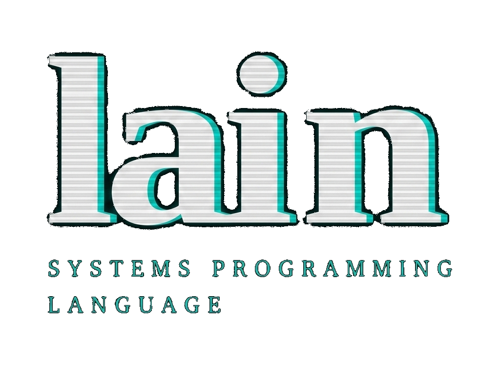

<p align="center">
  
</p>

<p align="center">
  <a href="https://lain-blush.vercel.app/"><strong>Official Website</strong></a>
</p>

Lain is a statically typed, compiled programming language designed for embedded systems, safety-critical software, and systems programming. Memory safety and resource safety are guaranteed entirely at compile time: no garbage collector, no reference counting, no runtime bounds checks.

---

## Safety Guarantees

| Safety Concern | Guarantee | Mechanism |
|:---------------|:----------|:----------|
| **Buffer Overflows** | Impossible | Value Range Analysis (§8) verifies every array access at compile time |
| **Use-After-Free** | Impossible | Linear types (`mov`) ensure resources are consumed exactly once |
| **Double Free** | Impossible | Ownership is linear; a resource is consumed exactly once |
| **Data Races** | Impossible | Borrow checker enforces exclusive mutability |
| **Null Dereference** | Prevented | Pointer dereference requires `unsafe` |
| **Memory Leaks** | Prevented | Linear variables must be consumed; forgetting is a compile error |
| **Division by Zero** | Prevented | Type constraints (`b int != 0`) enforce non-zero divisors |
| **Integer Overflow** | Defined | Signed: two's complement wrapping (`-fwrapv`). Unsigned: modular arithmetic |
| **Purity Violations** | Impossible | `func` cannot call `proc`, access globals, or have unbounded loops |

---

## Compilation Model

```
.ln source -> [Lain Compiler] -> out.c -> [gcc/clang] -> executable
```

All safety checks (ownership, borrowing, bounds, purity, pattern exhaustiveness) happen during compilation. The generated C99 code contains no runtime checks.

---

## Quick Start

**Build the compiler:**
```bash
gcc src/main.c -o compiler -std=c99 -Wall -Wextra \
    -Wno-unused-function -Wno-unused-parameter
```

**Compile a Lain program:**
```bash
# Step 1: Lain -> C
./compiler my_program.ln

# Step 2: C -> Executable
gcc out.c -o my_program -Dlibc_printf=printf -Dlibc_puts=puts -w

# Step 3: Run
./my_program
```

**Run the test suite:**
```bash
./run_tests.sh
```

---

## Language Reference

---

## 1. Lexical Structure

### 1.1 Keywords

The following identifiers are reserved keywords and cannot be used as variable or function names.

**Core keywords:**
| Keyword | Purpose |
|:--------|:--------|
| `var` | Mutable variable declaration |
| `mov` | Ownership transfer (move semantics) |
| `type` | Type definition (structs, enums, ADTs) |
| `func` | Pure function declaration |
| `proc` | Procedure declaration (side effects allowed) |
| `return` | Return a value from a function/procedure |
| `if` | Conditional branch |
| `elif` | Else-if branch |
| `else` | Default branch in conditional/case |
| `for` | Range-based for loop |
| `while` | While loop |
| `decreasing` | Termination measure for bounded `while` in `func` |
| `break` | Exit the innermost loop |
| `continue` | Skip to the next iteration |
| `case` | Pattern matching |
| `in` | Range iteration / index bound constraint / bounds-proving condition |
| `and` | Logical AND |
| `or` | Logical OR |
| `true` | Boolean true literal |
| `false` | Boolean false literal |
| `as` | Type cast operator |
| `import` | Module import |
| `extern` | External (C) declaration |
| `unsafe` | Unsafe block |
| `c_include` | Include a C header file |
| `defer` | Defer execution until end of scope |
| `comptime` | Compile-time parameter |
| `undefined` | Uninitialized explicit escape hatch |

> [!NOTE]
> **Reserved for future use**: The following keywords are recognized by the lexer but not yet fully implemented:
> `macro`, `expr`, `pre`, `post`, `use`, `end`, `export`.
> The keyword `fun` is accepted as an alias for `func`.

### 1.2 Operators & Punctuation

**Arithmetic operators:**
| Operator | Description |
|:---------|:------------|
| `+` | Addition |
| `-` | Subtraction / Unary negation |
| `*` | Multiplication / Pointer dereference |
| `/` | Division |
| `%` | Modulo |

**Comparison operators:**
| Operator | Description |
|:---------|:------------|
| `==` | Equal |
| `!=` | Not equal |
| `<` | Less than |
| `>` | Greater than |
| `<=` | Less than or equal |
| `>=` | Greater than or equal |

**Logical operators:**
| Operator | Description |
|:---------|:------------|
| `and` | Logical AND (keyword) |
| `or` | Logical OR (keyword) |
| `!` | Logical NOT (prefix) |

**Bitwise operators:**
| Operator | Description |
|:---------|:------------|
| `&` | Bitwise AND |
| `\|` | Bitwise OR |
| `^` | Bitwise XOR |
| `~` | Bitwise NOT (complement) |
| `<<` | Left shift |
| `>>` | Right shift |

**Assignment operators:**
| Operator | Description |
|:---------|:------------|
| `=` | Assignment |
| `+=` | Add and assign |
| `-=` | Subtract and assign |
| `*=` | Multiply and assign |
| `/=` | Divide and assign |
| `%=` | Modulo and assign |
| `&=` | Bitwise AND and assign |
| `\|=` | Bitwise OR and assign |
| `^=` | Bitwise XOR and assign |

> [!NOTE]
> Compound assignments (`+=`, `-=`, etc.) are desugared by the parser into `x = x + expr` form.

**Other punctuation:**
| Symbol | Description |
|:-------|:------------|
| `(` `)` | Grouping, function calls, tuple construction |
| `[` `]` | Array indexing, array/slice type syntax |
| `{` `}` | Blocks, struct/ADT bodies |
| `.` | Field access, module path separator |
| `..` | Range (exclusive end) |
| `..=` | Range (inclusive end, *reserved*) |
| `...` | Variadic parameters (in `extern` declarations) |
| `,` | Separator in lists |
| `:` | Match arm separator, sentinel in slice types |
| `;` | Statement terminator (optional) |

### 1.3 Literals

**Integer literals:**
```lain
42          // Decimal integer
0           // Zero
-1          // Negative (unary minus + literal)
```
> [!WARNING]
> Only decimal integer literals are currently supported. Hex, octal, and binary literals are not yet implemented.

**Character literals:**
```lain
'A'         // Character literal
'\n'        // Escape sequence
'\0'        // Null character
```

Recognized escape sequences: `\n` (0x0A), `\t` (0x09), `\r` (0x0D), `\0` (0x00), `\\` (0x5C), `\"` (0x22), `\'` (0x27).

**String literals:**
```lain
"Hello, World!\n"    // String literal with escape sequence
```
String literals have type `u8[:0]` (null-terminated sentinel slice). They expose two fields:
- `.data`: pointer to the raw bytes (`*u8`)
- `.len`: length of the string, excluding the sentinel

```lain
var s = "Hello"
libc_printf("Length: %d\n", s.len)   // 5
libc_printf("Content: %s\n", s.data) // Hello
```

### 1.4 Comments

```lain
// Single-line comment
/* Multi-line
   comment */
```

### 1.5 Statement Termination

Semicolons are **optional**. Both styles are valid:

```lain
var x = 10;    // With semicolon
var y = 20     // Without semicolon
```

---

## 2. Type System

### 2.1 Primitive Types

**Integers:**

| Type | Description | C Equivalent |
|:-----|:------------|:-------------|
| `int` | Signed integer (platform-dependent, typically 32-bit) | `int` |
| `i8` | Signed 8-bit integer | `int8_t` |
| `i16` | Signed 16-bit integer | `int16_t` |
| `i32` | Signed 32-bit integer | `int32_t` |
| `i64` | Signed 64-bit integer | `int64_t` |
| `u8` | Unsigned 8-bit integer | `uint8_t` |
| `u16` | Unsigned 16-bit integer | `uint16_t` |
| `u32` | Unsigned 32-bit integer | `uint32_t` |
| `u64` | Unsigned 64-bit integer | `uint64_t` |
| `isize` | Signed pointer-sized integer | `ptrdiff_t` |
| `usize` | Unsigned pointer-sized integer | `size_t` |

> [!NOTE]
> Fixed-width integer types require `<stdint.h>` in the generated C code (included automatically).
> The type `int` is platform-dependent (typically 32-bit). Prefer `i32` for portable fixed-width semantics.
> **Overflow Behavior**: Signed integer overflows result in two's complement wrap-around. The compiler injects `-fwrapv` automatically. Unsigned integers use modular arithmetic.

**Floating-point:**

| Type | Description | C Equivalent |
|:-----|:------------|:-------------|
| `f32` | 32-bit IEEE 754 floating-point | `float` |
| `f64` | 64-bit IEEE 754 floating-point | `double` |

Floating-point types support the standard arithmetic operators (`+`, `-`, `*`, `/`) and comparison operators. The modulo operator `%` is **not** available for floating-point types.

```lain
var pi f64 = 3
var radius f32 = 5
```

**Boolean:**

| Type | Description | C Equivalent |
|:-----|:------------|:-------------|
| `bool` | Boolean type with values `true` and `false` | `_Bool` |

```lain
var x bool = true
var y bool = false

if x {
    libc_printf("x is true\n")
}
```

### 2.2 Implicit Integer Widening

Lain allows **implicit widening**: a value of lower rank can be used where a higher-rank type is expected, without an explicit cast.

**Rank hierarchy:**

| Rank | Types |
|:-----|:------|
| 1 | `u8`, `i8` |
| 2 | `u16`, `i16` |
| 3 | `u32`, `i32`, `int` |
| 4 | `u64`, `i64` |
| 5 | `usize`, `isize` |

In a binary expression, the result type is the type of the higher-rank operand. **Narrowing** (high rank to low rank), `float`/`int` conversions, and pointer casts always require an explicit `as` cast.

```lain
var x u8 = 42
var y int = x           // OK: implicit widening u8 -> int
var z = x + 1000        // result type: int (1000 is int, wider than u8)

var n i32 = 1000
var b = n as u8         // explicit cast (truncation: 1000 -> 232)
var f = n as f64        // explicit cast: int -> float
```

### 2.3 Pointer Types

Pointer types use the prefix `*` syntax:

```lain
*int       // Pointer to int (shared, read-only)
var *int   // Mutable pointer to int
mov *int   // Owned pointer (linear)
*u8        // Pointer to u8 (C string compatible)
*void      // Opaque pointer (like C's void*)
```

| Syntax | Mode | C Equivalent |
|:-------|:-----|:-------------|
| `*T` | Shared (read-only) | `const T*` |
| `var *T` | Mutable | `T*` |
| `mov *T` | Owned (linear) | `T*` |

Raw pointer dereference and address-of (`&x`) are only allowed inside `unsafe` blocks (see §11).

### 2.4 Array Types

Arrays are fixed-size, stack-allocated collections. The size is part of the type.

```lain
var arr int[5]        // Array of 5 ints
var bytes u8[256]     // Array of 256 bytes
```

**Initialization:**
```lain
var arr int[3]
arr[0] = 10
arr[1] = 20
arr[2] = 30
```

**Indexing:**
```lain
arr[0] = 10
var x = arr[0]
```

Array indices are **statically verified** at compile time. Accessing an out-of-bounds index is a compile error (see §8).

### 2.5 Slice Types

Slices are dynamic views into arrays. They consist of a pointer and a length.

```lain
var s int[] = arr[0..3]   // Slice of elements [0, 1, 2]
```

All slice types (`T[]`) expose two fields:
- `.data`: pointer to the underlying data (`*T`)
- `.len`: number of elements in the slice

**Sentinel-terminated slices** end with a known sentinel value (typically `0`):

```lain
u8[:0]     // Null-terminated byte slice (C string compatible)
```

### 2.6 String Literals

String literals have type `u8[:0]` (null-terminated sentinel slice).

```lain
var greeting = "Hello, Lain!"       // Type: u8[:0]
var msg u8[:0] = "Explicit type"    // Explicit annotation
```

Strings can be passed to functions expecting `u8[:0]` or to C functions via `.data`:

```lain
func greet(msg u8[:0]) {
    libc_printf("Message: %s\n", msg.data)
}
```

### 2.7 Struct Types

Structs are defined using the `type` keyword.

**Definition:**
```lain
type Point {
    x int
    y int
}
```

**Construction** (two forms):

*Positional construction:*
```lain
var p = Point(10, 20)     // Fields assigned by position
```

*Field-by-field assignment:*
```lain
var p Point
p.x = 10
p.y = 20
```

**Field access:**
```lain
var x = p.x
var y = p.y
```

**Copy semantics:**
By default, assigning a struct creates a copy (for non-linear structs):
```lain
var p2 = p          // Copy of p
p2.x = 30           // Does not modify p
```

**Linear fields:**
Struct fields annotated with `mov` indicate ownership and make the containing struct **linear** (move-only):

```lain
type File {
    mov handle *FILE     // Owned handle; makes the struct linear
}
```

### 2.8 Algebraic Data Types (ADTs)

Lain uses a unified syntax for enums, tagged unions, and algebraic data types. All are defined with `type`.

**Simple enum (no data):**
```lain
type Color {
    Red,
    Green,
    Blue
}
```

**ADT with variant data:**
```lain
type Shape {
    Circle { radius int }
    Rectangle { width int, height int }
    Point                               // Unit variant (no data)
}
```

**Construction:**
```lain
var c = Color.Red
var shape = Shape.Circle(10)
var rect = Shape.Rectangle(5, 8)
var p = Shape.Point
```

**Pattern matching & Data Extraction:**
See §6.5 for `case` expressions.

> [!IMPORTANT]
> The `case` expression is the **only** mechanism to safely extract data from an ADT variant. Lain does not permit direct property access (e.g., `shape.radius`) on an ADT, because the compiler cannot statically guarantee that the ADT currently holds that specific variant.

**Direct Field Notation (Unsafe Extraction):**
If you are certain of the active variant and need to bypass the branching overhead, you can extract the field directly using the variant name. This is **only allowed** inside an `unsafe` block.

```lain
var s = Shape.Circle(10)
unsafe {
    var r = s.Circle.radius // Zero-overhead direct C union access
}
```

If the variant at runtime is actually a `Rectangle`, this will yield garbage data, living up to its `unsafe` name.

### 2.9 Opaque Types (`extern type`)

Opaque types declare a type whose size and layout are unknown to Lain. They can only be used behind pointers.

```lain
extern type FILE      // C's FILE struct
```

**Rules:**
- Can only be used as `*FILE`, never by value.
- Instantiating by value (`var f FILE`) is a compile error.
- Emitted as `typedef struct FILE FILE;` in the generated C code.

```lain
extern type FILE
extern func fopen(filename *u8, mode *u8) mov *FILE
extern func fclose(stream mov *FILE) int
```

### 2.10 The `void` Type

The `void` keyword represents the absence of a value. It is exclusively used for declaring opaque pointers (`*void`, analogous to C's `void*`).
Variables cannot be declared of type `void` (`var x void` is a compile error).

### 2.11 Nested Types (Namespaces)

Types can be nested within other types to create logical namespaces.

```lain
type Token {
    // ...
}

// Nested type definition using dot notation
type Token.Kind {
    Identifier,
    Number,
    String
}
```

Nested types are accessed using the same dot notation: `var kind Token.Kind = Token.Kind.Identifier`.

---

## 3. Variables & Mutability

Lain enforces a clear distinction between immutable and mutable bindings.

### 3.1 Immutable Bindings (Default)

Variables declared by simple assignment are **immutable**. They must be initialized and cannot be reassigned.

```lain
x = 10           // Immutable binding
// x = 20        // ERROR: Cannot assign to immutable variable
```

### 3.2 Mutable Bindings (`var`)

The `var` keyword creates a mutable binding. All variables *must* be initialized at declaration.

```lain
var y = 10       // Mutable binding with initialization
y = 20           // OK: y is mutable
```

To deliberately leave a variable uninitialized (e.g., for a large stack buffer), use `undefined`:

```lain
var buffer u8[4096] = undefined  // Zero-cost stack allocation, data is garbage
```

> [!WARNING]
> The compiler enforces **Definite Initialization Analysis**. If a variable is declared with `= undefined`, the compiler flow-sensitively tracks whether it is assigned before it is read. Reading an uninitialized variable on any code path is a hard compile error.

### 3.3 Type Annotations

Types can be optionally specified on any declaration:

```lain
var z int = 30            // Explicit type
var arr u8[5]             // Array with explicit type
name = "Lain"             // Inferred as u8[:0]
```

### 3.4 Global Variables

Variables can be declared at module (file) scope:

```lain
var global_counter int    // Mutable global variable
```

> [!WARNING]
> Pure functions (`func`) **cannot** read or write global variables. Only procedures (`proc`) may access global mutable state.

### 3.5 Binding vs. Assignment Disambiguation

- If `x` is **not** already in scope: `x = 10` creates a **new immutable binding**.
- If `x` **is** already in scope and was declared `var`: `x = 10` is an **assignment**.
- If `x` **is** already in scope and is immutable: `x = 10` is a **compile error**.

```lain
x = 10           // New immutable binding (x not in scope before)
var y = 20       // New mutable binding
y = 30           // Assignment (y was declared var)
// x = 40        // ERROR: x is immutable
```

### 3.6 Lexical Block Scoping

Variables declared within a block are only visible within that block. **Shadowing** is allowed: declaring a variable with the same name as an outer variable creates an independent inner variable.

```lain
var x = 10
if true {
    var x = 20       // Shadows outer x (independent variable)
    // x is 20 here
}
// x is 10 here again
```

## 4. Ownership & Borrowing

Lain guarantees memory safety without garbage collection through a strict **Ownership & Borrowing** system based on linear logic.

### 4.1 Ownership Modes

Every parameter, variable and field has one of three ownership modes:

| Mode | Syntax | Semantics | C Emission |
|:-----|:-------|:----------|:-----------|
| **Shared** | `p T` | Immutable borrow. Multiple shared references can coexist. | `const T*` |
| **Mutable** | `var p T` | Exclusive read-write borrow. Only one at a time. | `T*` |
| **Owned** | `mov p T` | Ownership transfer. Value must be consumed exactly once. | `T` (by value) |

### 4.2 Move Semantics (`mov`)

The `mov` operator transfers ownership of a value. After a move, the source variable is **invalidated**.

**Variable-to-variable move:**
```lain
var a Resource
a.id = 1
var b = mov a       // a is moved into b
// a.id             // ERROR [E001]: Use after move
```

**Move at function call site:**
```lain
take_ownership(mov resource)
// resource is now invalid
```

**Returning ownership:**
```lain
func wrap(mov r Resource) Container {
    return Container(mov r)    // Transfer ownership into return value
}
```

### 4.3 Linear Types

A type is **linear** if it has a `mov` field, or if it transitively contains a linear field. A linear value must be consumed **exactly once**:

- Not consumed at scope end: `[E002]`
- Consumed twice (double move): `[E003]`
- Moved inside a loop: `[E006]`

```lain
type File {
    mov handle *FILE   // Linear field -> File is linear
}

proc leak() {
    var f = open_file("data.txt", "r")
    // ERROR [E002]: linear variable 'f' not consumed before end of scope
}

proc correct() {
    var f = open_file("data.txt", "r")
    close_file(mov f)  // Consumed: OK
}
```

If a linear variable is consumed in one branch of an `if` but not the other, the compiler emits `[E007]`. All execution paths must uniformly consume (or not consume) linear variables.

### 4.4 Borrowing Rules (Read-Write Lock)

Lain enforces a "Read-Write Lock" model at compile time:

1. **Multiple shared borrows** are allowed simultaneously.
2. **Exactly one mutable borrow** is allowed at a time.
3. **Shared and mutable borrows cannot coexist** for the same variable.

| Active borrows | Operation attempted | Result |
|:---------------|:--------------------|:-------|
| None | Shared borrow | OK |
| None | Mutable borrow | OK |
| Shared borrow(s) | Shared borrow | OK |
| Shared borrow(s) | Mutable borrow | **Error** `[E004]` |
| Mutable borrow | Any other borrow | **Error** `[E004]` |
| Any active borrow | Move | **Error** `[E005]` |

**Conflict example (compile error):**
```lain
// ERROR: Same variable borrowed as shared AND mutable in the same call
modify_both(data, var data)
```

#### Two-Phase Borrows

When calling a method via UFCS (e.g., `x.method(x.field)`), the compiler desugars it to `method(var x, x.field)`. Without special handling, the mutable borrow of `x` for the first parameter would block reading `x.field` for the second.

Lain solves this with **two-phase borrows** (inspired by Rust RFC 2025). During argument evaluation, mutable borrows are registered in a **RESERVED** phase that permits shared reads of the same owner. After all arguments are evaluated, reserved borrows are promoted to **ACTIVE** (fully exclusive).

```lain
type Vec { data int, cap int }
proc push_n(var v Vec, n int) { v.data = v.data + n }

proc main() int {
    var v = Vec(0, 10)
    v.push_n(v.cap)      // OK: v.cap is a shared read during RESERVED phase
    return v.data         // 10
}
```

Two-phase borrows do **not** permit moves or mutable writes during the reserved phase; only shared reads.

### 4.5 Non-Lexical Lifetimes (NLL)

Borrows expire at their **last use**, not at the end of the lexical scope. This makes many common patterns valid that a purely scope-based system would reject.

```lain
var data = Buffer(0)

// OK: The shared borrow `read(data)` expires after evaluation.
// It does not conflict with the mutable borrow `mutate(var data)` inside the loop body.
while read(data) < 10 {
    mutate(var data)
}
```

### 4.6 Caller-Site Annotations

When calling a function, the caller must explicitly annotate `var` and `mov` to signal the intended ownership:

```lain
func read_data(d Data) int { return d.value }            // Shared borrow
func modify_data(var d Data) { d.value = d.value + 1 }   // Mutable borrow
func consume_data(mov d Data) { /* ... */ }               // Ownership transfer

// Call sites:
read_data(data)           // Implicit shared borrow
modify_data(var data)     // Explicit mutable borrow
consume_data(mov data)    // Explicit ownership transfer
```

### 4.7 Destructuring in Parameters

Parameters can be destructured at the function signature level:

```lain
func drop(mov {id} Resource) {
    // 'id' is extracted from Resource, consuming the struct
}
```

### 4.8 Return Ownership

**`return mov` — transfer ownership:**
```lain
func transfer(mov item Item) Item {
    return mov item       // Transfer ownership to the caller
}
```

**`return var` — return a mutable reference:**
```lain
func get_ref(var ctx Context) var int {
    return var ctx.counter    // Return a mutable reference to a field
}
```

> [!WARNING]
> Returning a mutable reference to a local variable is a compile error because it creates a dangling pointer. `return var` is restricted to references to data that outlives the function (such as fields of `var` parameters).

**`return` (default) — return by value (copy):**
```lain
func compute(a int, b int) int {
    return a + b          // Return a copy
}
```

---

## 5. Functions & Procedures

Lain enforces a strict boundary between pure computation and side effects.

### 5.1 Pure Functions (`func`)

Functions declared with `func` are **pure, deterministic, and guaranteed to terminate**.

**Restrictions:**
- Cannot modify global state.
- Cannot call procedures (`proc`).
- Cannot recurse (direct recursion is a compile error).
- Can only use `for` loops (over finite ranges) and bounded `while` loops with a termination measure. Unbounded `while` loops are banned.

```lain
func add(a int, b int) int {
    return a + b
}
```

**Termination guarantee:**
```lain
// ERROR: Recursion not allowed in pure function
func factorial(n int) int {
    if n <= 1 { return 1 }
    return n * factorial(n - 1)    // Compile error [E011]
}
```

### 5.2 Procedures (`proc`)

Procedures declared with `proc` can have side effects, perform I/O, modify global state, and recurse.

```lain
proc log(msg u8[:0]) {
    printf("%s\n", msg)        // Side effect: I/O
}

proc fib(n int) int {
    if n < 2 { return n }
    return fib(n-1) + fib(n-2) // Recursion: OK in proc
}
```

### 5.3 Parameter Modes

Both `func` and `proc` support three parameter modes:

```lain
func process(
    id int,             // Shared borrow (read-only)
    var ctx Context,    // Mutable borrow (read-write)
    mov res Resource    // Owned (consumed by function)
) { /* ... */ }
```

See §4.1 for full semantics.

### 5.4 Return Types & Void Functions

```lain
func add(a int, b int) int {    // Returns int
    return a + b
}

proc greet(msg u8[:0]) {        // Void (no return type)
    libc_printf("%s\n", msg.data)
}

proc main() int {               // main must always be 'proc'
    return 0
}
```

In void functions, `return` at the end of the block is optional. Using `return` without an expression is allowed for early exit:
```lain
func check(valid bool) {
    if !valid { return }   // Early exit from void function
    // ...
}
```

> [!IMPORTANT]
> The `main` function **must** be declared as `proc main()`. Declaring `main` as `func` is a compile error.

### 5.5 Termination Guarantees

| Feature | `func` | `proc` |
|:--------|:-------|:-------|
| Pure (no side effects) | Required | Not required |
| `for` loops | Allowed | Allowed |
| Unbounded `while` | Banned | Allowed |
| Bounded `while` (`decreasing`) | Allowed | Allowed |
| Recursion | Banned | Allowed |
| Global state access | Banned | Allowed |
| Calling `proc` | Banned | Allowed |
| Calling `func` | Allowed | Allowed |
| Calling `extern func` | Allowed | Allowed |
| Calling `extern proc` | Banned | Allowed |

> [!NOTE]
> **`extern func` vs `extern proc`**: External C functions declared as `extern func` are trusted to be pure (no side effects). External C functions declared as `extern proc` may have side effects. A pure `func` can call `extern func` but not `extern proc`.
>
> Example: `extern func abs(n int) int` is pure, callable from `func`.
> Example: `extern proc printf(fmt *u8, ...) int` is impure, callable only from `proc`.

### 5.6 Universal Function Call Syntax (UFCS)

Lain supports **UFCS** for all types. Any call of the form `target.method(arg)` is automatically translated by the compiler into `method(target, arg)`.

```lain
func is_even(n int) bool {
    return n % 2 == 0
}

proc main() {
    var x = 10
    var even = x.is_even()  // Equivalent to: is_even(x)
}
```

This works for all types, including slices, pointers, and structs. The ownership mode of the first parameter is inferred automatically from the function declaration:

```lain
func push(var v Vec, item int) { /* ... */ }
v.push(42)   // Desugars to: push(var v, 42)
```

---

## 6. Control Flow

### 6.1 If / Elif / Else

```lain
if x > 10 {
    // ...
} elif x > 5 {
    // ...
} else {
    // ...
}
```

Conditions do not require parentheses. The body must be enclosed in `{ }`. The condition contributes to **range analysis**: inside the `if x < y` branch, the compiler knows `x < y` and propagates this constraint (see §8).

### 6.2 For Loops (Range-Based)

For loops iterate over finite ranges. They are allowed in both `func` and `proc`.

**Single variable form:**
```lain
for i in 0..n {
    // i ranges from 0 to n-1 (exclusive end)
}
```

**Two variable form:**
```lain
for i, val in 0..10 {
    // i = index, val = value (same as i for integer ranges)
}
```

> [!NOTE]
> The loop variable `i` is statically known to be in `[0, n-1]`, enabling safe array indexing without runtime checks.

### 6.3 While Loops

Unbounded while loops are **only allowed in `proc`** (not in `func`).

```lain
proc count_up() {
    var i = 0
    while i < 10 {
        libc_printf("%d ", i)
        i = i + 1
    }
}
```

**Infinite loop pattern:**
```lain
while 1 {
    if done { break }
}
```

#### Bounded While — Termination Measure

A `while` loop may carry an optional **termination measure** via the `decreasing` keyword. When present, the loop is also allowed inside `func`, because the compiler statically verifies that:

1. The measure is **non-negative** when the loop condition holds.
2. The measure **strictly decreases** on every iteration.

```lain
func count_up(n int) int {
    var i = 0
    while i < n decreasing n - i {  // measure: n - i
        i += 1                       // i increases, so n - i decreases
    }
    return i
}
```

This enables provably-terminating finite state machines (lexers, parsers, protocol handlers) to be expressed as pure `func`.

**Supported patterns:**

| Condition | Measure | Why it works |
|:----------|:--------|:-------------|
| `i < n` | `n - i` | `i` increases, so measure decreases |
| `n > 0` | `n` | `n` decreases directly |
| `a < b` | `b - a` | Either `a` increases or `b` decreases |
| `i in arr` | `arr.len - i` | `in` implies `i < arr.len` (see §8.3.2) |

The measure is compile-time only; it produces no runtime overhead.

**Error codes:**
- `[E080]`: Cannot verify measure is non-negative when condition holds
- `[E081]`: Cannot extract variables from measure expression
- `[E082]`: Cannot verify measure strictly decreases each iteration

### 6.4 Break & Continue

`break` exits the innermost loop. `continue` skips to the next iteration.

```lain
proc example() {
    var i = 0
    while i < 10 {
        i = i + 1
        if i == 5 { continue }    // Skip 5
        if i == 8 { break }       // Stop at 8
        libc_printf("%d ", i)
    }
    // Output: 1 2 3 4 6 7
}
```

### 6.5 Case (Pattern Matching)

`case` is used for pattern matching on enums, ADTs, characters, and integer values. It can act as either a **statement** or an **expression**.

**Matching on an enum:**
```lain
case color {
    Red:   libc_printf("Red\n")
    Green: libc_printf("Green\n")
    Blue:  libc_printf("Blue\n")
}
```

**Matching on an ADT with destructuring:**
```lain
case shape {
    Circle(r):        libc_printf("Circle radius: %d\n", r)
    Rectangle(w, h):  libc_printf("Rect: %d x %d\n", w, h)
    Point:            libc_printf("Just a point\n")
}
```

**Matching with multiple patterns and ranges:**
Cases support comma-separated pattern lists and ranges (`start..end`), which are inclusive bounds:
```lain
case character {
    'a'..'z', 'A'..'Z': libc_printf("Alphabetical\n")
    '0'..'9':           libc_printf("Digit\n")
    '_', '-':           libc_printf("Symbol\n")
    else:               libc_printf("Other\n")
}
```

**Case Expressions:**
A `case` block can be evaluated as an expression. All branches must yield the same type:
```lain
var size = case width {
    1..10:  "Small"
    11..50: "Medium"
    else:   "Large"
}

var area = case shape {
    Circle(r):       r * r * 314 / 100
    Rectangle(w, h): w * h
    Point:           0
}
```

**Matching on integers** (requires `else` for exhaustiveness):
```lain
case x {
    1: return 1
    2: return 2
    else: return 0    // Required: integers are not finite
}
```

**Case arms** can be:
- A single expression: `Red: return 1`
- A block: `Red: { libc_printf("red\n"); return 1 }`
- Multiple patterns/ranges: `1, 2, 5..10: return 2`

#### Non-Consuming Match (`case &expr`)

By default, `case expr` consumes the scrutinee (for linear types). To inspect a value **without consuming it**, prefix the scrutinee with `&`:

```lain
var x = 42
var result = 0
case &x {            // Borrowed match: x is NOT consumed
    42: result = 1
    else: result = 0
}
return x + result    // x is still usable: returns 43
```

The `&` registers a shared borrow on the scrutinee for the duration of the match. This prevents mutation inside the match arms:

```lain
var x = 42
case &x {
    42: x = 99       // ERROR [E004]: cannot mutate 'x' because it is borrowed
    else: x = 0
}
```

Particularly useful with ADTs where you want to inspect a variant without consuming the value:

```lain
case &shape {
    Circle(r):      libc_printf("radius: %d\n", r)
    Rectangle(w, h): libc_printf("area: %d\n", w * h)
}
// shape is still available here
```

### 6.6 Exhaustiveness Checking

`case` statements must be **exhaustive**. The compiler verifies:

1. **Enums**: All variants must be covered, OR an `else` arm must be present.
2. **ADTs**: All variants must be covered, OR an `else` arm must be present.
3. **Integers**: An `else` arm is always required (integers are not finite).

```lain
// OK: All 3 variants covered, no 'else' needed
type Status { Ready, Running, Done }
case s {
    Ready:   /* ... */
    Running: /* ... */
    Done:    /* ... */
}

// ERROR [E014]: Missing 'Done' variant and no 'else'
case s {
    Ready:   /* ... */
    Running: /* ... */
}
```

### 6.7 Defer Statement

The `defer` statement defers execution of a block until the end of the current lexical scope. It is the primary mechanism for deterministic resource cleanup (RAII).

```lain
proc process_file() {
    var f = open_file("data.txt", "r")
    defer {
        close_file(mov f)
    }

    // ... use f ...
    // f is automatically closed when the function returns or exits the block
}
```

**Rules for defer:**
1. Deferred blocks execute in reverse order (LIFO, Last In First Out).
2. They execute on all exit paths: normal return, `return`, `break`, or `continue`.
3. If control flow exits multiple scopes, all `defer` statements from exited scopes are executed in the correct order.
4. `defer` blocks cannot contain `return`, `break`, or `continue` statements that escape the block.

---

## 7. Expressions & Operators

### 7.1 Arithmetic

```lain
a + b      // Addition
a - b      // Subtraction
a * b      // Multiplication
a / b      // Integer division
a % b      // Modulo (remainder)
```

### 7.2 Comparison

```lain
a == b     // Equal
a != b     // Not equal
a < b      // Less than
a > b      // Greater than
a <= b     // Less than or equal
a >= b     // Greater than or equal
```

### 7.3 Logical Operators

Lain uses keyword-based logical operators:

```lain
x > 0 and x < 100    // Logical AND
x == 0 or x == 1     // Logical OR
!condition            // Logical NOT
```

### 7.4 Bitwise Operators

```lain
a & b      // Bitwise AND
a | b      // Bitwise OR
a ^ b      // Bitwise XOR
~a         // Bitwise NOT (complement)
a << n     // Left shift
a >> n     // Right shift
```

### 7.5 Compound Assignment

All compound assignment operators are syntactic sugar:

```lain
x += 5     // Equivalent to: x = x + 5
x -= 3     // Equivalent to: x = x - 3
x *= 2     // Equivalent to: x = x * 2
x /= 4     // Equivalent to: x = x / 4
x %= 3     // Equivalent to: x = x % 3
x &= mask  // Equivalent to: x = x & mask
x |= flag  // Equivalent to: x = x | flag
x ^= bits  // Equivalent to: x = x ^ bits
```

### 7.6 Type Cast (`as`)

The `as` operator performs explicit type conversions between numeric types:

```lain
var x i32 = 1000
var y = x as u8           // Truncate i32 to u8 (wrapping)
var big = 42 as i64       // Widen int to i64
var small = 300 as u8     // Truncate to u8 (300 -> 44)
var n = 'A' as int        // char to int: 65
```

**Rules:**
- Conversions between integer types are always allowed (truncation may occur).
- Pointer casts (`*int as *void`) require an `unsafe` block.
- Non-numeric casts (e.g., struct to int) are not allowed.

### 7.7 Operator Precedence

| Precedence | Operators | Associativity | Description |
|:-----------|:----------|:-------------|:------------|
| 1 (highest) | `()` `[]` `.` | Left | Grouping, indexing, field access |
| 2 | `!` `~` `-` `*` | Right | Unary NOT, complement, negation, deref |
| 3 | `as` | Left | Type cast |
| 4 | `*` `/` `%` | Left | Multiplicative |
| 5 | `+` `-` | Left | Additive |
| 6 | `<<` `>>` | Left | Bit shift |
| 7 | `&` | Left | Bitwise AND |
| 8 | `^` | Left | Bitwise XOR |
| 9 | `\|` | Left | Bitwise OR |
| 10 | `<` `>` `<=` `>=` `in` | Left | Comparison / bounds check |
| 11 | `==` `!=` | Left | Equality |
| 12 | `and` | Left | Logical AND |
| 13 (lowest) | `or` | Left | Logical OR |

> [!NOTE]
> Use parentheses to override precedence when intent is unclear: `(a + b) * c`.

### 7.8 Structural Equality

The equality operators (`==` and `!=`) are only supported for:
- Primitive numeric types (integers, `bool`)
- Pointers

Using `==` or `!=` directly on `struct`, `array`, or `ADT` instances is a **compile error**. Structural equality must be performed manually by comparing individual fields.

### 7.9 Numeric Conversions

Lain supports **implicit widening** between integer types: a value of lower rank can be used where a higher-rank integer is expected, without an explicit cast (see §2.2).

**Widening (implicit, no cast needed):**
```lain
var x u8 = 42
var y int = x        // OK: u8 widened to int implicitly
var z = x + 1000     // OK: result type is int
```

**Narrowing (explicit, requires `as`):**
```lain
var n int = 300
var b = n as u8      // Explicit: int -> u8 (may truncate)
```

**Float/int (explicit, requires `as`):**
```lain
var f f64 = 3
var i = f as int     // Explicit: float -> int
var g = i as f64     // Explicit: int -> float
```

**Pointer casts (requires `unsafe`):**
```lain
unsafe {
    var vp = ptr as *void    // pointer cast inside unsafe
}
```

### 7.10 Evaluation Order

The evaluation of expressions, function arguments, and operands is strictly defined as **Left-to-Right**.
For `foo(a(), b())`, `a()` is guaranteed to execute and return before `b()` is executed.

---

## 8. Type Constraints

Lain uses **equation-style type constraints** to statically verify function requirements and guarantees. All checks are performed at compile time with zero runtime overhead.

### 8.1 Parameter Constraints

Constraints on parameters are written directly after the type:

```lain
func safe_div(a int, b int != 0) int {
    return a / b
}
```

The compiler verifies at each call site that `b` cannot be zero:
```lain
safe_div(10, 2)     // OK: 2 != 0
safe_div(10, 0)     // ERROR: 0 violates b != 0
```

**Supported constraint operators:**
| Constraint | Meaning |
|:-----------|:--------|
| `b int != 0` | b must not be zero |
| `b int > 0` | b must be positive |
| `b int >= 0` | b must be non-negative |
| `b int < a` | b must be less than a |
| `b int > a` | b must be greater than a |
| `b int == 1` | b must equal 1 |

### 8.2 Return Type Constraints

Constraints on the return value are written after the return type:

```lain
func abs(x int) int >= 0 {
    if x < 0 { return 0 - x }
    return x
}
```

The compiler verifies that **all** return paths satisfy `result >= 0`:
```lain
// ERROR: -1 does not satisfy >= 0
func bad_abs(x int) int >= 0 {
    return -1
}
```

### 8.3 Index Bounds (`in` keyword)

The `in` keyword has two complementary roles in bounds verification:

#### 8.3.1 Parameter Constraint (`i int in arr`)

As a parameter constraint, `in` declares that a value is a valid index into an array:

```lain
func get(arr int[10], i int in arr) int {
    return arr[i]      // Always safe; compiler knows i in [0, 9]
}
```

This desugars to the constraint: `i >= 0 and i < arr.len`.

```lain
get(arr, 5)      // OK: 5 in [0, 10)
get(arr, 15)     // ERROR: 15 is not in [0, 10)
```

#### 8.3.2 Bounds-Proving Condition (`idx in arr`)

As a binary expression, `idx in arr` evaluates to `true` if `0 <= idx < arr.len`. When used as the condition of an `if` or `while`, it creates an **in-guard** that authorizes `arr[idx]` accesses inside the guarded body, without `unsafe` and without runtime checks.

```lain
func peek(data u8[:0], pos int) int {
    if pos in data { return data[pos] as int }  // safe: in-guarded
    return 0
}
```

**While loops with `in`:**
```lain
func find_zero(data u8[:0]) int {
    var i = 0
    while i in data decreasing data.len - i {
        if (data[i] as int) == 0 { return i }   // safe: in-guarded
        i += 1
    }
    return 0 - 1
}
```

**And-chain composition:** The `in` guard propagates through `and`, so the right-hand side of an `and` can safely access the array:
```lain
while l.pos in l.src and (l.src[l.pos] as int) != '"' decreasing l.src.len - l.pos {
    l.pos += 1   // l.src[l.pos] is safe on both sides
}
```

**Termination integration:** `idx in arr` implies `idx < arr.len`, so the measure `arr.len - idx` is recognized as non-negative by the termination verifier (§6.3).

**Scoping:** In-guards are scoped to the body of the `if`/`while`. They do not extend to `else` branches or code after the block.

> [!NOTE]
> The `in` guard uses structural expression matching: `l.pos in l.src` guards exactly `l.src[l.pos]`, including member expressions. Accesses with different offsets (e.g., `l.src[l.pos + 1]`) are **not** guarded and still require `unsafe`.

### 8.4 Relational Constraints Between Parameters

Constraints can reference other parameters:

```lain
func require_lt(a int, b int > a) int {
    return b - a     // Always positive
}

func clamp(x int, lo int, hi int >= lo) int >= lo and <= hi {
    if x < lo { return lo }
    if x > hi { return hi }
    return x
}
```

### 8.5 Multiple Constraints

Chain constraints with `and`:

```lain
func bounded(x int >= 0 and <= 100) int {
    return x
}
```

### 8.6 Static Verification Mechanism (VRA)

The compiler uses **Value Range Analysis (VRA)**, a decidable, polynomial-time static analysis. No SMT solver is required.

| Property | Value |
|:---------|:------|
| Decidable | Yes (always terminates) |
| Complexity | Polynomial |
| Sound | Yes (does not accept invalid programs) |
| Complete | No (may reject valid programs; conservative) |
| Runtime overhead | Zero |

**How it works:**

1. **Interval tracking**: Every integer variable carries a range `[min, max]`.
   - Literals: `10` -> `[10, 10]`
   - Types: `u8` -> `[0, 255]`, `int` -> `[-2^31, 2^31-1]`

2. **Arithmetic propagation**:
   - `[a, b] + [c, d]` -> `[a+c, b+d]`
   - `[a, b] - [c, d]` -> `[a-d, b-c]`

3. **Control flow refinement**:
   - Inside `if x < 10`: `x` is narrowed to `[min, 9]`
   - Inside `else`: `x` is narrowed to `[10, max]`
   - After merge: conservative hull (union of both branches)

4. **Assignment tracking**: Ranges are updated through assignments.

5. **Linear constraint propagation**:
   ```lain
   var x = y + 1   // x = y + 1 implies x > y
   require_gt(x, y) // OK: compiler knows x > y
   ```

### 8.7 Loop Widening

Variables modified within loops are **conservatively widened** to their type's full range after the loop:

```lain
var x = 0
for i in 0..10 {
    x = x + 1
}
// x is widened to [INT_MIN, INT_MAX] after the loop
// Cannot prove x == 10 statically
```

> [!WARNING]
> This is a known limitation. Loop variables lose precision, making some post-loop constraints unverifiable. Future versions may support loop invariant annotations.

---

## 9. Module System

### 9.1 Import

The `import` keyword loads another Lain module. Module paths use dot-notation corresponding to the filesystem hierarchy:

```lain
import std.c            // Loads std/c.ln
import std.io           // Loads std/io.ln
import std.fs           // Loads std/fs.ln
import tests.stdlib.dummy   // Loads tests/stdlib/dummy.ln
import std.fs as fs         // Namespace aliasing
```

If imported without `as`, all public declarations from the imported module are injected into the current global scope. If imported with `as`, they are accessed via the namespace prefix (e.g., `fs.open_file()`).

### 9.2 Flat Namespace & C Name Mangling

After module inlining, all declarations share a flat global namespace. In the generated C code, symbols receive a prefix based on their module path:

| Lain Declaration | Generated C Name |
|:-----------------|:-----------------|
| `func add(...)` in `main.ln` | `main_add(...)` |
| `proc print(...)` in `std/io.ln` | `std_io_print(...)` |
| `type File` in `std/fs.ln` | `std_fs_File` |

Circular imports are implicitly prevented; each module is loaded at most once.

### 9.3 Standard Library

Lain ships with a minimal standard library:

| Module | Purpose |
|:-------|:--------|
| `std.c` | Core C bindings (stdio, stdlib) |
| `std.io` | Console output (`print`/`println`) |
| `std.fs` | File operations with ownership safety |
| `std.math` | Pure math utilities |
| `std.option` | Generic `Option(T)` type |
| `std.result` | Generic `Result(T, E)` type |
| `std.string` | String utilities (placeholder) |

**`std/c.ln`** — Core C bindings:
```lain
c_include "<stdio.h>"
c_include "<stdlib.h>"

extern type FILE

extern proc printf(fmt *u8, ...) int
extern proc fopen(filename *u8, mode *u8) mov *FILE
extern proc fclose(stream mov *FILE) int
extern proc fputs(s *u8, stream *FILE) int
extern proc fgets(s var *u8, n int, stream *FILE) var *u8
extern proc libc_printf(fmt *u8, ...) int
extern proc libc_puts(s *u8) int
```

> [!IMPORTANT]
> All C standard library functions that perform I/O are declared as `extern proc` because they have side effects. A pure `func` cannot call these functions.

**`std/io.ln`** — Basic I/O:
```lain
import std.c

proc print(s u8[:0]) {
    libc_printf(s.data)
}

proc println(s u8[:0]) {
    libc_puts(s.data)
}
```

**`std/fs.ln`** — File system with ownership:
```lain
import std.c

type File {
    mov handle *FILE       // Owned file handle
}

proc open_file(path u8[:0], mode u8[:0]) mov File {
    var raw = fopen(path.data, mode.data)
    return File(raw)
}

proc close_file(mov {handle} File) {
    fclose(handle)
}

proc write_file(f File, s u8[:0]) {
    fputs(s.data, f.handle)
}
```

> [!NOTE]
> The `File` type is a safe wrapper around C's `FILE*`. Because `handle` is declared `mov`, the `File` struct is **linear**: it must be explicitly consumed via `close_file(mov f)`. Forgetting to close a file is a compile error `[E002]`.

**`std/math.ln`** — Pure math utilities:

| Function | Signature | Description |
|:---------|:----------|:------------|
| `min` | `func min(a int, b int) int` | Returns the smaller of two values |
| `max` | `func max(a int, b int) int` | Returns the larger of two values |
| `abs` | `func abs(x int) int` | Returns the absolute value |
| `clamp` | `func clamp(x int, lo int, hi int) int` | Clamps x to [lo, hi] |

All functions in `std/math` are pure (`func`), with no side effects or external dependencies.

**`std/option.ln`** — Generic Option type:
```lain
type OptInt = Option(int)

proc main() int {
    var a = OptInt.Some(42)
    var b = OptInt.None

    var x = 0
    case a {
        Some(v): x = v
        None: x = 0
    }
    return x  // 42
}
```

`Option(T)` is a compile-time generic ADT with two variants: `Some { value T }` and `None`.

**`std/result.ln`** — Generic Result type:
```lain
type MyResult = Result(int, int)

proc main() int {
    var r = MyResult.Ok(15)
    var x = 0
    case r {
        Ok(v): x = v
        Err(e): x = e
    }
    return x  // 15
}
```

`Result(T, E)` is a compile-time generic ADT with variants `Ok { value T }` and `Err { error E }`. Combined with pattern matching, it provides type-safe error handling.

### 9.4 Name Resolution & Forward Declarations

Lain uses a multi-pass compiler. Functions, procedures, and types can be referenced before they are declared in the source file. There is no need for forward declarations or header files.

```lain
func main() int { return helper() }
proc helper() int { return 42 }      // OK: defined after use
```

---

## 10. C Interoperability

Lain compiles to C99 and provides first-class mechanisms for interfacing with C code.

### 10.1 `c_include` Directive

Directly includes a C header file in the generated output:

```lain
c_include "<stdio.h>"
c_include "<stdlib.h>"
c_include "my_header.h"
```

### 10.2 Extern Functions

The `extern` keyword declares functions defined in C:

```lain
extern func abs(n int) int
extern func malloc(size usize) mov *void
extern func free(ptr mov *void)
extern func exit(status int)
```

Ownership annotations (`mov`) can be applied to extern parameters and return types.
`malloc` returns `mov *void` (the caller owns the allocation).
`free` takes `mov *void` (it consumes the pointer).

### 10.3 Extern Types (Opaque)

See §2.9. Opaque types allow wrapping C handles safely:

```lain
extern type FILE
extern func fopen(filename *u8, mode *u8) mov *FILE
```

### 10.4 Variadic Parameters

C-style variadic parameters are supported in extern declarations:

```lain
extern func printf(fmt *u8, ...) int
```

The `...` is only valid in `extern` function declarations.

### 10.5 Type Mapping

| Lain Type | C Type | Context |
|:----------|:-------|:--------|
| `int` | `int` | |
| `u8` | `unsigned char` | |
| `usize` | `size_t` | |
| `*u8` (shared) | `const char *` | In extern parameters |
| `var *u8` (mutable) | `char *` | In extern parameters |
| `*T` (shared) | `const T*` | Default for shared references |
| `var *T` | `T*` | Mutable references |
| `mov *T` | `T*` | Owned pointer |

---

## 11. Unsafe Code

While Lain prioritizes safety, low-level systems programming sometimes requires bypassing safety checks.

> [!TIP]
> Before reaching for `unsafe`, consider whether the `in` keyword (§8.3.2) can prove your array access safe. Code like `if idx in arr { arr[idx] }` or `while i in data decreasing data.len - i { data[i] }` is fully verified at compile time with zero runtime overhead.

### 11.1 Unsafe Blocks

Operations that bypass safety checks must be enclosed in an `unsafe` block:

```lain
unsafe {
    var val = *ptr      // Pointer dereference: OK inside unsafe
    *ptr = 42           // Write through pointer
    var addr = &x       // Address-of: OK inside unsafe
}

// var val = *ptr       // ERROR: Dereference outside unsafe block
```

### 11.2 What `unsafe` Does NOT Disable

`unsafe` only disables the specific operations listed in §11.1. The following remain fully active inside `unsafe` blocks:

- Ownership tracking and move semantics (`[E001]`, `[E002]`, `[E003]`)
- Borrow checking (`[E004]`, `[E005]`)
- Type checking
- VRA bounds verification
- Pattern exhaustiveness checking
- Purity enforcement

```lain
unsafe {
    consume(mov resource)
    // consume(mov resource)  // ERROR [E003]: double move (even inside unsafe)
}
```

### 11.3 Raw Pointers

Raw pointers (`*int`, `*void`) bypass Lain's ownership system. **Dereferencing** a raw pointer is only allowed inside `unsafe` blocks.

```lain
func main() {
    var p *int = 0

    unsafe {
        var y = *p      // OK (compiles, though dangerous at runtime)
    }
}
```

### 11.4 The Address-Of Operator (`&`)

The unary address-of operator `&` creates a raw pointer to a local variable. Taking the address of a local variable is **only allowed inside an `unsafe` block**.

```lain
proc main() int {
    var x = 42

    unsafe {
        var p = &x      // OK: p is of type *int
        *p = 100        // Mutates x
    }
    return x            // Returns 100
}
```

### 11.5 Nesting Rules

Unsafe blocks can be nested and combined with control flow:

```lain
unsafe {
    unsafe {
        var val = *p    // OK: nested unsafe
    }
    var val2 = *p       // OK: still inside outer unsafe
}
```

### 11.6 Null Pointers & C Interop

Lain does not have a native `null` concept for its safe reference types. However, pointers returned by `extern` functions (like `*void` from `malloc` or `*FILE` from `fopen`) can natively be null. To safely handle C-interop pointers, they must be validated against `0` before being wrapped in safe Lain types.

---

## 12. Safety Guarantees

Lain eliminates entire classes of bugs at compile time without runtime overhead.

| Safety Concern | Guarantee | Mechanism |
|:---------------|:----------|:----------|
| **Buffer Overflows** | Impossible | Static Range Analysis (§8) verifies every array access at compile time. No runtime bounds checks needed. |
| **Use-After-Free** | Impossible | Linear Types (`mov`) ensure resources are consumed exactly once. Accessing a moved variable is a compile error. |
| **Double Free** | Impossible | Ownership is linear; a resource must be consumed exactly once, preventing double destruction. |
| **Data Races** | Impossible | The Borrow Checker enforces exclusive mutability. Simultaneous shared + mutable borrows are rejected. |
| **Null Dereference** | Prevented | References are valid by construction. Raw pointer dereference requires `unsafe`. |
| **Memory Leaks** | Prevented | Linear variables (`mov`) must be consumed. Forgetting to use or destroy a resource is a compile error. |
| **Division by Zero** | Prevented | Type constraints (`b int != 0`) can enforce non-zero divisors at compile time. |
| **Integer Overflow** | Documented | Signed overflow wraps (two's complement, `-fwrapv`). Unsigned overflow wraps (modular arithmetic). |

---

## 12.1 Error Codes

Compiler errors are prefixed with error codes for easy reference:

| Code | Category | Triggering Condition |
|:-----|:---------|:---------------------|
| `[E001]` | Use after move | Using a variable after it was moved |
| `[E002]` | Unconsumed linear value | Linear variable not consumed before end of scope |
| `[E003]` | Double move | Moving a variable that was already moved |
| `[E004]` | Borrow conflict | Conflicting borrows (mut+shared, mut+mut) |
| `[E005]` | Move of borrowed value | Moving a variable while it is borrowed |
| `[E006]` | Move in loop | Moving a variable inside a loop |
| `[E007]` | Branch inconsistency | Linear variable consumed in some branches but not others |
| `[E008]` | Linear field error | Linear struct field not properly handled |
| `[E009]` | Immutability violation | Assigning to an immutable variable |
| `[E010]` | Dangling reference | `return var` of a local (doesn't outlive function) |
| `[E011]` | Purity violation | `func` calls `proc`, uses unbounded `while`, or accesses global state |
| `[E012]` | Type error | Type mismatch |
| `[E013]` | Undeclared identifier | Using a variable or field that doesn't exist |
| `[E014]` | Exhaustiveness | Non-exhaustive case: missing variant or `else` |
| `[E015]` | Division by zero | Division by a constant zero |
| `[E080]` | Measure non-negativity | Cannot verify measure is non-negative when condition holds |
| `[E081]` | Measure extraction | Cannot extract variables from measure expression |
| `[E082]` | Measure decrease | Cannot verify measure strictly decreases each iteration |

Each error also includes source-line context with a caret pointing to the exact location:

```
[E004] Error Ln 5, Col 12: cannot mutate 'x' because it is borrowed by 'x'
  --> main.ln:5:12
   |
 5 |     x = 99
   |            ^
```

---

## 13. Compilation Pipeline

### 13.1 Lain -> C Code Generation

```
 .ln source -> [Lain Compiler] -> out.c -> [C Compiler] -> executable
```

All safety checks occur during compilation. The generated C99 code contains no runtime checks.

### 13.2 Building the Compiler

The Lain compiler is written in C99:

```bash
gcc src/main.c -o compiler -std=c99 -Wall -Wextra \
    -Wno-unused-function -Wno-unused-parameter
```

### 13.3 Compiling Programs

```bash
# Step 1: Lain -> C
./compiler my_program.ln

# Step 2: C -> Executable
gcc out.c -o my_program -Dlibc_printf=printf -Dlibc_puts=puts -w
# or with cosmocc for portable binaries:
./cosmocc/bin/cosmocc out.c -o my_program.exe -w \
    -Dlibc_printf=printf -Dlibc_puts=puts
```

### 13.4 C Compilation Flags

When compiling the generated `out.c`:

| Flag | Purpose |
|:-----|:--------|
| `-Dlibc_printf=printf` | Maps Lain's `libc_printf` to C's `printf` |
| `-Dlibc_puts=puts` | Maps Lain's `libc_puts` to C's `puts` |
| `-w` | Suppress C compiler warnings from generated code |

> [!IMPORTANT]
> The `libc_` prefix convention exists to avoid name collisions between Lain's extern declarations and C's standard library during compilation. Without these flags, the linker will report undefined symbol errors.

### 13.5 Test Framework

Tests are organized under `tests/` and run via `run_tests.sh`:

- **Positive tests** (`*.ln`): Must compile and run successfully.
- **Negative tests** (`*_fail.ln`): Must **fail** compilation (testing error detection).

```bash
# Run all tests
./run_tests.sh

# Run a single test
./run_tests.sh tests/core/functions.ln

# Negative tests are auto-detected by the _fail suffix
./run_tests.sh tests/safety/bounds/bounds_fail.ln
```

**Test categories:**
| Directory | Tests | Purpose |
|:----------|:------|:--------|
| `tests/core/` | 26 | Basic language features (functions, loops, math, bitwise, compound assignments, shadowing, two-phase borrows, match borrow, option, result) |
| `tests/types/` | 17 | Type system (ADTs, enums, arrays, structs, strings, bool, casts, integers, chars, floats, match borrow) |
| `tests/safety/bounds/` | 14 | Static bounds checking & type constraints |
| `tests/safety/ownership/` | 42 | Ownership, borrowing, move semantics, block scoping, two-phase borrows |
| `tests/safety/purity/` | 6 | Purity enforcement, bounded while termination |
| `tests/safety/` (root) | 4 | Unsafe blocks, linear struct fields |
| `tests/stdlib/` | 6 | Module system, extern, stdlib |

---

## 14. Error Model

Lain does **not** have exceptions, `try`/`catch`, or stack unwinding. All error paths are explicit through return values and ADTs.

### 14.1 Error Handling Strategies

| Strategy | When to use | Overhead |
|:---------|:------------|:---------|
| **Return codes** (`int`) | Simple pass/fail, low-level code | Zero |
| **`Option(T)`** | Value may be absent; forces caller to handle both cases | Zero |
| **`Result(T, E)`** | Success or failure with error info | Zero |
| **`defer`** | Deterministic cleanup regardless of exit path | Zero |
| **Linear types** | Prevent resource leaks at compile time | Zero |

### 14.2 The `Option` and `Result` Pattern

```lain
import std.option
import std.result

type OptFile = Option(File)
type FileResult = Result(File, int)

var result = FileResult.Ok(my_file)
case result {
    Ok(f): write_file(f, "hello")
    Err(code): libc_printf("Error: %d\n", code)
}
```

Combined with `case` pattern matching, this provides type-safe error handling and forces the caller to acknowledge the failure path.

---

## 15. Memory Model

### 15.1 Stack Allocation

All local variables, structs, and arrays in Lain are **stack-allocated** by default. There is no implicit heap allocation.

```lain
var x int = 42           // Stack-allocated integer
var arr int[100]         // Stack-allocated array of 100 ints
var p Point              // Stack-allocated struct
```

### 15.2 Heap Allocation

Heap allocation is performed through C interop, using `malloc` and `free`:

```lain
extern proc malloc(size usize) mov *void
extern proc free(ptr mov *void)

proc main() int {
    var ptr = malloc(1024)    // Heap allocation
    // ... use ptr ...
    free(mov ptr)             // Explicit deallocation
    return 0
}
```

Lain's ownership system tracks heap-allocated resources through `mov` annotations, preventing leaks and double-frees.

### 15.3 No Garbage Collector

Lain never performs automatic memory management. All resource lifetimes are statically determined at compile time via the ownership system:
- Resources are freed at known, predictable points.
- No GC pauses, no reference counting, no tracing.
- No runtime allocator needed beyond what the programmer explicitly uses.

---

## 16. Initialization & Zero Values

### 16.1 Explicit Initialization

Lain requires all variables to be explicitly initialized. To deliberately leave a variable uninitialized (for performance), the programmer must assign the `undefined` keyword:

```lain
var x int = 0          // Safely initialized to 0
var y int = undefined  // Explicitly uninitialized (contains garbage)
```

The compiler's **Definite Initialization Analysis** verifies that variables assigned `= undefined` are written before they are read on every code path.

### 16.2 Struct Initialization

```lain
// All fields initialized at once (safe)
var p = Point(10, 20)

// Explicit placeholder for uninitialized field
var q = Point(10, undefined)
```

---

## 17. Arithmetic Overflow

| Type Category | Overflow Behavior |
|:-------------|:------------------|
| **Signed integers** (`int`, `i8`-`i64`, `isize`) | Two's complement wrapping (via `-fwrapv`) |
| **Unsigned integers** (`u8`-`u64`, `usize`) | Modular arithmetic (e.g., `u8(255) + 1 -> 0`) |
| **Floating-point** (`f32`, `f64`) | IEEE 754 rules: overflow to +/-infinity, underflow to 0 or denormal |

---

## 18. Visibility & Modules

### 18.1 All-Public by Default

Currently, **all** top-level declarations (functions, procedures, types, global variables) are public and visible to any module that imports them. There is no `private` or module-scoped visibility.

### 18.2 Future: `export` Keyword

The `export` keyword is reserved for a future visibility system:

```lain
// Future vision
export func public_api() int { return 42 }
func internal_helper() int { return 0 }  // Not exported
```

---

## 19. String & Text Handling

### 19.1 Byte-Oriented Strings

Lain strings are **byte arrays**. The type `u8[:0]` is a null-terminated byte slice.

- `.len` returns the number of **bytes** (not Unicode codepoints)
- `.data` returns a pointer to the raw bytes

```lain
var s = "Hello"      // Type: u8[:0], .len = 5
```

### 19.2 Encoding

Lain does not enforce any particular text encoding. String literals are stored as raw bytes in the source file's encoding (typically UTF-8). Multi-byte characters are represented as multiple `u8` values.

```lain
var s = "café"       // .len = 5 (4 ASCII bytes + 1 two-byte UTF-8 char)
```

---

## 20. Compile-Time Generics

Lain uses **compile-time evaluation (CTFE)** instead of traditional generic syntax (`<T>`). Generic functions are normal `func` declarations that accept `comptime` parameters and are evaluated at compile time. The result is **monomorphized** code: each distinct set of compile-time arguments produces an independent concrete specialization.

### 20.1 `comptime` Parameters

```lain
func identity(comptime T type, x T) T {
    return x
}

func max_val(comptime T type, a T, b T) T {
    if a > b { return a }
    return b
}

max_val(int, 3, 5)    // generates: int max_val_int(int a, int b)
max_val(bool, x, y)   // generates: bool max_val_bool(bool a, bool b)
```

### 20.2 Generic Types

Functions that return `type` are **type constructors**:

```lain
func Option(comptime T type) type {
    return type {
        Some { value T }
        None
    }
}

func Result(comptime T type, comptime E type) type {
    return type {
        Ok  { value T }
        Err { error E }
    }
}

// Instantiation
type OptInt    = Option(int)
type FileResult = Result(File, int)

var a OptInt = OptInt.Some(42)
var b OptInt = OptInt.None
```

The standard library provides `std/option.ln` (`Option(T)`) and `std/result.ln` (`Result(T, E)`) built on this mechanism.

---

## 21. Complete Examples

### Hello World

```lain
import std.c

proc main() int {
    libc_printf("Hello, World!\n")
    return 0
}
```

### Pure Function with Bounds Checking

```lain
// Safe linear search (i statically in [0, 9])
func find(arr int[10], target int) int {
    for i in 0..10 {
        if arr[i] == target { return i }
    }
    return 0 - 1
}

// Safe access using in-guard
func peek(data u8[:0], pos int) int {
    if pos in data { return data[pos] as int }
    return 0
}
```

### File Handling with Ownership

```lain
import std.fs

proc process() {
    var f = open_file("log.txt", "w")
    defer { close_file(mov f) }   // guaranteed even on early return

    write_file(f, "Processing...\n")
    // f is closed automatically here
}
```

### ADT and Pattern Matching

```lain
type Shape {
    Circle    { radius int }
    Rectangle { width int, height int }
    Point
}

func area(s Shape) int {
    return case s {
        Circle(r):       r * r * 314 / 100
        Rectangle(w, h): w * h
        Point:           0
    }
}
```

### Option and Result

```lain
type OptionInt  = Option(int)
type FileResult = Result(File, int)

func find_positive(arr int[10]) OptionInt {
    for i in 0..10 {
        if arr[i] > 0 { return OptionInt.Some(arr[i]) }
    }
    return OptionInt.None
}

proc main() int {
    var arr int[10]
    // ... fill arr ...

    case find_positive(arr) {
        Some(v): libc_printf("Found: %d\n", v)
        None:    libc_printf("Not found\n")
    }
    return 0
}
```

### Bounded While Loop in a Pure Function (Lexer)

```lain
// String length as a pure, provably-terminating function
func string_length(src u8[:0]) int {
    var i = 0
    while i in src decreasing src.len - i {
        i += 1
    }
    return i
}

// Scan for a delimiter, safe with in-guard and and-chain
func scan_until(src u8[:0], delim u8) int {
    var i = 0
    while i in src and (src[i] as int) != (delim as int) decreasing src.len - i {
        i += 1
    }
    return i
}
```

---

## Appendix A: Type Summary

| Syntax | Description | Example |
|:-------|:------------|:--------|
| `T` | Named/primitive type | `int`, `Point` |
| `*T` | Shared pointer to T (read-only) | `*u8`, `*FILE` |
| `var *T` | Mutable pointer to T | `var *int` |
| `mov *T` | Owned pointer (linear) | `mov *FILE` |
| `T[N]` | Fixed-size array | `int[10]`, `u8[256]` |
| `T[]` | Slice (fat pointer) | `int[]`, `u8[]` |
| `T[:S]` | Sentinel-terminated slice | `u8[:0]` (string) |
| `comptime T` | Compile-time parameter | `comptime T type` |
| `var T` | Mutable borrow / mutable param | `var int`, `var Point` |
| `mov T` | Owned type (in params/returns) | `mov File` |
| `type` | Meta-type (type as value) | return of generic func |
| `*void` | Opaque pointer (like C's `void*`) | `malloc` return |

---

## Appendix B: Keyword Reference

**Core keywords:**
| Keyword | Purpose |
|:--------|:--------|
| `and` | Logical AND operator |
| `as` | Type cast operator (§7.6) |
| `break` | Loop exit |
| `c_include` | C header inclusion |
| `case` | Pattern matching (§6.5) |
| `comptime` | Compile-time type parameters (§20) |
| `continue` | Loop iteration skip |
| `decreasing` | Termination measure for bounded `while` in `func` (§6.3) |
| `defer` | Deferred cleanup (§6.7) |
| `elif` | Else-if branch |
| `else` | Default branch |
| `extern` | C interop declarations |
| `false` | Boolean false literal |
| `for` | Range-based loop |
| `func` | Pure function |
| `fun` | Alias for `func` |
| `if` | Conditional |
| `import` | Module import |
| `in` | Range iteration / index bounds / bounds-proving condition (§8.3) |
| `mov` | Ownership transfer |
| `or` | Logical OR operator |
| `proc` | Procedure (side effects) |
| `return` | Return value |
| `true` | Boolean true literal |
| `type` | Type definition |
| `undefined` | Uninitialized variable marker |
| `unsafe` | Unsafe block |
| `var` | Mutable binding |
| `while` | While loop (`proc`); bounded `while cond decreasing measure` also in `func` |

**Reserved keywords** (recognized by the lexer, semantics not yet defined):
`end`, `export`, `expr`, `macro`, `post`, `pre`, `use`.

**Primitive types:**
| Type | Description |
|:-----|:------------|
| `int` | Platform-dependent signed integer |
| `i8`, `i16`, `i32`, `i64` | Signed fixed-width integers |
| `u8`, `u16`, `u32`, `u64` | Unsigned fixed-width integers |
| `isize` | Signed pointer-sized integer |
| `usize` | Unsigned pointer-sized integer |
| `f32` | 32-bit floating-point |
| `f64` | 64-bit floating-point |
| `bool` | Boolean type |

---

## Appendix C: Reserved Keywords & Future Plans

### `pre` / `post` — Contract Annotations

Reserved for explicit precondition and postcondition contract blocks. Currently, constraints are expressed inline on parameter and return types (§8).

### `..=` — Inclusive Range

Reserved for inclusive range syntax. Currently only `..` (exclusive end) is supported.

### `export` — Visibility System

Reserved for a future module visibility system, enabling `private` declarations.

---

## Appendix D: Grammar Summary (Pseudo-BNF)

```
program         = { top_level_decl } ;

top_level_decl  = import_decl | c_include_decl | extern_decl
                | type_decl | var_decl | func_decl | proc_decl ;

import_decl     = "import" module_path ;
module_path     = IDENT { "." IDENT } ;

c_include_decl  = "c_include" STRING_LITERAL ;

extern_decl     = "extern" ( "type" IDENT
                           | ("func" | "proc") IDENT "(" param_list ")" [type_expr] ) ;

type_decl       = "type" IDENT "{" type_body "}" ;
type_body       = { field_decl | variant_decl } ;
field_decl      = ["mov"] IDENT type_expr ;
variant_decl    = IDENT [ "{" field_list "}" ] ;

func_decl       = "func" IDENT "(" param_list ")" [type_expr [constraints]] block ;
proc_decl       = "proc" IDENT "(" param_list ")" [type_expr [constraints]] block ;

param_list      = [ param { "," param } ] ;
param           = ["var" | "mov"] IDENT type_expr [constraints] ;

constraints     = constraint { "and" constraint } ;
constraint      = ("!=" | "==" | "<" | ">" | "<=" | ">=") expr
                | "in" IDENT ;

type_expr       = IDENT                      (* named type *)
                | "*" type_expr              (* pointer *)
                | type_expr "[" NUMBER "]"   (* array *)
                | type_expr "[" "]"          (* slice *)
                | type_expr "[" ":" expr "]" (* sentinel slice *) ;

block           = "{" { statement } "}" ;

statement       = var_decl | assignment | return_stmt | if_stmt
                | for_stmt | while_stmt | case_stmt | break_stmt
                | continue_stmt | defer_stmt | unsafe_block | expr_stmt ;

defer_stmt      = "defer" block ;

var_decl        = ["var"] IDENT [type_expr] "=" expr ;
assignment      = lvalue assign_op expr ;
assign_op       = "=" | "+=" | "-=" | "*=" | "/=" | "%="
                | "&=" | "|=" | "^=" ;

return_stmt     = "return" ["mov" | "var"] [expr] ;
break_stmt      = "break" ;
continue_stmt   = "continue" ;

if_stmt         = "if" expr block { "elif" expr block } [ "else" block ] ;
for_stmt        = "for" IDENT ["," IDENT] "in" expr ".." expr block ;
while_stmt      = "while" expr [ "decreasing" expr ] block ;

case_stmt       = "case" ["&"] expr "{" { case_arm } "}" ;
case_arm        = pattern ":" (expr | block) ;
pattern         = IDENT [ "(" pattern_list ")" ]
                | NUMBER | CHAR_LITERAL
                | NUMBER ".." NUMBER
                | "else" ;

unsafe_block    = "unsafe" block ;

expr            = literal | IDENT | expr binop expr | unop expr
                | expr "." IDENT | expr "[" expr "]"
                | expr "(" arg_list ")"
                | IDENT "." IDENT [ "(" arg_list ")" ]
                | "mov" expr | "(" expr ")" ;

binop           = "+" | "-" | "*" | "/" | "%" | "==" | "!="
                | "<" | ">" | "<=" | ">=" | "in" | "and" | "or"
                | "&" | "|" | "^" | "<<" | ">>" ;

unop            = "-" | "!" | "~" | "*" ;

literal         = NUMBER | CHAR_LITERAL | STRING_LITERAL | "undefined" ;
```

> [!WARNING]
> This grammar is a simplified approximation. The actual parser may accept or reject certain constructs not captured here. The grammar is intended as a reference, not a formal specification.
