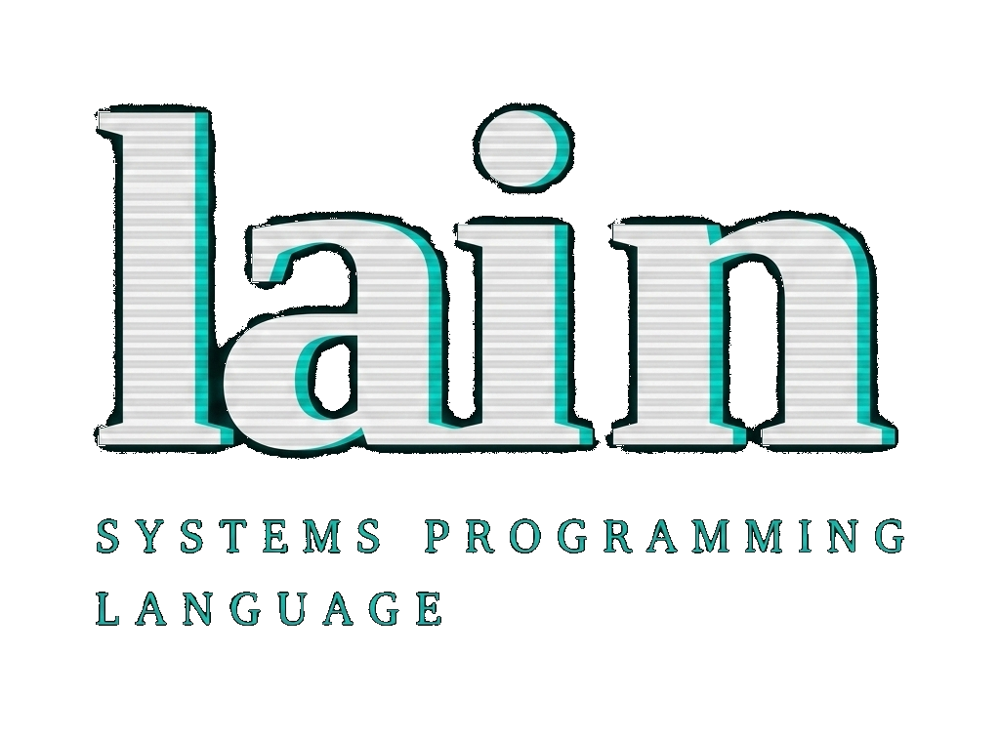
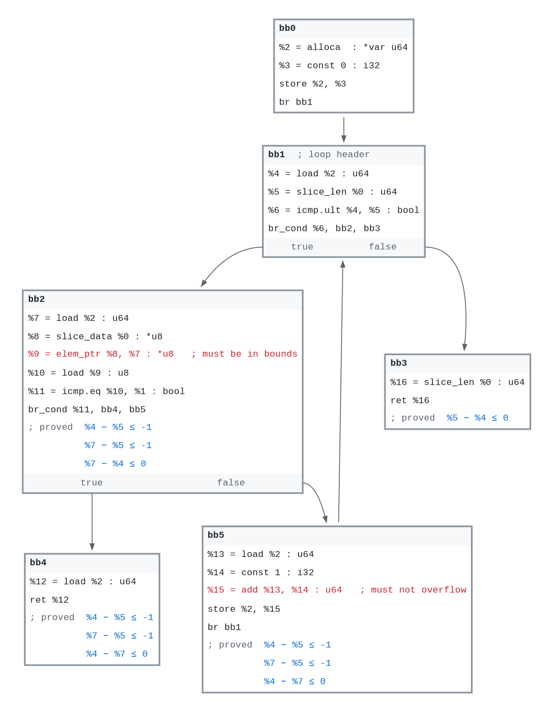

<p align="center">
  
</p>

Lain is a systems language in which memory safety, resource safety, integer safety and
termination are **proven at compile time** and therefore **not checked at runtime**. A program
that could read out of bounds, overflow, divide by zero, use a moved value or leak a resource
does not compile.

Rejecting programs is only half of it. Every proof is also a fact the backend can use: exclusive
access becomes `restrict`, an empty effect set becomes `const`, a declared length becomes
`access`. And a check shown to be unnecessary is simply never emitted, including checks no
optimiser could have removed on its own.

```
 your.ln ──▶ front end ──▶ Lain-IR ──▶ analyses ──▶ backend ──▶ executable
                          typed SSA    ownership     C99
                           and CFG     borrows       LLVM
                                       bounds
                                       overflow
                                       termination
                                       effects
```

Every analysis runs on the IR. None of them looks at the source text or at the output target,
so the same proofs hold whichever backend emits the code.

## Guarantees

| | C / C++ | C + sanitizers | Rust | **Lain** |
|:---|:---|:---|:---|:---|
| Out-of-bounds read/write | UB | Caught when a run hits it | Panics at runtime | **Rejected at compile time** |
| Integer overflow | UB (signed) | Caught when a run hits it | Panics in debug, wraps in release | **Rejected at compile time** † |
| Division by zero | UB | Caught when a run hits it | Panics | **Rejected at compile time** |
| Use after free / move | UB | Caught when a run hits it | Prevented | **Prevented** |
| Double free | UB | Caught when a run hits it | Prevented | **Prevented** |
| Resource leak | Silent | Memory leaks listed at exit | **Allowed** (`mem::forget` is safe) | **Rejected** |
| Dangling reference | UB | Caught when a run hits it | Prevented | **Prevented** |
| Uninitialised read | UB | Caught when a run hits it | Prevented | **Prevented** |
| Non-termination | Allowed | Not detected | Allowed | **Rejected in `func`** |
| Data races | UB | Caught when a run hits it | Prevented | Single-threaded before 1.0 |
| Array length in the type | No | No | Const generics only | **`a i32[out.len]`, `a i32[h*w]`** |
| Aliasing told to the optimiser | manual `restrict`, UB if wrong | No help | `noalias` from `&mut` | **Derived from the borrow proof** |
| Sum-type layout | manual | No help | Niche packing, silent | **Niche packing, and it warns when it fails** |

Sanitizers are a testing tool. They find a bug on the paths a run happens to take, say nothing
about the paths it does not, and are too slow to ship: the gather in chapter 4 costs 4.28x under
`-fsanitize=undefined,bounds`. A proof covers every path and costs nothing at runtime.

† One class escapes the shipping binary today, the loop-carried accumulator. It is stated in
full, with the program that miscomputes, in [11. Limits](#11-limits).

## Contents

```
  1  Proof Engine
  2  Linear Type System
  3  Borrow Checking
  4  Value Range Analysis
  5  Termination Analysis
  6  Effect System
  7  Data Layout
  8  Code Generation
  9  Verification
 10  Reference
 11  Limits
 12  Quick Start
```

---

# 1. Proof Engine

The program below searches a slice of bytes for a value. The slice length is not known when the
program is compiled, so every access into it has to be justified against a number that only
exists at runtime.

```lain
func find(haystack u8[], target u8) usize {
    var i usize = 0
    while i < haystack.len {
        if haystack[i] == target { return i }
        i = i + 1
    }
    return haystack.len
}
```

**Step 1. Lower to a typed SSA/CFG IR.** Lowering attaches every safety obligation to a
specific instruction. `elem_ptr` has to be shown in bounds, `add` has to be shown not to
overflow, and the back edge into a loop header has to be shown to terminate.

<p align="center">
  
</p>

<p align="center"><sub>The IR of <code>find</code>, drawn from the compiler's own dump. Red marks what a block
has to prove, blue what was proved there. In <code>bb2</code> the index <code>%7</code> is compared
against the length <code>%5</code>, which is what settles the access on the line above.</sub></p>

**Step 2. Work out what the values can be.** Facts are propagated through the graph, and each
loop is walked again until a pass adds nothing new, so what comes out holds on every iteration
rather than only the first.

Two kinds of fact are kept: the range a value can take, and how two values compare. The second
is what settles an array access. A range for `i` is no use when the length is unknown too, but
`i` being below the length is enough whatever either turns out to be.

`--dump-octagon` prints what the compiler settled on at the array access:

```
── octagon state: find ──
  bb2
      %2 ∈ [0, +inf]                                   ; i
      %4 ∈ [0, +inf]
      %5 ∈ [1, +inf]                                   ; haystack.len
      …
      %2 − %5 ≤ -1                                     ; the guard, carried in
      %4 − %5 ≤ -1
      …
    · %7 ∈ [0, +inf]   %7−%2≤0   %7−%4≤0   %7−%5≤-1
                                                       ; index − length ≤ −1
```

Read the last line. `%7` is the index and `%5` is the length, so `%7 − %5 ≤ -1` says the index
is at least one below the length. Neither value is known at compile time. The comparison between
them is, and that is enough to settle the bounds check before the program runs.

**Step 3. Check each obligation against those facts.**

```
  find      index bounds   @ 4:13  PROVEN check-free
  find      arith overflow @ 5:4  PROVEN check-free
  find      termination    @ 0:0  PROVEN check-free
3/3 proof obligations discharged check-free
```

**Step 4. Emit C, keeping what was proved.**

```c
__attribute__((pure)) __attribute__((nonnull))
size_t bytes_find(size_t __len_haystack, const uint8_t * restrict haystack, uint8_t target) {
    size_t i = 0;
    while (i < __len_haystack) {
        if (haystack[i] == target) {
            return i;
        }
        i = i + 1;
    }
    return __len_haystack;
}
```

Nothing in the Lain source asked for `pure`, `nonnull` or `restrict`, and nothing asked for the
length to be passed separately. Each one is a fact the analyses established.

Change `<` to `<=` and the fact becomes `%7 − %5 ≤ 0`. The index can now equal the length, so
the bounds obligation no longer holds and the program is rejected:

```
[E085] bounds error: cannot prove index is within bounds for dynamic-length array
  --> bytes.ln:4:13
   |
 4 |         if haystack[i] == target { return i }
   |             ^
       index `i`: range [0, MAX]
       array `haystack`: length [unknown]
       hint: use `for i in 0..arr.len`, a fixed-length type `[N]`, or a `p in arr` guard
```

The analyses in the chapters below depend on one another. Because the borrow checker guarantees
a mutable borrow is exclusive, the numeric analysis can keep a fact about a value across a
function call. Because the effect system knows a function cannot panic, the backend is allowed
to mark it `const`.

---

# 2. Linear Type System

Linear types (Girard, 1987; Wadler, 1990) require a value to be used **exactly once**. Rust is
*affine*: a value is used at most once, which is why leaking is safe there. Lain is linear, so
using a value zero times is an error as well.

Using it twice is rejected:

```lain
type Buffer {
    mov data *u8
    len usize
}
func release(mov {data, len} Buffer) { }

proc main() i32 {
    var p *u8 = 0
    var b = Buffer(p, 0)
    release(mov b)
    release(mov b)          // E002: 'b' was already used/consumed
    return 0
}
```

and not zero:

```lain
type Buffer {
    mov data *u8
    len usize
}
func release(mov {data, len} Buffer) { }

proc main() i32 {
    var p *u8 = 0
    var b = Buffer(p, 0)    // E003: linear field 'data' of 'b' was not consumed
    return 0
}
```

The rule applies **per field**, so a struct can be taken apart a piece at a time and each piece
is tracked separately. It is **flow-sensitive**, so consuming a value on one branch but not the
other is caught. `defer` counts as the consumer, and it counts at every exit from the function,
including the exit taken when an error propagates out.

**Rust accepts the second program.** `mem::forget` is safe, `Rc` cycles leak, and Rust states
that leaking is outside its guarantees.

---

# 3. Borrow Checking

The rule is one mutable borrow or many shared ones, never both, and a borrow ends at its last
use rather than at the end of its scope. The regions come from Cyclone (Jim et al., 2002), the
loan discipline from Patina (Reed, 2015) and Oxide (Weiss et al., 2019), and the last-use
refinement from non-lexical lifetimes.

Two things follow from that beyond the safety property.

## Lifetimes are inferred, not annotated

The compiler lowers the whole module before checking it, so it can read out of the function
body which parameter a returned reference borrows:

```lain
type Data { x i32 }

func pick_x(var a Data, var b Data) var i32 { return var a.x }

proc main() i32 {
    var p = Data(1)
    var q = Data(2)
    var r = pick_x(var p, var q)     // r borrows p, inferred, not written
    r = 7
    return q.x                       // q is still free
}
```

Rust rejects that signature outright, because it checks each function against its signature
alone:

```
error[E0106]: missing lifetime specifier
2 | fn pick_x(a: &mut Data, b: &mut Data) -> &mut i32 { &mut a.x }
  |              ---------     ---------     ^ expected named lifetime parameter
  = help: this function's return type contains a borrowed value, but the signature
          does not say whether it is borrowed from `a` or `b`
help: consider introducing a named lifetime parameter
2 | fn pick_x<'a>(a: &'a mut Data, b: &'a mut Data) -> &'a mut i32 { &mut a.x }
```

Its suggested fix is weaker than the truth. Tying `a` and `b` to one lifetime freezes `b` for as
long as the result lives, even though the result never pointed into `b`. Lain reads the body,
sees the result borrows `a`, and leaves `b` alone.

## Exclusive borrows become `restrict`

C's `restrict` is a promise that two pointers never refer to the same object, and the C compiler
takes it on trust. In Lain that promise is the borrow checker's output, so it can be emitted.

Below is the same loop compiled twice. The only difference is whether `restrict` was passed
through to gcc (`-O3 -march=x86-64-v3`):

```lain
proc vadd(out var i32[], a i32[out.len], b i32[out.len]) {
    var i usize = 0
    while i < out.len {
        out[i] = a[i] +% b[i]
        i = i + 1
    }
}
```

```asm
; with the proof                          ; proof withheld
vadds_vadd:                               vadds_vadd:
  endbr64                                   endbr64
  test  %rdi,%rdi                           mov   %rdi,%r8
  je    cb                                  mov   %rdx,%rdi
  lea   -0x1(%rdi),%rax                     test  %r8,%r8
  cmp   $0x6,%rax                           je    11e
  jbe   d4                                  lea   -0x1(%r8),%rax
  mov   %rdi,%r8                            cmp   $0x2,%rax
  xor   %eax,%eax                           jbe   100          ─┐ to the scalar copy
  shr   $0x3,%r8                            lea   0x4(%rdx),%r9 │
  shl   $0x5,%r8                            mov   %rsi,%rdx     │ overlap test 1
                                            sub   %r9,%rdx      │
  vmovdqu (%rdx,%rax,1),%ymm1               cmp   $0x18,%rdx    │
  vpaddd  (%rcx,%rax,1),%ymm1,%ymm0         jbe   100          ─┤
  vmovdqu %ymm0,(%rsi,%rax,1)               lea   0x4(%rcx),%r9 │
  add     $0x20,%rax                        mov   %rsi,%rdx     │ overlap test 2
  cmp     %r8,%rax                          sub   %r9,%rdx      │
  jne     <loop>                            cmp   $0x18,%rdx    │
                                            jbe   100          ─┘
                                            ...
                                          100:                  ; the scalar copy
                                            mov   (%rcx,%rax,4),%edx
                                            add   (%rdi,%rax,4),%edx
                                            mov   %edx,(%rsi,%rax,4)
                                            add   $0x1,%rax
```

Both versions end up with an AVX2 loop. Only the left one goes straight into it. On the right
gcc has to check at runtime whether the three buffers overlap, and has to keep a scalar copy of
the loop to jump to when they do. **59 instructions against 81.**

---

# 4. Value Range Analysis

This is abstract interpretation (Cousot and Cousot, 1977) using the octagon domain (Miné, 2006),
which stores facts of the form `±x ±y ≤ c`, widened against thresholds as in Astrée.

Storing comparisons between values, rather than only ranges, is what makes it useful on real
code. The fact that makes an array access safe is hardly ever a constant. It is usually a
comparison with a length that is itself unknown.

| the access | proven by |
|:---|:---|
| scan `a[i]` under `i < a.len` | `i − len ≤ −1`, straight from the guard |
| two-pointer `a[i]` under `i ≤ j < a.len` | transitive closure: `i − j ≤ 0` and `j − len ≤ −1` |
| reverse `a[a.len-i-1]` | `len − i ≥ 1`, from `i < len` |
| masked gather `a[x & (N-1)]`, **any** `x` | `x & (N−1) ∈ [0, N−1]` for every `x`, no assumption on the data |
| sliding window `a[i+1]` over `a i32[n]` under `i < n-1` | the guard as `i − n ≤ −2`, so `(i+1) − n ≤ −1` |
| insertion sort `a[j-1]` under `j > 0 ∧ j < a.len` | offset by −1, lower bound from `j > 0` |
| 2D `a[i*w + j]` over `i32[h*w]` | per dimension: `i < h ∧ j < w` |
| binary search `a[lo + (hi-lo)/2]` over `a i32[8]` | an inductive loop invariant recovers `0 ≤ lo < hi ≤ len`, which the loop's blanket widening had thrown away, then `mid < hi` |

Each row is a program in the test corpus. Since an index the compiler cannot place in bounds is
an `E085` rather than a runtime check, a program compiling is what tells you the bound was
proved.

The last row is the current edge: binary search proves over a fixed-length array, and the same
search over a runtime length is still rejected.

## Lengths can be part of a type

A parameter's length can be written as an expression over the other parameters:

```lain
proc vadd(var out i32[], a i32[out.len], b i32[out.len]) {
    for i in 0..out.len {
        out[i] = a[i] + b[i]
    }
}
```

`a` and `b` are arrays the same length as `out`. Callers have to satisfy that, and are told so
with `E087` if they do not; inside the body it comes for free.

The expression can be anything, so a matrix is just a flat buffer with a shape. Here `h` and `w`
are unknown at compile time and `a[i*w + j]` still needs no check:

```lain
proc msum(a i32[h * w], h usize, w usize) i32 {
    var s i32 = 0
    var i usize = 0
    while i < h {
        var j usize = 0
        while j < w {
            s = s +% a[i * w + j]
            j = j + 1
        }
        i = i + 1
    }
    return s
}
```

C has no way to state that precondition. Rust's const generics cannot take `h * w`.

## Wide accesses are checked at their real width

A 16-byte SIMD load has to satisfy `i + 16 ≤ len`, not `i < len`. That is still an ordinary
comparison, so the same analysis handles it and there is no SIMD-specific reasoning anywhere in
the compiler:

```lain
proc scan(src u8[4096], n u32 < 4097, start u32 < 4097, term u8) u32 {
    var i u32 = start
    while (i + 15) in src and i +% 16 <= n {
        var hit u32 = @movemask(@load(u8x16, src, i) == term) & (65535 as u32)
        if hit != 0 {
            i = i +% (@ctz(hit) as u32)
            break
        }
        i = i +% 16
    }
    while i in src and i < n and src[i] != term { i = i +% 1 }
    return i
}
```

No `unsafe`. No runtime bounds check.

## Arithmetic works the same way

`+` widens its result, so adding two `i32` values cannot overflow. What can fail is storing the
result somewhere narrower, and that is where the check goes:

```lain
func widened(a i32, b i32) i64 { return a + b }     // accepted
```

```lain
func narrowed(a i32, b i32) i32 {
    var s i32 = a + b       // E086: the sum may not fit an i32
    return s
}
```

When overflow is what you want, say which kind: `+%` wraps, `+|` saturates, `a +? b else 0`
gives you a fallback value, and `unsafe { }` turns the check off. What you cannot do is leave the
question unanswered.

Division is handled the same way, and the error lists the ways out:

```
[E015] Error: division/modulo by a divisor whose range [-2147483648, 2147483647]
       includes zero. Guard it (`if d != 0`), constrain it (`d int != 0`), or wrap
       the divide in an `unsafe` block.
```

Both of those are real. `func divide(a i32, b i32 != 0) i32` puts the constraint in the
signature, where every caller has to satisfy it, and an `if b != 0` that dominates the division
settles it locally.

## Where a C compiler cannot follow

In this loop the index does not come from the loop counter. It is read out of memory and masked:

```lain
proc kernel(a i32[4096], b i32[4096], idx u32[4096]) i64 {
    var acc i64 = 0
    var i usize = 0
    while i < 4096 {
        var j usize = (idx[i] & 4095) as usize
        acc = acc +% ((a[j] *% b[i]) as i64)
        i = i + 1
    }
    return acc
}
```

Whatever `idx[i]` holds, `idx[i] & 4095` lands in `[0, 4095]`, and the array has 4096 elements.
That holds for every possible input, so no check is emitted and gcc vectorises eight elements at
a time. The mask instruction does double duty: it is both the computation and the reason the
access is safe.

```asm
  vpand     (%r8,%rdx,1),%ymm2,%ymm0    ; mask 8 indices, the proof
  vmovd     %xmm0,%esi                  ; ┐
  vpextrd   $0x1,%xmm0,%ecx             ; │ gather the 8 elements
  ...                                   ; ┘
  vpmulld   (%rdi,%rdx,1),%ymm0,%ymm0   ; 8 multiplies
  vpaddq    %ymm4,%ymm1,%ymm1           ; widen and accumulate
  cmp       $0x4000,%rdx
  jne       <loop>
```

The same C compiled with `-fsanitize=undefined,bounds` stays scalar, with a pointer-overflow,
null and alignment test in front of every access:

```asm
  mov    %r13,%r12
  add    %rbx,%r12
  jb     c5                    ; pointer overflow
  test   %r12,%r12
  je     1a1                   ; null
  test   $0x3,%r12b
  jne    1a1                   ; alignment
  mov    0x0(%r13,%rbx,1),%eax ; and only now the load
  and    $0xfff,%eax
  lea    (%rcx,%rax,4),%r12
  cmp    %rcx,%r12
  jb     182                   ; and the same again for the gather
```

**57 instructions against 111**, and no vectorisation. Measured end to end (`bench/thesis/`,
same kernel on both sides, `gcc -O3 -march=native`):

```
  (A) proven safe, check-free (what Lain emits)    :   1468.1 ms
  (B) runtime-checked safety (-fsanitize=undefined):   6290.0 ms
  --> 4.28x to learn at runtime what the compiler already knew
```

This only matters for some checks. A check gcc can see is redundant, like `a[i]` guarded by
`i < n`, gcc removes on its own, and Lain gains nothing. A check that depends on runtime data
cannot be removed by any optimiser, since the optimiser has no way to know what the data will
be. Those are the ones a proof removes.

---

# 5. Termination Analysis

A `func` always finishes. Every loop and every recursive call needs some quantity that shrinks
on each step and cannot shrink forever, and in most cases the compiler works out what that
quantity is: `while i < n` gives `n − i`, `while i > 0` gives `i`, `while lo < hi` gives
`hi − lo`.

The step does not have to be by one. Whether a quantity shrinks is something the numeric
analysis already knows, so halving and shifting need nothing written:

```lain
func bits(x u32) u32 {
    var n u32 = x
    var c u32 = 0
    while n > 0 {           // measure `n` inferred; n/2 < n for n > 0
        n = n / 2
        c = c + 1
    }
    return c
}
```

Euclid's algorithm needs the quantity named, though not justified. Since `b = a % b` lands in
`[0, b-1]`, the divisor shrinks on every iteration:

```lain
func gcd(a0 usize, b0 usize) usize {
    var a usize = a0
    var b usize = b0
    while b > 0 decreasing b {
        var t usize = b
        b = a % b
        a = t
    }
    return a
}
```

Recursion is held to the same standard:

```lain
func factorial(n int) int {
    if n <= 1 { return 1 }
    return n *% factorial(n - 1)      // accepted: n shrinks toward the base case
}
```

```lain
func collatz(n int) int {
    if n <= 1 { return 0 }
    if n % 2 == 0 { return collatz(n / 2) }
    return collatz(3 * n + 1)         // E011: no decreasing measure
}
```

A `proc` is allowed to loop forever. That is what separates the two.

---

# 6. Effect System

Every function gets a set of effects drawn from `{Write, Diverge, Raises, IO, Alloc}`, worked
out by following the call graph. You can declare what a function is allowed to do with
`effects …`, and the compiler checks the declaration instead of trusting it:

```
[E130] Error: 'talk' declares `effects` that do not cover what its body does —
       it also has: io.
```

## An empty effect set means one call instead of two

A function with no effects writes nothing, does no I/O, allocates nothing and cannot panic.
That is exactly what `__attribute__((const))` claims in C:

```lain
func mix(x i32, y i32) i32 {
    var a i32 = (x *% 2654435761) ^ (y *% 40503)
    a = a ^ (a >> 13)
    return a *% 1274126177
}

func twice(p i32, q i32) i32 { return mix(p, q) +% mix(p, q) }
```

```c
__attribute__((const)) int32_t eff_mix(int32_t, int32_t);
```

Compiling the two in separate translation units leaves gcc with nothing to go on but that
annotation:

```asm
; effect row known                    ; effect row withheld
eff_twice:                            eff_twice:
  endbr64                               endbr64
  sub    $0x8,%rsp                      push   %r12
  call   <eff_mix>                      mov    %esi,%r12d
  add    $0x8,%rsp                      push   %rbp
  add    %eax,%eax   ; CSE'd            mov    %edi,%ebp
  ret                                   push   %rbx
                                        call   <eff_mix>
                                        mov    %r12d,%esi
                                        mov    %ebp,%edi
                                        mov    %eax,%ebx
                                        call   <eff_mix>   ; twice
                                        add    %ebx,%eax
                                        pop    %rbx
                                        pop    %rbp
                                        pop    %r12
                                        ret
```

Knowing the result depends only on the arguments, gcc calls `mix` once and doubles the answer.
The register saving and restoring around the second call goes with it: **6 instructions against
13**. Written by hand in C, that annotation is a claim nobody checks. Here it comes from the
effect set.

Panics are part of the set for a good reason. `const` lets gcc delete a call whose result is
never used, so putting it on a function that can abort will turn a program that aborts at `-O0`
into one that runs clean at `-O3`. This project shipped that miscompile once. Tracking panics as
an effect is what fixed it.

---

# 7. Data Layout

```lain
type OptionByte {
    Some { v *u8 }
    None
}
```

```c
typedef const uint8_t * niche_OptionByte;

static inline niche_OptionByte niche_OptionByte_Some(const uint8_t * v) {
    return v;
}
static inline niche_OptionByte niche_OptionByte_None(void) {
    return (const uint8_t *)(uintptr_t)0LL;
}
```

There is no tag and no struct. The type is the pointer, and `None` is the null pointer. The
compiler looks through the payload type for bit patterns it cannot otherwise hold, and uses
those to tell the cases apart.

Errors are laid out the same way. `*u8 | NotFound | Denied` is still one pointer wide:

```c
typedef const uint8_t * __U_ptr_u8_NotFound_Denied;

static inline __U_ptr_u8_NotFound_Denied ..._NotFound(void) {
    return (const uint8_t *)(uintptr_t)0LL;
}
static inline __U_ptr_u8_NotFound_Denied ..._Denied(void) {
    return (const uint8_t *)(uintptr_t)8LL;
}
```

The two error cases become addresses 0 and 8, which no real object can occupy. No tag word, no
heap allocation, no unwinding.

When none of the error cases carries a payload, fitting in the spare patterns is not something
the compiler tries and gives up on. It is required, and you are told when it cannot be done:

```
[E064] Error: the union `i32 | ...` cannot be zero-cost — 'i32' has no spare
       bit-patterns for its 2 marker(s). Give the value type niche room (a
       refinement like `u8 < 200`, a pointer, or a slice), or use fewer markers.
```

When an error case does carry a payload a tag byte is unavoidable, and then it is allowed.
Ordinary enums work the same way, and the compiler says so when it has to add one:

```
[W120] Warning: enum 'OptI32' not fully zero-cost.
       Payload provides 0 sentinel slot(s); 1 empty variant(s) require 1.
       Layout falls back to 1 tag byte + payload union.
       To eliminate the tag byte: reduce empty variants, constrain the
       payload type with a refinement, or change payload to a type with
       larger sentinel space (i8: 255, i16: 65535, *T: 8192).
```

A layout optimisation that silently fails is something you discover later with a profiler. This
one tells you at compile time.

---

# 8. Code Generation

## What the C compiler is told

Here is a nine-line sliding-window sum over a runtime length. Its Lain source carries no
annotations at all. This is the declaration it produces:

```c
__attribute__((access(read_only, 1, 2)))
__attribute__((pure))
__attribute__((nonnull))
int32_t window(const int32_t * restrict a, size_t n);
```

Five separate facts about the function, none of them written by the programmer:

| C annotation | Derived from | What it is in C |
|:---|:---|:---|
| `restrict` | The borrow checker rejects any program where two reference parameters could name the same object | A claim the C compiler trusts. **UB if wrong** |
| `access(read_write, n, m)` | The declared length: parameter *n* holds *m* elements | A claim the C compiler trusts |
| `const T *` | The set of things the function writes, computed from its body | Not checked across the call |
| `pure` / `const` | An empty effect set: no writes, no I/O, no allocation, **no panic** | A claim the C compiler trusts. If it is wrong, calls that had to happen get deleted |
| `nonnull` | A borrow can never be null | A claim the C compiler trusts |

## Targets

C99 is the backend that works. It compiles the whole corpus, and every listing on this page came
out of it. The output is portable and readable, and ordinary debuggers understand it.

There is also an LLVM path, and it is honestly a partial one. `--emit-llvm` lowers integer code
and passes the proved ranges through as `@llvm.assume`, which lets LLVM drop work the proof
shows is unreachable. That is where more of the value is, since it reaches optimisations that
cannot be expressed by going through C at all. But it covers a subset: anything outside it comes
out as an `; unsupported` comment, so C remains the path that runs.

Neither target owns the proofs. They are settled on the IR, which is why adding a backend is
ordinary work rather than a redesign.

---

# 9. Verification

These numbers cover the whole test suite, not a selected benchmark:

```
corpus                             658 programs, pass and fail alike
bounds obligations proven          833 / 846  check-free
programs with zero bounds checks   104 / 111
```

Three things are checked, and all three are run rather than argued:

- **The numeric domain.** Its operations are compared against brute force over small integer
  boxes, 40 000 random trials per run, to confirm they never claim a value is outside a range it
  can actually reach.
- **The analyses.** Fuzzers generate programs, compile them, and then *run* what the compiler
  claimed was safe under ASan and UBSan. A program proved check-free that reads out of bounds
  when executed is a false proof, and is reported as one. There are seventeen of them, and each
  was checked by putting back the bug it was written to catch and confirming it fires.
- **The corpus.** Every program expected to fail names the diagnostic it has to produce.

The middle end is being rebuilt around the analysis shown in chapter 1. With `--engine=ir` the
new ownership, borrow and initialisation checks already run on the normal compile path: **402
programs accepted, 0 false positives, 241 rejections caught**. Both engines run against the
corpus on every change.

---

# 10. Reference

| | |
|:---|:---|
| `LANGUAGE.md` | the full language reference |
| `spec/` | the specification, with `spec_gate.sh` diffing Annex B against the compiler (54/54) |
| `bench/thesis/` | the benchmark behind the 4.28x figure, rerunnable |

---

# 11. Limits

- **Overflow of a running total inside a loop is not caught.** When the analysis widens a loop
  it clamps the total to the type it is stored in, which makes the store fit by construction and
  the check meaningless:

  ```lain
  func up8(n u8) u8 {
      var s u8 = 0
      var i u8 = 0
      while i < n {
          s = s + i          // accepted today; 0+1+…+199 = 19900 does not fit a u8
          i = i + 1
      }
      return s
  }
  ```

  `up8(200)` compiles, and prints **188** instead of 19900. The rebuilt engine catches it
  (`--engine=ir-full` reports `[E086] arithmetic is not provably free of overflow`), and getting
  that onto the default path is the main reason the middle end is being replaced. This is the
  largest gap between what this page claims and what the current binary enforces.

- **Once that is fixed, a running total with no bound will be rejected rather than checked.**
  You will have to guard it, widen the type, or use `+%`. Expect this to be the rule that costs
  you the most.

- **No concurrency.** Single-threaded before 1.0, so "no data races" is a consequence of that
  rather than something achieved. An interrupt-aware model is planned.

- **`unsafe` turns off the numeric and bounds checks** inside it. It is a block, so it is easy
  to find.

- **Generics are monomorphised with no trait bounds.** Mistakes show up when a generic is
  instantiated rather than where it is defined.

- **None of this is machine-checked.** The analyses are fuzz-tested and the domain is validated
  by brute force, but there is no mechanised soundness proof. That is future work, and not
  something being claimed here.

---

# 12. Quick Start

```bash
gcc -std=c99 -Wall -Wextra -o lain src/main.c -I src     # build the compiler
./lain my_program.ln -o out.c                            # Lain  -> C99
gcc out.c -o my_program -Dlibc_printf=printf -w          # C99   -> executable
```

Run from the repository root if a program imports from `std/`, since module paths are resolved
relative to the source file.

```bash
bash run_tests.sh        # the corpus
bash readme_gate.sh      # every example on this page, through the compiler
bash spec_gate.sh        # every diagnostic the compiler emits, against the specification
```

`readme_gate.sh` pulls every Lain example off this page and compiles it. Examples labelled with
an error have to fail; the rest have to compile. It exists because the previous version of this
file spent months describing a language the compiler had stopped implementing.
