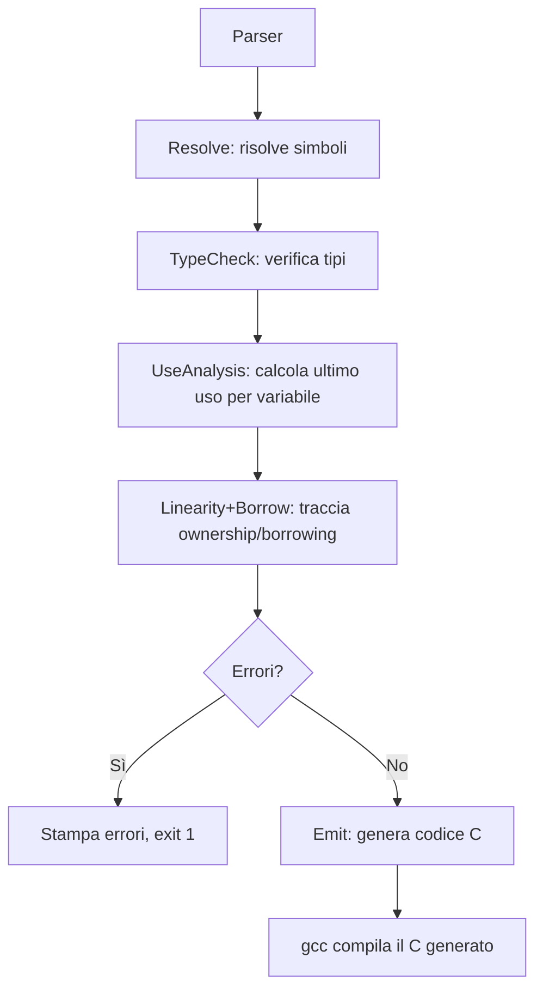

# Analysis 13 — Borrow Checker: Stato Attuale e Roadmap Completa

## 1. Panoramica Generale

Il borrow checker di Lain è un sistema statico di analisi della proprietà (ownership) e del prestito (borrowing) che garantisce sicurezza della memoria senza garbage collector. Il sistema opera come un transpiler pass: il compilatore Lain analizza il codice sorgente, esegue i controlli semantici (tipo, linearità, borrow), e solo se tutto passa, genera codice C equivalente.

Il borrow checker è strutturato in due componenti principali:

| Componente | File | Responsabilità |
|------------|------|----------------|
| **Region/Borrow System** | `region.h` | Traccia i prestiti (borrow), gestisce regioni lessicali, rileva conflitti di accesso |
| **Linearity System** | `linearity.h` | Traccia la proprietà lineare (`mov`), consumi, inizializzazione, scope |

Queste due componenti collaborano tramite la tabella `LTable`, che contiene sia le `LEntry` (per linearità) che un puntatore a `BorrowTable` (per prestiti).

---

## 2. Fasi Completate

### Phase 1 — Foundation ✅

La base del borrow checker, implementata dall'inizio del progetto:

| Feature | Descrizione | Stato |
|---------|-------------|-------|
| Rilevamento conflitti intra-espressione | `f(var x, var x)` → errore | ✅ |
| Tracking tipi lineari (`LTable`) | Struct con campi `mov` devono essere consumate esattamente una volta | ✅ |
| Semantica `mov` (`EXPR_MOVE`, `ltable_consume`) | `mov x` trasferisce proprietà, invalida `x` | ✅ |
| Branch consistency | `if` / `match` devono consumare le stesse variabili in ogni ramo | ✅ |
| Regola loop-depth | Non si può consumare una variabile definita fuori dal loop dentro un loop | ✅ |
| Pulizia borrow temporanei | Borrow intra-statement scadono a fine statement | ✅ |
| `return var local` dangling check | Non si può restituire un `var` reference a una variabile locale | ✅ |
| Analisi inizializzazione definita | Variabili usate prima dell'assegnamento → errore | ✅ |


### Phase 2 — Non-Lexical Lifetimes ✅

| Feature | Descrizione | Stato |
|---------|-------------|-------|
| Pre-pass use-analysis | `UseTable` che calcola l'ultimo uso di ogni variabile per funzione | ✅ |
| Borrow persistente con ultimo-uso | I borrow creati da `var ref = get_ref(var x)` scadono all'ultimo uso di `ref` | ✅ |
| Rilascio borrow all'ultimo uso | `borrow_release_expired()` dopo ogni statement | ✅ |
| Conflitto accesso proprietario | Se `ref` è attivo, `x` non può essere modificato o mosso | ✅ |


### Phase 3 — Re-borrow & Owner Reassignment ✅

| Feature | Descrizione | Stato |
|---------|-------------|-------|
| Re-borrow transitivity | `var ref2 = get(var ref1)` → catena: `ref1` live finché `ref2` è usato | ✅ |
| Tracking `root_owner` | Ogni `BorrowEntry` traccia il proprietario originale della catena | ✅ |
| Owner reassignment check | `x = new_value` mentre `ref` prende in prestito da `x` → errore | ✅ |


### Phase 4 — Direct Var-Borrows & Defer ✅

| Feature | Descrizione | Stato |
|---------|-------------|-------|
| Direct `var`-expression persistent borrows | `var ref = var data.field` crea un borrow persistente | ✅ |
| Multi-`var`-parameter lifetime inference | Tutti i parametri `var` sono tracciati come borrowati quando una funzione restituisce `var T` | ✅ |
| Defer consumption tracking | `defer drop(mov x)` differisce il consumo — `is_defer_consumed` con strategia save/restore | ✅ |
| Fix save/restore per `STMT_DEFER` | Il save/restore ora copre TUTTE le variabili tracciate, non solo quelle `must_consume` | ✅ |


### Phase 5 — Per-Field Linearity ✅

| Feature | Descrizione | Stato |
|---------|-------------|-------|
| `FieldState` struct | Lista collegata per tracciare `field_name` + `is_consumed` per campo lineare | ✅ |
| `ltable_init_field_states()` | Risolve il tipo struct, crea `FieldState` per ogni campo `mov` | ✅ |
| `ltable_consume_field()` | Consuma un campo specifico; auto-completa lo struct quando tutti consumati | ✅ |
| `ltable_is_partially_consumed()` | Rileva stato misto consumato/non-consumato; blocca `mov struct_var` dopo consumo parziale | ✅ |
| `EXPR_MOVE` update per `EXPR_MEMBER` | Tenta consumo a livello di campo prima del consumo whole-variable | ✅ |
| Messaggi errore per-field | `linear field 'ptr' of 'h1' was not consumed` | ✅ |
| Deep-copy `field_states` in `ltable_clone` | Branch analysis (if/else) mantiene il tracking per-field | ✅ |
| Branch consistency per-field | `ltable_check_branch_consistency` verifica coerenza consumo campi tra branch | ✅ |
| Merge per-field in `ltable_merge_from_branch` | Copia stati field + `is_defer_consumed` dal branch al parent | ✅ |

#### Test Phase 5

| Test | Verifica | Risultato |
|------|----------|-----------|
| `field_consume_pass.ln` | Struct con campo `mov` consumato correttamente via `mov` whole-struct | ✅ Passa |
| `field_consume_fail.ln` | Campo lineare `right` non consumato → errore per-field | ❌ Correttamente fallisce |
| `field_partial_move_fail.ln` | `mov pair` dopo `mov pair.left` → errore: campi già consumati | ❌ Correttamente fallisce |

**Regressioni**: Zero. Tutti gli 85+ test passano.

---

## 3. Bug Fix Applicati

| Fix | File | Descrizione |
|-----|------|-------------|
| `ltable_clone` deep-copy | `linearity.h` | Copia in profondità `field_states`, `var_type`, `is_defer_consumed` per branch analysis |
| Branch consistency per-field | `linearity.h` | `ltable_check_branch_consistency` verifica coerenza consumo campi tra branch if/else |
| Merge per-field | `linearity.h` | `ltable_merge_from_branch` ora copia stati field + `is_defer_consumed` |
| Defer save/restore completo | `linearity.h` | Il save/restore di `STMT_DEFER` ora copre tutte le variabili, non solo `must_consume` |

---

## 4. Bug Pre-Esistente Documentato

**SIGABRT crash** quando si compila da path assoluti esterni al progetto (es. `/tmp/test.ln`).

- **Causa**: `c_name_for_id` in `emit/core.h` usa un buffer statico di 256 byte per i nomi mangled dei moduli. Path assoluti lunghi generano nomi tipo `_tmp_test_minimal_Foo` che, combinati con i prefissi del modulo, possono eccedere il buffer e corrompere l'heap.
- **Impatto**: SIGABRT (exit 134) durante la compilazione. Non genera `out.c`.
- **Workaround**: Compilare file all'interno della directory del progetto.
- **Conferma**: Verificato pre-esistente tramite `git stash` (il crash si verifica anche prima di qualsiasi modifica Phase 4-5).
- **Fix proposto**: Allocare dinamicamente il buffer in `c_name_for_id` o aumentare la dimensione a 1024+ byte.

---

## 5. Architettura Interna del Sistema

### 5.1 Strutture Dati Principali

```
LTable
├── head → LEntry → LEntry → LEntry → ...
│          ├── id: Id*             (nome variabile)
│          ├── state: UNCONSUMED | CONSUMED
│          ├── must_consume: bool  (tipo lineare)
│          ├── is_mutable: bool
│          ├── is_initialized: bool
│          ├── is_defer_consumed: bool
│          ├── defined_loop_depth: int
│          ├── var_type: Type*     (Phase 5)
│          ├── field_states → FieldState → FieldState → ...
│          │                  ├── field_name: Id*
│          │                  └── is_consumed: bool
│          └── region: Region*
├── borrows → BorrowTable
│             ├── current_region: int
│             └── head → BorrowEntry → BorrowEntry → ...
│                        ├── owner_id: Id*
│                        ├── borrow_id: Id*
│                        ├── is_mutable: bool
│                        ├── last_use_stmt: int
│                        ├── root_owner: Id*
│                        └── region_id: int
└── arena: Arena*
```

### 5.2 Flusso di Esecuzione



### 5.3 Algoritmo di Analisi Linearità per Statement

Per ogni statement `s` nella funzione:

1. **Analizza espressioni** — cerca `EXPR_MOVE`, `EXPR_MUT`, `EXPR_IDENTIFIER`
2. **Aggiorna LTable** — consuma/inizializza variabili
3. **Rilascia borrow scaduti** — `borrow_release_expired(current_stmt_idx)`
4. **Controlla conflitti** — accesso a variabili borrowate
5. **Gestisci scope** — push/pop per blocchi, branch consistency per if/match

---

## 6. Roadmap Dettagliata: Fasi Future

### Phase 6 — Precision & Soundness Refinement 🔴

**Obiettivo**: Ridurre i falsi positivi rimanenti e completare la verifica defer.

#### 6.1 Defer Borrow Verification (§15.2) — Priorità: Media

**Problema**: Multiple `defer` blocks eseguono in ordine LIFO. Il checker non verifica che le operazioni deferred non creino conflitti di borrow tra loro all'exit dello scope.

```lain
var a = Resource(1)
var b = Resource(2)
defer { use(var a); consume(mov b) }   // defer 1 — esegue secondo
defer { use(var b); consume(mov a) }   // defer 2 — esegue primo
// Al momento: nessun errore. Ma al runtime:
// defer 2 usa b e consuma a → poi defer 1 prova a usare a → dangling!
```

**Implementazione proposta**:
- Dopo aver processato gli statement del body, "eseguire" i defer in ordine LIFO sulla tabella linearità
- Verificare che i borrow attivi nei defer non conflicano tra loro
- ~80 righe di codice in `linearity.h`

**File da modificare**: `linearity.h` (sezione `STMT_DEFER` e logica scope exit)

#### 6.2 Slice Borrow Tracking (§12.2) — Priorità: Bassa

**Problema**: Il borrow checker non distingue tra slice che puntano allo stesso array e slice indipendenti.

```lain
var a int[10]
var s1 = a[0:5]   // borrow della prima metà
var s2 = a[5:10]  // borrow della seconda metà — non conflicano!
```

**Implementazione proposta**:
- Trattare `a[i:j]` come borrow dell'intero array `a`
- Aggiungere campo `is_slice_borrow: bool` a `BorrowEntry`
- Future: tracking range-based per slice non-overlapping
- ~100 righe

**File da modificare**: `linearity.h` (EXPR_INDEX/EXPR_SLICE), `region.h`

#### 6.3 Two-Phase Borrows — Priorità: Media

**Problema**: Pattern come `vec.push(vec.len())` falliscono perché il borrow mutabile per `push` viene creato prima del borrow condiviso per `len`.

```lain
var v = Vec()
v.push(v.len())   // Errore attuale: v già borrowato mutabilmente
```

**Implementazione proposta**:
- Dividere i borrow mutabili in due fasi: (1) riservazione, (2) attivazione
- La fase di riservazione permette borrow condivisi concorrenti
- L'attivazione avviene alla prima scrittura
- ~200 righe

**File da modificare**: `region.h` (aggiungere `phase: RESERVED | ACTIVE` a `BorrowEntry`)

---

### Phase 7 — NLL Avanzato 🟡

**Obiettivo**: Migliorare la granularità del rilascio borrow.

#### 7.1 Block-Level NLL (§6.5) — Priorità: Media

**Problema**: Il tracking attuale è statement-level. Borrow creati in un branch if/else rimangono attivi per tutto lo scope del blocco, anche se non sono raggiungibili.

```lain
var data int[10]
if condition {
    var ref = data[0:5]   // borrow attivo solo in este branch
    process(ref)
}
// Attualmente: il borrow potrebbe restare attivo qui
mutate(var data)   // Potrebbe fallire falsamente
```

**Implementazione proposta**:
- Modificare `borrow_enter_scope` / `borrow_exit_scope` per creare region annidati nei branch
- I borrow creati dentro un branch scadono all'uscita del branch
- Richiede refactoring del `UseTable` per essere branch-aware
- ~300 righe

**File da modificare**: `use_analysis.h`, `region.h`, `linearity.h`

#### 7.2 Per-Field Borrow Tracking (§11.4) — Priorità: Media

**Problema**: Attualmente `var ref = get_ref(var p)` prende in prestito l'intero `p`. Dovrebbe poter prendere in prestito solo un campo.

```lain
type Point { x int, y int }
var p = Point(1, 2)
var ref_x = get_field(var p.x)
p.y = 30   // ✅ OK: solo p.x è borrowato
use(ref_x)
```

**Implementazione proposta**:
- Estendere `BorrowEntry.owner_id` con un `field_path` opzionale
- I conflitti verificano overlap tra field path (es. `p` conflicca con `p.x`, ma `p.x` non conflicca con `p.y`)
- ~200 righe

**File da modificare**: `region.h` (borrow path matching), `linearity.h`

---

### Phase 8 — Ergonomia & Diagnostica 🟡

**Obiettivo**: Migliorare l'esperienza sviluppatore.

#### 8.1 Non-Consuming Match (§13.4) — Priorità: Alta

**Problema**: Attualmente `match` consuma il valore scrutinato. Molti pattern hanno bisogno di ispezione senza consumo.

```lain
// Oggi:
match shape {           // consuma shape
    case Circle(r): ...
}
// shape non più accessibile

// Target:
match &shape {          // ispeziona senza consumare
    case &Circle(r): ...
}
// shape ancora accessibile
```

**Implementazione proposta**:
- **Parser**: Supportare `match &expr` e `case &Pattern`
- **Sema**: Trattare `match &expr` come borrow condiviso temporaneo
- **Linearity**: Non consumare il valore in `match &`
- Richiede modifiche al parser (`parser.h`) + sema + linearity
- ~150 righe totali

**File da modificare**: `parser.h`, `linearity.h`, eventualmente `emit/stmt.h`

#### 8.2 Rich Diagnostics (§17) — Priorità: Media

**Problema**: I messaggi di errore attuali sono informativi ma minimalisti. Mancano:
- Indicazione della riga dove il borrow è stato creato
- Suggerimenti su come risolvere l'errore
- Visualizzazione delle catene di borrow

```
// Attuale:
Error Ln 15, Col 4: linear field 'ptr' of 'h1' was not consumed before return.

// Target:
Error Ln 15, Col 4: linear field 'ptr' of 'h1' was not consumed before return.
  --> Ln 10, Col 4: 'h1' was declared here with linear field 'ptr'
  help: add `defer { drop(mov h1) }` after the declaration, or consume 'h1.ptr' with `mov`
```

**Implementazione proposta**:
- Salvare `declaration_line` e `declaration_col` in `LEntry`
- Stampare note secondarie con contesto del borrow/dichiarazione
- Aggiungere suggerimenti basati sul tipo di errore
- ~200 righe

**File da modificare**: `linearity.h` (messaggi errore), `region.h`

#### 8.3 Loop Field Consumption (§11.2 esteso) — Priorità: Bassa

**Problema**: Consumare un campo dentro un loop è potenzialmente errato (doppia consumazione).

```lain
type Pair { mov left *int, mov right *int }
var p = Pair(ptr1, ptr2)
for i in 0..10 {
    consume(mov p.left)   // ❌ Errore: doppia consumazione al secondo giro
}
```

**Implementazione proposta**:
- Riusare la regola `loop_depth` esistente per i campi
- In `ltable_consume_field`, verificare che il `defined_loop_depth` dell'entry sia ≥ `current_loop_depth`
- ~20 righe (oggi già parzialmente gestito dalla regola whole-var)

---

### Phase 9 — Advanced & Long-Term 🟡

#### 9.1 CFG-Based NLL (Point-Level)

Il livello finale di precisione: costruire un Control Flow Graph (CFG) esplicito e verificare i borrow punto per punto, come Rust dal 2018.

- Richiede infrastruttura CFG (basic block, edge, dominator tree)
- Elimina TUTTI i falsi positivi dovuti a branch conservativi
- ~1000+ righe, progetto a sé stante

#### 9.2 Full Path Tracking (Profondità Arbitraria)

Estendere il tracking per-field a profondità arbitraria:

```lain
type Inner { mov data *int }
type Outer { inner Inner }
var o = Outer(Inner(ptr))
consume(mov o.inner.data)   // Tracking path: o.inner.data
```

- Richiede struttura `PlacePath` con linked list di field ID
- Modifica `ltable_consume_field` per navigare path multi-livello
- ~300 righe

#### 9.3 Concurrency Model (Send/Sync)

Quando Lain avrà threading:

- `Send`: tipo sicuro da spostare tra thread
- `Sync`: tipo sicuro da condividere tra thread via reference
- Inferenza automatica basata sui campi (come Rust)
- Dipende da design del linguaggio (non attuale)

#### 9.4 Closures & Borrow Capture

Quando Lain avrà closures:

```lain
var data = create()
var f = |x| { use(var data); x + 1 }   // cattura var data
mutate(var data)   // ❌ data è borrowata dalla closure
```

- Le closures devono dichiarare la modalità di cattura (`mov`, `var`, copia)
- Il borrow checker traccia le variabili catturate come borrow attivi
- Dipende dall'implementazione delle closures

---

## 7. Tabella Riepilogativa Feature

| # | Feature | Phase | Priorità | Complessità | Stato |
|---|---------|-------|----------|-------------|-------|
| 1 | Conflitti intra-espressione | 1 | — | Bassa | ✅ |
| 2 | LTable + move semantics | 1 | — | Media | ✅ |
| 3 | Branch consistency | 1 | — | Media | ✅ |
| 4 | Loop-depth consumption | 1 | — | Bassa | ✅ |
| 5 | Definite initialization | 1 | — | Media | ✅ |
| 6 | Return var local check | 1 | — | Bassa | ✅ |
| 7 | Use-analysis pre-pass | 2 | — | Alta | ✅ |
| 8 | Persistent borrow + NLL | 2 | — | Alta | ✅ |
| 9 | Re-borrow transitivity | 3 | — | Media | ✅ |
| 10 | Owner reassignment check | 3 | — | Bassa | ✅ |
| 11 | Direct var-expr borrows | 4 | — | Media | ✅ |
| 12 | Multi-var-param lifetime | 4 | — | Bassa | ✅ |
| 13 | Defer consumption | 4 | — | Media | ✅ |
| 14 | Per-field linearity | 5 | — | Alta | ✅ |
| 15 | Field branch consistency | 5 | — | Media | ✅ |
| 16 | Defer borrow verification | 6 | 🟡 Media | Bassa | 🔴 |
| 17 | Slice borrow tracking | 6 | 🟢 Bassa | Media | 🔴 |
| 18 | Two-phase borrows | 6 | 🟡 Media | Alta | 🔴 |
| 19 | Block-level NLL | 7 | 🟡 Media | Alta | 🔴 |
| 20 | Per-field borrow tracking | 7 | 🟡 Media | Alta | 🔴 |
| 21 | Non-consuming match | 8 | 🟠 Alta | Media | 🔴 |
| 22 | Rich diagnostics | 8 | 🟡 Media | Media | 🔴 |
| 23 | Loop field consumption | 8 | 🟢 Bassa | Bassa | 🔴 |
| 24 | CFG-based NLL | 9 | 🔵 Long-term | Molto Alta | 🔴 |
| 25 | Full path tracking | 9 | 🔵 Long-term | Alta | 🔴 |
| 26 | Send/Sync traits | 9 | 🔵 Long-term | Alta | 🔴 |
| 27 | Closure borrow capture | 9 | 🔵 Long-term | Alta | 🔴 |

---

## 8. Differenze da Rust

| Feature | Rust | Lain | Razionale |
|---------|------|------|-----------|
| Annotazioni lifetime (`'a`) | Obbligatorie per firme complesse | Mai richieste | Semplicità — il controllo di flusso strutturato rende l'inferenza sufficiente |
| `Copy` trait | Opt-in | Default per tipi non-`mov` | La maggior parte dei tipi è copiabile |
| `Drop` trait | Cleanup automatico | Statement `defer` | Esplicito > Implicito |
| Mutabilità interiore (`Cell`, `RefCell`) | Disponibile | Non ancora | Spazio di design futuro |
| Closures con cattura borrow | Supporto completo | Non ancora | Richiede feature closures |
| `Pin` | Per tipi auto-referenziali | Non necessario | No async, no tipi auto-referenziali |
| `Send`/`Sync` | Thread safety traits | Non necessario ancora | No concorrenza |
| Borrow-through-match | `match &x` | 🔴 Target (Phase 8) | §13.4 |
| Two-phase borrows | `v.push(v.len())` | 🔴 Target (Phase 6) | Ergonomia |
| NLL CFG-based | Dal 2018 | 🔴 Long-term (Phase 9) | Precisione massima |

---

## 9. Metriche Attuali

| Metrica | Valore |
|---------|--------|
| Test totali | 85+ |
| Test linearità/ownership | 30+ |
| Test borrow/NLL | 15+ |
| Regressioni introdotte (Phases 3-5) | 0 |
| Righe modificate in `linearity.h` (totale) | ~500 |
| Feature implementate (totale) | 15/27 |
| Feature rimanenti | 12 |
| Progresso complessivo | ~56% |

---

*Fine dell'analisi — 4 marzo 2026*
